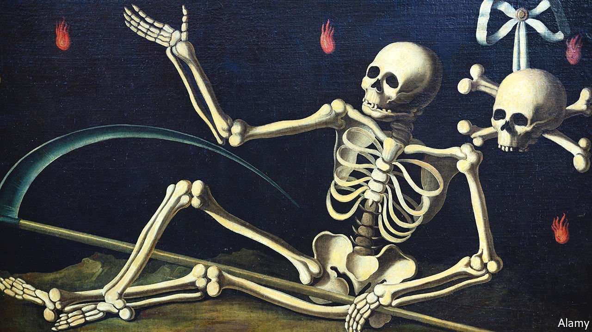

###### The undiscovered country

# “This Mortal Coil” is a surprisingly upbeat history of death 

##### Andrew Doig’s study of how people die is a story of human ingenuity 

 

> Feb 5th 2022 

This Mortal Coil. By Andrew Doig. Bloomsbury; 384 pages; £25

FOR OVER 200 years, France has diligently recorded the life spans of its citizens. Since 1816 their average life expectancy has more than doubled: long skewed by high infant mortality, it jumped from 41.1 years to 85.3 for French women, and from 39.1 years to 79.3 for men. In other words, it “has increased on average by five hours per day”, writes Andrew Doig in “This Mortal Coil”, a study of how people die. “So, every day, the date of a French person’s death gets closer by 24 hours due to the passing of time, but recedes by five hours, thanks to medicine, nutrition, sanitation, good government, trade, peace and so on.”


You might expect a book on this morbid theme to be forbidding or sombre. This one is neither. Instead Mr Doig, a biochemist at the University of Manchester, tells an empowering story of human ingenuity.

For most of human history, life expectancy hovered around 30. The oldest anatomically modern humans, who lived around 200,000 years ago, often died in accidents—in falls, say, or by drowning—or were killed by large animals during hunts or by other people. About 10,000 years ago humans discovered agriculture, and previously nomadic populations settled to grow fields of wheat, barley and maize. Farmers could suddenly produce a lot more food than people had before; but, counter-intuitively, that did not translate into an explosion in the species. The world’s human population increased only from 4m in 10,000BC to 5m in 5000BC.

Farming, it turned out, had some big downsides. Not only did it involve back-breaking labour; it brought new diseases to people. Most of the infections that plague humans today come from bugs that once lived in animals and crossed the species barrier. Measles derives from the rinderpest virus in cattle and influenza from poultry. Living in close quarters with animals meant a higher chance of catching their lurgies. Dense settlements and cities let new ailments spread quickly. Their appearance repeatedly obliterated human communities; it took generations for natural resistance to evolve and spread.

The fight against infectious diseases made a step-change around 250 years ago in Europe and North America. Mr Doig devotes chapters to some of the major infections of the medieval era, including bubonic plague, smallpox, typhoid and cholera. His gut-wrenching descriptions of disease and death—stinking, weeping boils, diarrhoea and worse—serve as background to the larger story of how people began to apply reason to their understanding of illnesses. In the process, they invented the seeds of modern medicine.

In 1747 James Lind, a Scottish doctor, designed a systematic experiment to show that citrus fruits could cure scurvy. Fifty years later, Edward Jenner, an Englishman, discovered that people could be protected from smallpox if they were inoculated with pus from the blisters of milkmaids who had contracted a related disease, cowpox. In 1854 John Snow, a doctor in London, was studying cholera, the “most terrifying disease of the 19th century”, which could plunge a person from good health to death in only 12 hours. He gathered data on where cholera-affected households in Soho had been getting their water. Around the same time in Vienna, Ignaz Semmelweis, a Hungarian, showed that cleanliness in maternity hospitals could save the lives of new mothers.

Such were the respective origins of clinical trials, vaccination, epidemiology and good hygiene. At last, humans were acquiring decisive weapons against infections and, from the mid-19th century, life expectancy began to rise. Death, however, remained inevitable. As some versions of it fade, others take their place.

The early 21st century might be the healthiest time ever to be alive; modern medicine has given people in developed countries tremendous lifespans. But all bodies fail eventually. The top causes of death today are coronary heart disease, stroke and lung diseases including asthma, emphysema and pneumonia. Cancers are now known to comprise several types of disease, but, if grouped together, they kill almost as many people as heart troubles. Human behaviour has exacerbated some of these afflictions: processed junk food, smoking, alcohol and lack of exercise all damage human bodies.

The whips and scorns of time

A looming spectre is dementia. The numbers of elderly people are rising so fast that the incidence of debilitating, costly conditions such as Alzheimer’s and Parkinson’s is growing rapidly. Here science is still stumped: in contrast to the arsenals available to fend off other causes of death, there are no drugs to slow or halt these terrifying brain diseases. Mr Doig’s conclusion is grim but realistic: “We seem to be heading for a world of elderly people with functioning bodies, but demented minds.”

Nevertheless, he is an optimist. He points to medical marvels that may lie ahead—such as 3D-printed organs that could make it routine to go into hospital at 60 to “freshen up” with new lungs, kidneys, liver or pancreas, grown from stem cells and optimised by genetic editing. “We could then have hearts like Usain Bolt and lungs like Serena Williams,” he writes. “Many more of us would only die when our brains can no longer function.” The “years of living with chronic disability”, which now blight old age, would be over.

These are remarkable prospects. But, as Mr Doig knows, ultimately they are distractions from the immutable fact that, however ingenious medicine becomes, one day, it will all end. ■

