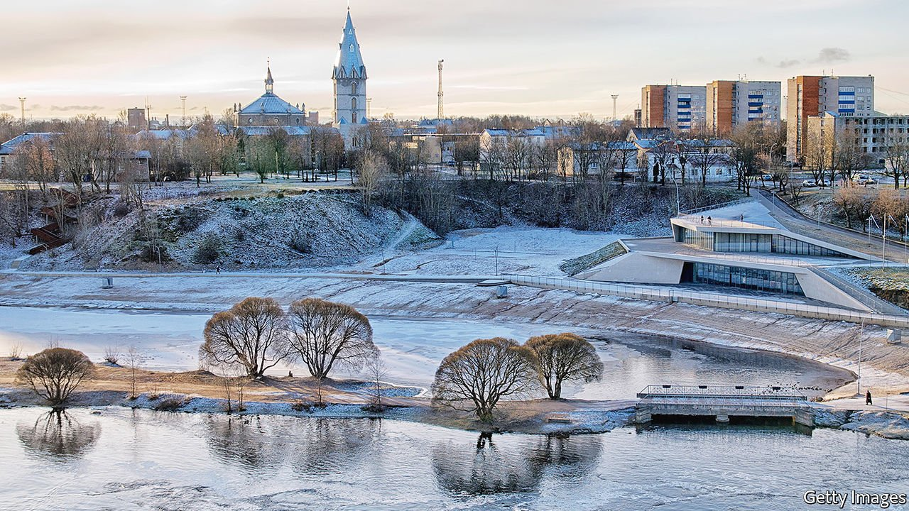

###### Who’s next?

# As Russia menaces Ukraine, eastern European countries grow nervous 

##### Even relatively friendly countries in the region mistrust Russian expansionism 

 

> Feb 5th 2022 

THE MUNICIPAL offices in the Estonian city of Narva are just a snowball’s throw from Russia. From her window Katri Raik, the mayor, can watch cars and lorries trickling through a border checkpoint. More than 80% of Narva’s residents are ethnic Russians, a legacy of the centuries during which Narva was part first of the Russian empire and then of the Soviet Union. Ethnic Russians, nearly a quarter of the population, have grown more integrated since Estonia became independent 30 years ago. Yet most send their children to Russian-language schools and rely on Russian media. “Yesterday someone on the city council said ‘U nikh v Estonii tak [That’s how it is over there in Estonia],’” says Ms Raik.

A former interior minister, Ms Raik was elected in December pledging to bridge the gap. A new Estonian-language school will open in September. The regional economy is now oriented towards the West. But Russia’s military build-up on the Ukrainian border is reminding Narva of where it sits. Opinion is divided along familiar lines. In several conversations, ethnic Estonians saw Russia as the aggressor, whereas ethnic Russians tended to think the risk of war exaggerated or to blame NATO. “We each know what the other thinks, so we simply don’t talk about it,” says Ms Raik.


Across eastern Europe, the  in Ukraine evokes long-standing fears. Most countries, Estonia included, are NATO members and face no immediate risk of incursion. But Russian and Soviet expansionism has shaped their politics for centuries. These days many eastern Europeans are at odds with the Kremlin over energy supplies or Russian-financed corruption. Others have friendlier relations, helped by trade, Russian-speaking minorities or politicians who get on with Vladimir Putin, Russia’s president. But even in such places, the crisis in Ukraine is causing problems.

The Baltic countries, which were Soviet territory until 1991, are the strongest voices for deterrence and harsh sanctions. “Interdependence means you can hurt the one who is dependent on you,” says Kaja Kallas, Estonia’s prime minister, whose mother’s family was deported to Siberia under Stalin. Her government is trying to send weapons to Ukraine, but Germany has been blocking the passing-on of German-made equipment. On January 27th Latvia’s defence minister called the German stance “immoral and hypocritical”.

Last summer, when Mr Putin wrote an essay claiming that Ukraine was not a legitimate nation, it rang alarms in Estonia, Latvia and Lithuania, because he had made similar arguments about them in the 2000s. Defence planners in these countries consider Russia an existential threat.

In Romania and Bulgaria, things are more complex. Both are NATO members. But their politics are plagued by corruption, some of it tied to Russia. They have not always been enthusiastic about American policies that link anti-corruption efforts to regional security. Romanian politicians have clamoured for years for NATO to upgrade its presence, though Bulgarian ones downplay new deployments to avoid provoking voters with Russian sympathies. Still, both countries were furious when Russia demanded on January 21st that NATO pull allied forces out of their territory. On February 2nd Joe Biden instead announced the deployment of an additional 3,000 troops to the region

It is in central Europe that attitudes towards Russia are most ambivalent. Viktor Orban, Hungary’s populist prime minister, is friendly with Mr Putin and visited him in Moscow on February 1st. He has imitated Mr Putin’s model of government by taking control of his country’s media and judiciary. He has also bought Russian nuclear power plants, struck deals for Russian gas that circumvent Ukraine and persistently called for relaxing EU sanctions. Milos Zeman, the Czech Republic’s president, is cosy with Mr Putin, too. But Petr Fiala, the new Czech prime minister, is solidly in step with NATO and the EU.

Poland’s government also has some affinity with Mr Putin’s. It is conservative, religious and nationalist, and is fighting with the EU over its efforts to turn judges into political pawns. Yet it is the most fiercely anti-Russian government in Europe. The Russian empire ruled much of Poland throughout the 19th century and tried to Russify its population. In the second world war Stalin carved Poland up with Hitler and executed much of its elite. Many Poles see Russia as a country that tried to eliminate them as a nation.

Eastern European countries will pay a price for isolating Russia, especially in energy. In October Moldova was forced to strike an expensive gas deal with Gazprom, and rising electricity bills nearly toppled Ms Kallas’s government in January. But only for the Baltic countries is Russia among the top five export markets. In no country is direct investment from Russia more than a tenth that from the EU, though in some pockets it plays a significant role.

In Narva, for instance, about 30% of the firms in the city’s industrial zone are owned by Russians, reckons Vadim Orlov, the zone’s director. Russian businessmen want factories in a country governed by the rule of law. Why should Estonia back sanctions that could make things harder for its own Russian-owned businesses?

One reason is that Russia likes to use sanctions too. Ms Kallas mentions 2007, when it retaliated for the removal of a memorial to Soviet soldiers in Tallinn by cutting off fuel supplies. Dumitru Alaiba, a Moldovan MP, recalls 2014, when Russia hit his country with an embargo after it signed an association agreement with the EU. “[We] have learned that dealing with Russia has risks,” says Ms Kallas. If the region’s ties to Russia are further weakened, Mr Putin will have himself to blame. ■

All of our recent coverage of the Ukraine crisis can be found 

