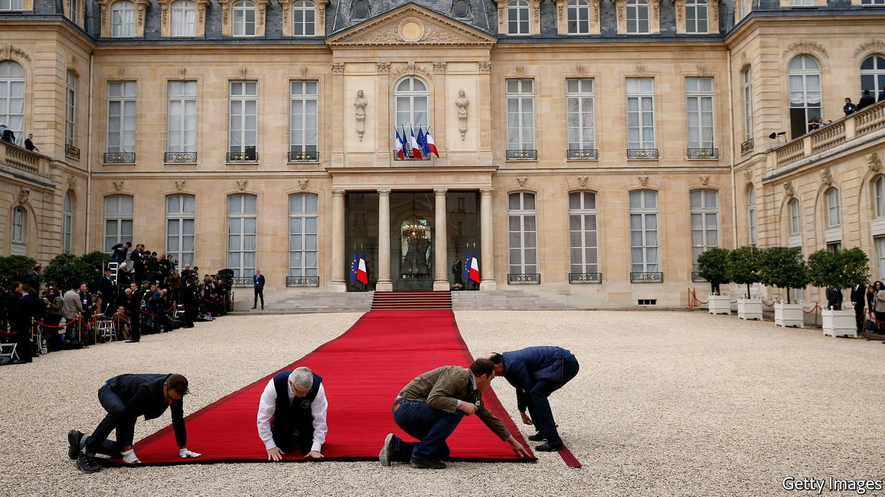
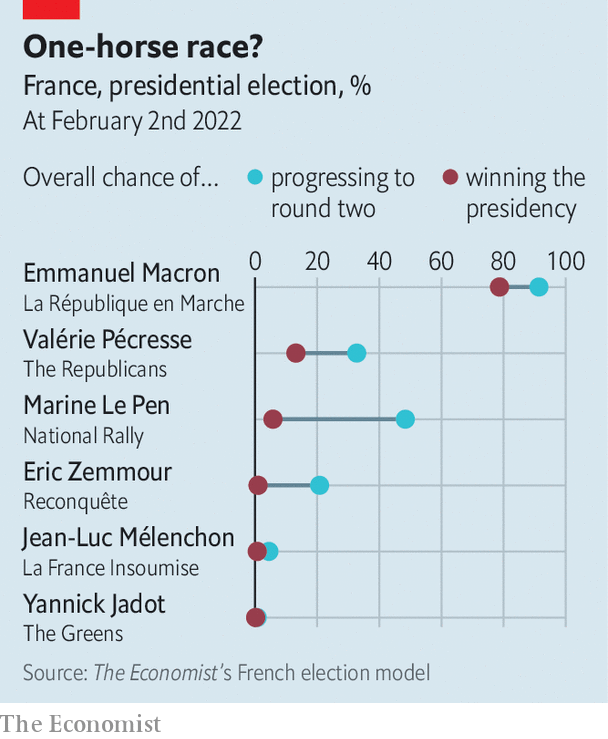

###### A four-in-five chance

# Emmanuel Macron is highly likely to be re-elected as France’s president 

##### The Economist’s election model derives probabilities from the polls and past experience 

 

> Feb 5th 2022 

SO KEEN ARE the French to evict any leader they vote into office that the language even has a word for it: dégagisme. No French president has been re-elected for 20 years. This April, five years after Emmanuel Macron seized the presidency in his first attempt at winning elected office, voters will decide whether to keep him on for a second term. The Economist’s election model, launched on February 2nd, suggests that they will. It puts Mr Macron’s chance of re-election at 79%. If he wins, the 44-year-old will break yet another rule of French politics.

 suggests that Mr Macron’s most serious challenger is the candidate of the centre-right Republicans, Valérie Pécresse. Yet on February 2nd it put her chances of becoming France’s first female president at only one in eight. The model gives the nationalist Marine Le Pen even worse odds: one in 17. Even this is far better than the chances for Eric Zemmour, a far-right polemicist, whose entry into the race dented Ms Le Pen’s poll numbers; his current polling average of just 13% and poor showing in hypothetical match-ups give him a 1% chance of victory. On the left, no candidate has even as much as him.


To produce these results,  a poll-based statistical forecasting . The election will have two rounds, on April 10th and 24th. Our model, which runs 10m simulations a day, calculates the probability of each candidate reaching the second-round run-off, and of then winning that to secure the presidency. Charles de Gaulle devised this electoral system as a direct “encounter” between a candidate and the people, unfiltered by an established party. Before narrowing the choice to two, it offers outsiders the chance to try their luck against party nominees—provided they secure the 500 signatures from elected officials needed to validate their candidacy.

 


The Economist’s model gives Mr Macron greater chances of winning than the disgruntled mood in France might suggest. He may lead in first-round polls, but the French are scarcely enamoured. Nearly half of voters tell pollsters that they will vote for a candidate from the extremes, either on the left or the right. Mr Macron detonated the previously dominant two-party structure in 2017, having launched his centrist party, now called La République en Marche. He remains a divisive figure, resented by left and right alike, and reproached for a haughty and know-it-all governing style. Anti-vax protesters regularly take to the streets. Teachers and parents have been exasperated by the complex covid-19 testing regime in schools.

In January Mr Macron’s approval rating was only 38%, according to Kantar, a polling outfit. This is better at this point in his presidency than either of his two immediate predecessors, François Hollande (19%) or Nicolas Sarkozy (29%). But it is lower than that of the only two presidents to have won re-election since de Gaulle: François Mitterrand in 1988 and Jacques Chirac in 2002. Each was helped by running for re-election while in “cohabitation” with a government from the opposition, which deflected responsibility for voters’ gripes away from the president. Mr Macron enjoys no such advantage.

Mr Macron’s favourable odds stem from his consistent and significant first-round poll lead, combined with his very high chances of beating either Ms Le Pen or Mr Zemmour in a run-off. Under the French system, victory in the run-off can come despite a far-from-commanding first-round score. In 2017 Mr Macron secured just 24% of the initial vote, but won 66% in the second round.

Politically, Mr Macron’s base seems quite loyal. His 24% first-round score in 2017 roughly matches his showing in polls today. Those who say they will vote for him in April are more certain of their choice than are those who back Mrs Pécresse, according to Ipsos, another polling group. Mr Macron’s party has successfully occupied a broad political space, borrowing politicians from the left and the right, crushing many potential rivals and splintering the opposition. The Socialist Party, supplier of two previous Fifth Republic presidents, is a feeble version of its once grand self.

Moreover, Mr Macron’s management of the economy and the pandemic has proved reasonably solid. In 2021 French GDP rebounded at a rate of 7%, its fastest growth for 52 years. Workers and firms have been protected from lay-offs and closures by generous government support. The employment rate for 15- to 64-year-olds has reached a record high. The latest wave of covid infections seems to have peaked. France’s vaccination rate for first doses is higher than in Britain and Germany, and its number of excess deaths is lower.

That said, odds this favourable to Mr Macron do not mean that he will inevitably win. Were he to face Ms Le Pen or Mr Zemmour, the polls say he would beat each by a fair margin. But should his opponent be Mrs Pécresse, the race would be tighter, and could easily tighten more.

Our model gives the Republicans’ nominee, who enjoyed a bump after winning the party’s primary in December before sliding back in the polls, a 32% chance of reaching the run-off. The polling averages currently give Mr Macron a six-point lead in such a match-up—a fairly narrow margin. A serious candidate who knows her brief and likes to call herself “two-thirds Merkel and one-third Thatcher”, Mrs Pécresse has been criss-crossing the country on the campaign trail. Ipsos suggests that 50% of those who back Mr Macron say that Mrs Pécresse, once considered a potential recruit to his government, would be their second choice. To be sure of defeating her in a run-off, Mr Macron would need to get out the vote on the left, which is out of her reach but might be tempted to abstain.

French election campaigns can also twist in unexpected ways. Three months before the first round in 2017, only one poll suggested that the eventual victor, Mr Macron, would get to the run-off. Our model tries to allow for unexpected poll movements, but does not incorporate the possibility that Mr Zemmour fails to secure his 500 signatures and so drops out. If he did Ms Le Pen’s score would rise sharply and Mrs Pécresse’s place in the final would be very much at risk, to Mr Macron’s benefit.

Indeed, a 21% chance of Mr Macron losing, our starting projection as the model goes live, is not trivial. It reflects the risk not only of a late-breaking scandal but also of polls being off by a higher-than-usual margin. Much can happen in the ten weeks before a first-round vote, as Mr Macron knows full well. But at this point the sitting president, despite the reproaches hurled his way by voters, is looking well placed to keep his job. ■

 Due to a coding bug, an earlier version of this story displayed slightly lower odds for Valérie Pécresse and slightly higher odds for Marine Le Pen. This has been amended.

For more coverage of the French election, visit our dedicated 

