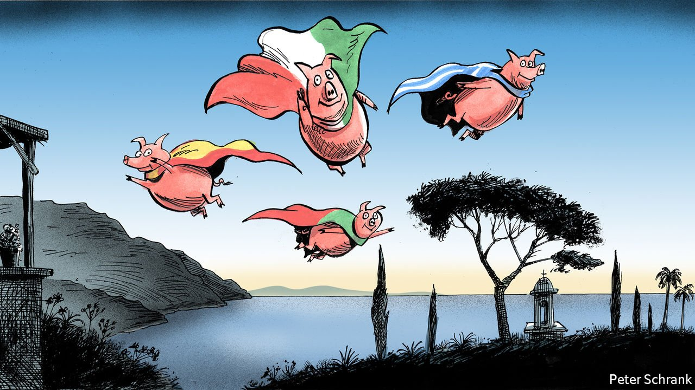

###### Charlemagne

# Southern Europe is reforming itself 

##### The old PIGS are airborne, even as northern countries fall to earth 

 

> Feb 3rd 2022 

THE ACRONYM stuck for a decade, no matter how bitterly the countries it lumped together moaned about it. Being branded one of the PIGS—short for Portugal, Italy, Greece and Spain—as the euro teetered was to be the perennial butt of bond-market bullying, Eurocrat nagging and German tabloid contempt. But look today and the bloc’s Mediterranean fringe is doing rather well. Those once stuck in the muck in the aftermath of the global financial crisis are now flying high. Southern Europeans are running their countries with the competence and reformist zeal all too often lacking in their northern neighbours. It may be a flash in the pan. But if it endures, it will come to change the nature of the EU.

The political stars in Europe these days are found down in what used to be termed “the periphery”. On January 30th António Costa led his Socialist party to an absolute majority in Portuguese parliamentary elections, obviating the need for ungainly coalitions of the sort now hobbling Germany. On the opposite side of both the continent and the political spectrum, Kyriakos Mitsotakis of Greece is the centre-right’s undisputed idol, recently hosting Valérie Pécresse of France as she sought to burnish her Macron-beating credentials. Between the two is Mario Draghi, who looks set for a longer stint as Italy’s prime minister after the prospect of his promotion to the presidency revealed a lack of any other politician who could hold his disparate coalition together. By bidding for the top job Mr Draghi miscalculated. But he was lucky: to be seen as the only calming force in Italy’s choppy political waters adds to the already considerable credibility he enjoys. And he may become president in a year or two.


Better yet, the southerners are achieving the rare feat of combining political success with reforms to economies previously thought unreformable. Mr Costa has gained plaudits since 2015 as a lefty who also knows how to balance a budget. Italy’s technocrats are overhauling its creaking courts and overly generous pensions—necessary, urgent changes that governments of all stripes have for decades shirked. Spain, under somewhat more fractious political leadership, has made useful tweaks to its labour markets. Greece has worked on digitising a rickety bureaucracy, among many other things. All are growing faster than the EU as a whole.

When Europe’s problems are pored over today, most fingers point north and east. Poland and Hungary are challenging European norms on the rule of law with as much abandon as Greece once ignored the bloc’s deficit rules. Germany is sending helmets to Ukraine when what is really needed are howitzers. Over 40% of French voters are expected to cast their ballot for extremist candidates in April, even though they have suffered none of the wrenching reforms of the sort undertaken by the dynamic southerners since the pandemic struck. The Netherlands, once an enthusiastic PIGS-baiter, only recently acquired a government following nine months of haggling. The previous one had collapsed after a benefits snafu plunged thousands into penury. Could nobody from Athens be dispatched to help them get a grip? Is it time for a visit from the troika?

To austere types in Berlin or Helsinki who tormented southerners during the eurozone’s darkest hours a decade ago, the periphery’s success is evidence that tough love works. In their telling, it is the threats and badgering doled out at interminable EU summits that put southern Europe on the righteous path of tighter budgets. The beatings continued and morale improved. Reformed economies were in better shape to handle the pandemic.

Tosh, say their opponents. The PIGS are airborne today because the austerity-led playbook of the 2010s has been binned in favour of solidarity. As covid-19 struck, rich countries agreed to an EU fund that will end up funnelling €750bn ($850bn) in loans and grants mainly to poor countries. It is this Next Generation (NGEU) money—Italy alone is entitled to €192bn—that is giving politicians there the space to adopt reforms they always would have supported if they could have afforded them. The Germanic cudgelling of yore merely boosted populists, which made enacting change all the harder. Now, sane politicians are back in charge.

It’s a bird, it’s a plane...

Convincing either side of the merits of the other is a lost cause. All agree any crowing over southern Europe’s current success is premature. Growth is high mainly because the porcine foursome slumped hardest during the pandemic. Unemployment remains high. Reforms still have a long way to go; opponents to change may simply be biding their time. Public debt levels—over 200% of GDP in Greece’s case—are worrying. PIGS are able to borrow at low rates only thanks to the ECB snapping up their bonds, a form of monetary-policy largesse that inflation may soon render untenable. Italy faces a fractious election by 2023 at the latest. A snowstorm that paralysed Athens two weeks ago acted as a reminder of the enduring limits of the state there. And what if the Mediterranean becomes, once again, the focus of a migration crisis?

For now, though, the southern bloc is enjoying its time in the sun. Its reforms provide backing for its views on the future of the union’s economic governance. Arguing against the hasty return of strict deficit limits is easier if steady GDP growth makes debt seem manageable. (Not even Germany seems keen on a strict return to the old rules.) Pleading for more NGEU-type funding resonates more with Dutch voters if they feel their money has supported useful reforms in countries with which they share a currency.

Convergence between north and south takes some venom out of what remain poisonous debates around who makes the EU’s rules and how they are enforced. Beyond being a good thing in itself, a fast-growing southern fringe lets both the austere and their opponents believe their pet economic policy is what created a richer Europe. While the argument drags on about why PIGS are flying, everyone can look up and enjoy the view. ■

Read more from Charlemagne, our columnist on European politics: (Jan 29th)

 (Jan 22nd)

 (Jan 15th)

