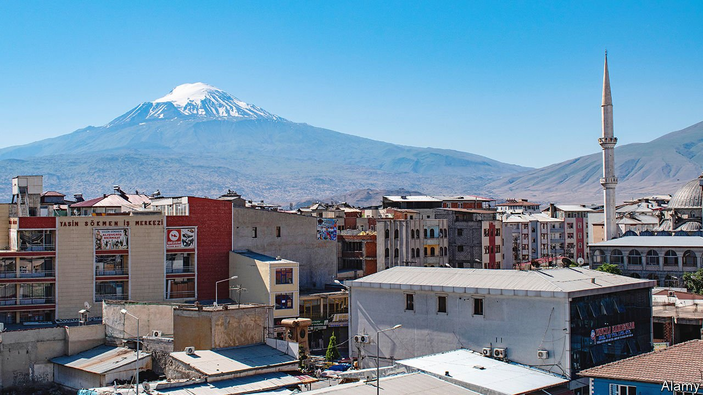
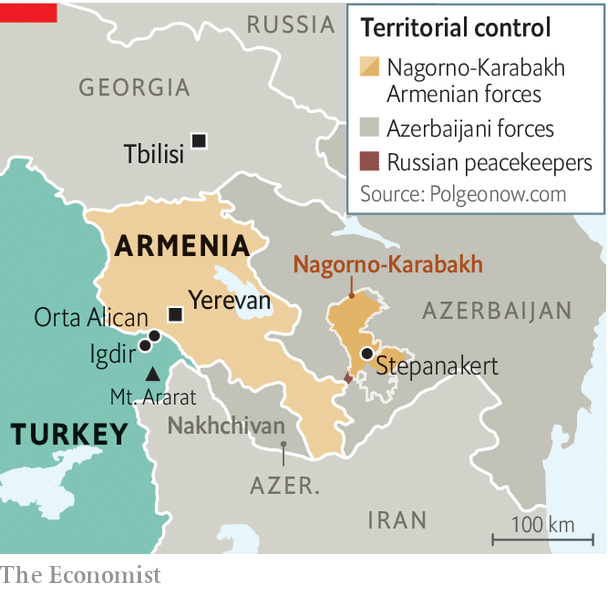

###### Caucasian thaw

# The Turkey-Armenia relationship is thawing 

##### But normalisation will not mean reconciliation 

 

> Feb 3rd 2022 

BLANKETS OF SNOW cover Igdir, a drab town in eastern Turkey near the border with Armenia. Mount Ararat, where Noah and his ark supposedly washed up after a spot of rain, towers over the scene. The closest big city, Yerevan, Armenia’s capital, is 30km away. But there is no going there, nor is there a way for Armenians to reach Turkey by land. The border between the two countries is closed. At the crossing outside town, Turkish soldiers stand guard opposite an unused customs building, braving the cold.

Happily, a thaw seems to be coming. Turkey and Armenia, divided by regional disputes and the legacy of the mass murder of Armenians by Ottoman forces over a century ago, are talking again. Flights between Yerevan and Istanbul, home to nearly all of Turkey’s remaining Armenians, resumed on February 2nd, after a hiatus of two years. Weeks earlier, the two countries launched talks aimed at normalising ties. (Armenia and Turkey have never established diplomatic relations.) Armenia’s foreign minister will attend a conference in Turkey in March. The opening of the border may be next.


Armenia is cut off from the east by Azerbaijan, with which it fought a war less than two years ago. It is separated from Russia, its main ally, by Georgia, and largely excluded from regional transport and energy projects. It has much to gain from direct trade with Turkey, a market of nearly 85m people. (Armenia is home to a mere 3m, and much poorer.) A reopened border could become its gateway to Europe.

Places like Igdir could undoubtedly use the boost from trade, too. Turkey’s currency crisis and surging inflation, which reached an annual rate of 49% in January, have made the region, which was already one of Turkey’s least developed, even poorer. At a teahouse in Orta Alican, a village close to the border, farmers sitting around a wood stove complain they can no longer afford fertiliser, whose price has tripled in only a few months, or diesel. One of the men recently sold most of his cows because he could not afford animal feed. For some, the only way to escape poverty has been to escape altogether. Over the past year, says Davut, one of the farmers, as many as 30 men from the village, about one per household, have upped sticks, many for Europe. Davut’s own brother was recently caught by border guards in Croatia. He had sold all his possessions to pay smugglers over $8,000 for passage to France. “If I had that much money,” says Davut, “I would leave as well.”

 


Over the past three decades, the fate of the border has hinged on events hundreds of kilometres to the east, in Nagorno-Karabakh, an Armenian enclave inside Azerbaijan. Turkey closed the border in 1993, out of solidarity with Azerbaijan, towards the end of a bloody war that saw Armenian forces take control of the enclave and occupy seven neighbouring Azeri districts. In the war in 2020 Azerbaijan, backed by Turkey, recaptured much of the region (see map). Armenia’s defeat means one of the main obstacles to the reopening of the border, and to Turkey’s rapprochement with Armenia in general, is now gone.

Turkey and Armenia were on the verge of patching up most of their differences in 2009, before a backlash from nationalists on both sides, and from Azerbaijan too, upended the process. Things are different today. Armenia, defeated and more dependent than ever on Russia, is negotiating from a position of weakness. America and Europe, which once saw the rapprochement as a way to dilute Russian influence in the Caucasus, are less involved. Turkey itself has become more cosy with Russia. The talks in 2009 took place in Zurich. The current ones are in Moscow.

Normalisation, if it happens, will not mean reconciliation. Turkey refuses to recognise the deaths of 1m or so Armenians in 1915-17 as a war crime, much less as genocide. Armenians arriving in Igdir would be aghast to spot a towering statue, featuring 40-metre swords raised to the sky, commemorating the “genocide” not of Armenians by Ottoman Turks, but the other way around. A monument to Turkish-Armenian friendship, built on another section of the border, was demolished in 2011 after Recep Tayyip Erdogan, Turkey’s president, called it a monstrosity.

Attitudes on the ground are less stubbornly entrenched. Locals in Igdir say that they would welcome visiting Armenians. “If the border were to open tomorrow, 99% of the people here would approve,” says Murat Yikit, the town’s former mayor. The opening would of course not transform the region’s economy or the relationship between the two countries overnight. “But it would give young people from both sides a chance to overcome past hatreds,” says Habip Eksik, a local lawmaker from the progressive Peoples’ Democratic Party. There are some good omens. Earlier this year locals in Orta Alican spotted a group of officials from Turkey’s highways directorate near the village. They turned out to be carrying out surveys for a project to widen the road leading up to the border. ■

