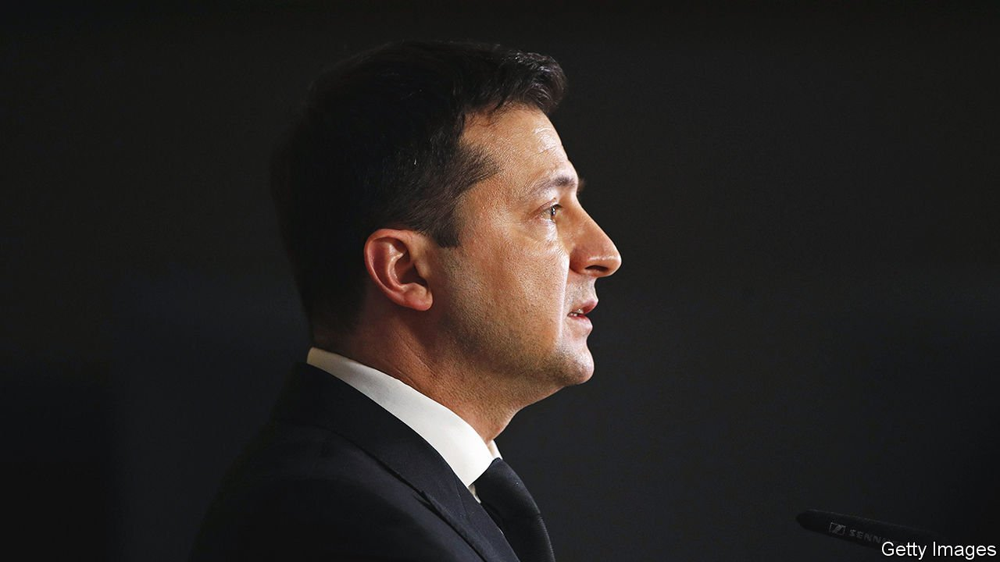

###### Blood hype

# Why Ukraine’s president is talking down the threat from Russia 

##### Volodymyr Zelensky’s call for calm rubs America the wrong way 

 

> Feb 5th 2022 

BLOOD MAY soon be spilled in Ukraine, but will it be real or fake? On January 31st authorities arrested a group they said was planning to stage riots in Ukrainian cities. The plot allegedly involved thousands of paid anti-government protesters, smoke bombs and litres of fake blood for the cameras, with medics on the scene to simulate first aid. The goal, explained Ihor Klymenko, Ukraine’s police chief, was to shake the country with viral images of unrest and police brutality.

Yet two days earlier, Ukraine’s government dismissed leaks from American intelligence officials that Russia was transporting supplies of blood to its troops at the Ukrainian border to treat potential casualties of war. “The purpose of such information is to spread panic and fear in our society,” wrote the deputy defence minister, Hanna Maliar, in a Facebook post. A rhetorical and analytical rift has opened between Ukraine and America. While the Americans warn of an imminent , , Ukraine’s president, thinks the gravest threat may come from within.


Mr Zelensky rejects the assessment reportedly delivered over the phone by Joe Biden, the American president, that a Russian invasion of Ukraine is “certain” and that Kyiv, the capital, could be “sacked” (America has denied the report). He has reproached foreign leaders for their dire rhetoric and suggested that Russia’s military menace is nothing new. “I’m the president of Ukraine, I’m based here, and I think I know the details deeper than any other president,” Mr Zelensky said.

Many foreign diplomats express frustration with Mr Zelensky, whom they see as inexperienced and thin-skinned. They note that he demands urgent deliveries of arms from the West while pooh-poohing the prospect of a full-blown war for which those weapons would be needed. Much of Washington’s foreign-policy establishment this week descended on Kyiv, to show support but also to bypass the government and explain the risk of invasion directly to locals. Boris Johnson, Britain’s prime minister, visited Kyiv on February 1st and weighed in to note Russia was now conducting “the biggest demonstration of hostility towards Ukraine in our lifetimes”.


For eight years  with Russian-backed separatists in its eastern Donbas region. The prospect of Russian escalation is a perennial threat. It does not need to occur to hurt Ukraine’s morale and discourage investment. Many Ukrainians, who take a stoical attitude to the situation, appreciate Mr Zelensky’s calm. The foreign ministry rebuked America and Britain for evacuating staff from their embassies in Kyiv, calling it “excessive caution”.

Some Ukrainians mistrust America’s spies, who they think view Ukraine as a pawn in a wider struggle with Russia. The steady drip of American intelligence leaks seems to them to be serving American plans for Europe’s security, rather than helping Ukraine. But Mr Zelensky’s defenders feel the rift is overstated. They say he is simply staying positive in public while planning privately for a crisis, as any leader might. After all, America and its allies are still sending Ukraine aid, sharing intelligence and pressing Russia to back down.

America sees Ukraine’s armed forces as overmatched, making a Russian occupation possible. But Ukrainians have faith in the country they have built since 2014. If Russia were to invade and establish a puppet regime, it would face not just an insurgency but—just as frustrating—an unco-operative bureaucracy. The country has purged its police force of pro-Russian officers; new applicants must explain to a commission how they would respond to illegal orders. Even for corrupt Ukrainians atop patronage networks, a Russian occupation is not enticing. In the Donbas, it has meant economic collapse. In Crimea, local elites must compete for spoils with powerful officials dispatched from Moscow. Ukrainian officials may sometimes be crooked, but that does not mean that their loyalty is for sale to Russia, declares one defence contractor in Kyiv.

Yet even if Ukraine is more resilient than Americans think, Mr Zelensky is in a bind. If a full-blown invasion comes, his decision to play down the risk could cost him public trust. In negotiations in Munich next week with Russia, France and Germany, he will face pressure to implement the , a deal imposed by Russia at gunpoint in 2015 which in effect gives Ukraine’s pro-Russian regions a veto over foreign policy. On January 31st the head of Ukraine’s national security council said the country would not implement the protocols, and the West should stop pushing it to do so. The Opposition Platform For Life, a Russia-friendly party, is waiting for Mr Zelensky to stumble. So is his predecessor, Mr Poroshenko, an oligarch whom Mr Zelensky’s government has charged with high treason—another reason for Western disappointment.

But Ukrainians understand the difference between an imperfect president and the system he bestrides. Mr Zelensky’s statements are “irritating for us, he may be irritating for the West,” says Oleksiy Haran, a political scientist at the Kyiv-Mohyla Academy. “But that is what goddamn democracy is about.” If war comes, it is Ukraine’s democracy, messy as it is, that will be at stake.■

All of our recent coverage of the Ukraine crisis can be found .

