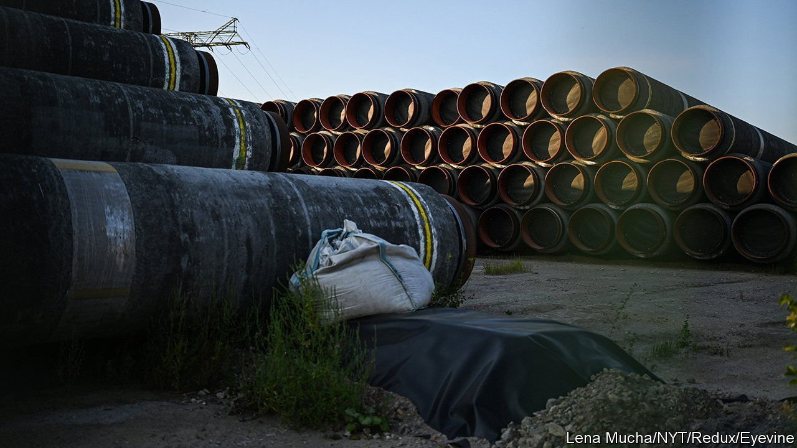

###### Taking aim

# America prepares the “mother of all sanctions” against Russia 

##### How much would they hurt? 

 

> Feb 5th 2022 

HAVING ALL but ruled out engaging militarily with Russia, directly at least, were it to , the West’s main weapons are economic. This week America and Britain vowed measures on a scale never seen before. “The mother of all sanctions”, was how Bob Menendez, chairman of the US Senate’s foreign-relations committee, described the package being assembled by the chamber. President Joe Biden says Vladimir Putin, his Russian counterpart, has “never seen sanctions like the ones I promised will be imposed”. For sanctions to work, though, Western allies will need to show unity, and be willing to shoulder some economic pain themselves. History suggests that this may be their greatest challenge.

The Senate is expected to approve its package any day now. Some of the sanctions being drafted could be implemented before any invasion, in response to activities Russia has already undertaken, such as cyber-attacks. The administration’s sanctions would target figures and companies in or close to Mr Putin’s inner circle as well as the relatives they sometimes use as asset-owning proxies. The aim would be to cut targets off from the global financial system and go after money they have parked in the West.


Britain is working closely with America. On January 31st its foreign secretary, Liz Truss, announced a new sanctions law. The goal is to widen the group of Putin cronies who can be penalised. Britain has sanctioned 180 Russian individuals and 48 entities since Russia’s annexation of Crimea in 2014. The new penalties, Ms Truss promised, can be slapped on anyone “providing strategic support” to Mr Putin’s regime. Britain’s stance is closely watched because rich Russians have strong financial ties to the country. London is a key capital-raising centre for oligarchs and their companies.

These measures are expected to form part of a broader package of sanctions focused on finance, energy and technology. America may target Russian state-linked banks, including Sberbank, a savings giant. Mr Biden also wants to keep open the option, resisted by some European countries, of excluding Russian banks from SWIFT, the interbank messaging system used to make cross-border transfers.

In energy, the talk in Washington is of broadening sanctions to target not just current production but investment, too. One way would be to restrict capital-raising by Russian oil-and-gas giants in New York and London. America has also threatened to prevent the opening of , a pipeline that would send Russian gas to Europe.

Technology is arguably America’s most powerful lever. It could, for instance, block more exports of high-tech gear on the Commerce Department’s “entity list”. This would restrict Russia’s access not only to items used by its defence sector, but also to parts used in many phones and appliances, inconveniencing Russia’s consumers as much as its weapons-makers.

The last economy of any size to be hit with broad sanctions was Iran, which was targeted with “maximum-pressure” sanctions in 2018 over its nuclear ambitions. Punishing Russia poses a more daunting challenge as its economy is more internationally connected than the Islamic Republic’s. For sanctions to be effective, they will have to cause pain to the West itself.

The most obvious blowback would be in energy. Europe relies on Russia for over a third of its imported natural gas. Some large European lenders also have close ties to Russia. Among the most exposed are Société Générale of France and UniCredit of Italy. The European Central Bank has reportedly asked the most heavily exposed of the 115 large euro-zone banks it supervises to provide details of how they would navigate various .

These risks leave some of America’s European allies feeling queasy. Germany gets over half of its imported gas from Russia and has wobbled on sanctioning Nord Stream 2 (though many think it will end up agreeing to do so). Even Britain’s commitment is uncertain. Campaigners say it has failed to use its leverage as a major financial centre. Its Crimea-related sanctions of 2014-15 contained scant restrictions on Russians raising capital in London.

The other big question is how much even severe sanctions would hurt the Russian economy. Mr Putin’s officials have gone to great lengths to sanction-proof it. Central-bank reserves have been  to more than $600bn; the share in dollars has fallen steadily in recent years, to 16%. Only a fifth of Russia’s sovereign bonds are held by foreigners.

Nevertheless, insulating the economy fully is impossible. Russian officials have boasted of riding out the Crimea-related sanctions relatively comfortably. Yet one study suggests the sanctions may have taken more than 2.5 percentage points off average annual Russian GDP growth since they were imposed. The sanctions Mr Biden is contemplating could therefore cause intense pain, if he can get his allies on board. ■

All of our recent coverage of the Ukraine crisis can be found .

For more expert analysis of the biggest stories in economics, business and markets, , our weekly newsletter.

