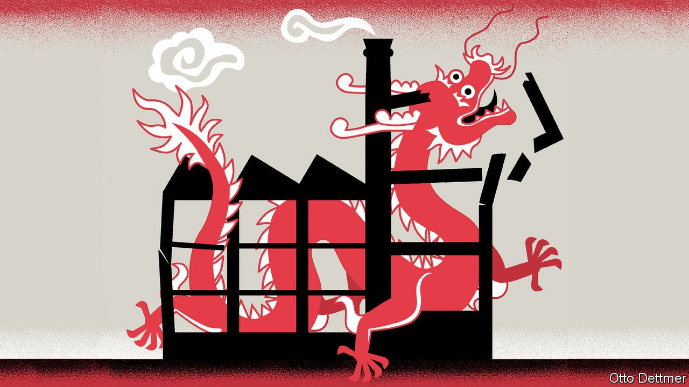
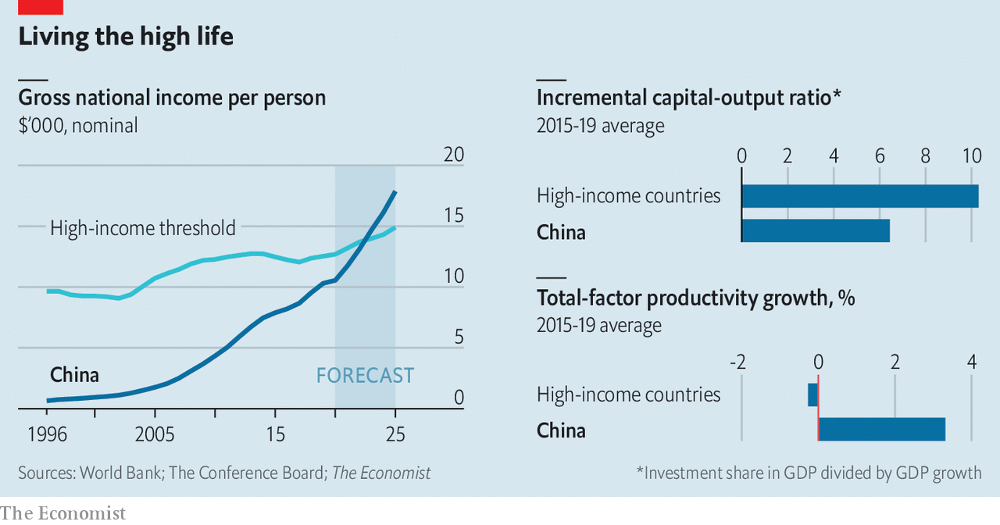

###### Free exchange

# China may soon become a high-income country 

##### Has it truly escaped the middle-income trap? 

 

> Feb 5th 2022 

CHINA IS HAUNTED by the spectre of the “middle-income trap”, the notion that emerging economies grow quickly out of poverty only to get stuck before they get rich. “During the next five years, we must take particular care to avoid falling into the middle-income trap,” said Li Keqiang, China’s prime minister, in 2016. Lou Jiwei, then China’s finance minister, once put the odds of China becoming ensnared at 50%.

The trap was named by Homi Kharas and Indermit Gill, two economists, in 2006, when they were both at the World Bank. It raises an obvious question: what counts as middle income and what would qualify as surpassing it? Mr Kharas and Mr Gill adopted the bank’s own income classifications. These were established in 1989 when the bank drew a line separating high-income countries from the rest. The line had to accommodate all of the countries that were then considered “industrial market economies”. It was drawn at a national income per person of $6,000 in the prices prevailing in 1987, just low enough to include Ireland and Spain. That line is now $12,695. It rises in step with a weighted average of prices and exchange rates in five big economies: America, Britain, China, the euro area and Japan. Eighty countries met that threshold in 2020, three fewer than the year before. The pandemic relegated Mauritius, Panama and Romania to the middle division.


Despite its leaders’ fears, or perhaps because of them, China is now on the cusp of becoming a high-income country by this definition (see chart). Based on the latest available forecasts from Goldman Sachs, we calculate that China could cross the line next year, helped in part by its strong currency. (The transition would not be officially announced until mid-2024, when the World Bank updates its classifications based on the previous year’s data.) If we are right, then 2022, the year of the tiger, could be China’s last as a middle-income country. It will be a fatter cat thereafter.

 


The threshold, of course, is arbitrary. Several countries (including Argentina, Russia and even Venezuela) have surpassed it only to flounder or fail in subsequent years. A lasting escape from the middle-income trap requires a more fundamental transition. Countries at this intermediate stage of development can encounter a variety of pitfalls. They may face diminishing returns to capital. They typically run out of workers to move out of agriculture. And they must invest heavily in education, beyond the basic schooling a factory hand needs to follow instructions. The truer test of a high-income country is how well it copes with such threats to its growth. How is China faring on these three counts?

China is still accumulating capital at a furious pace. It invested 43% of its GDP in the five years before the pandemic. The high-income countries averaged only half that percentage. But China’s high investment rate is perhaps not as fruitless as is often assumed. Just as its investment remains high by the standards of rich countries, so does its GDP growth rate. Indeed, the ratio between its investment share in output and its growth rate (sometimes called the incremental capital-output ratio, or ICOR) still looks favourable in comparison with high-income countries.

What about other sources of growth? In its annual check-up of China’s economy, released on January 28th, the IMF noted with concern that China’s “total factor productivity” growth, which measures changes in output that cannot be attributed to more capital or labour, fell in the past decade, compared with the ten years before. It attributed this slackening to “a stalling” of structural reforms, especially of state-owned enterprises. “Market dynamism has been losing steam recently,” it argued. But this kind of productivity is notoriously hard to measure. And according to one gauge from the Conference Board, a business group, it is rising notably faster in China than in high-income countries (see chart).

China’s employment patterns still differ markedly from those of more prosperous countries. Surprisingly, perhaps, the share of its workforce in construction is lower than the high-income average. The percentage in manufacturing is higher (19% compared with an average of 13%) and the share still in agriculture is far higher—about 25% compared with a high-income average of 3%. From one perspective, this residual rural workforce is a reason for optimism. If China can achieve high-income levels with a quarter of its workers marooned in agriculture, imagine what it will do as they escape into more productive employment? The worry, however, is that these workers have not left the farms because they cannot. Perhaps they do not want to forfeit their claims on communal land. Or perhaps they are too old or poorly educated to take advantage of better opportunities in cities.

China’s stock of human capital is indeed a cause for concern. According to its latest census, its adult population had an average of 9.9 years of schooling in 2020. That would put it near the bottom of the heap of high-income countries, which have 11.5 years on average, according to Robert Barro of Harvard and Jong-Wha Lee of Korea University.

The high-income trap

This problem can only be fixed one cohort at a time. China’s older citizens grew up in a much poorer country and were educated accordingly. A child now entering China’s school system could expect to receive 13.1 years of education, according to the World Bank. The quality does not yet match the quantity: based on how well children score on standardised tests, 13 years of school in China is equivalent to less than ten years in a country like Singapore, the bank calculates. Nevertheless, things have improved.

The “stock” of human capital reflects China’s impoverished past, then, but the “flow” of investment in new human capital is more befitting of a high-income future. The problem is that this costly investment of money and time is deterring parents from having children, a demographic deadlock that is sadly characteristic of many rich parts of the world. China’s population increased last year by only 0.03%. Judging by Japan’s experience, an ageing, declining population can contribute to depressed spending, low growth and low interest rates. China’s policymakers must now worry about a different kind of trap. ■

Read more from Free Exchange, or column on economics:

 (Jan 29th) (Jan 22nd) (Jan 15th)

For more expert analysis of the biggest stories in economics, business and markets, , our weekly newsletter.

