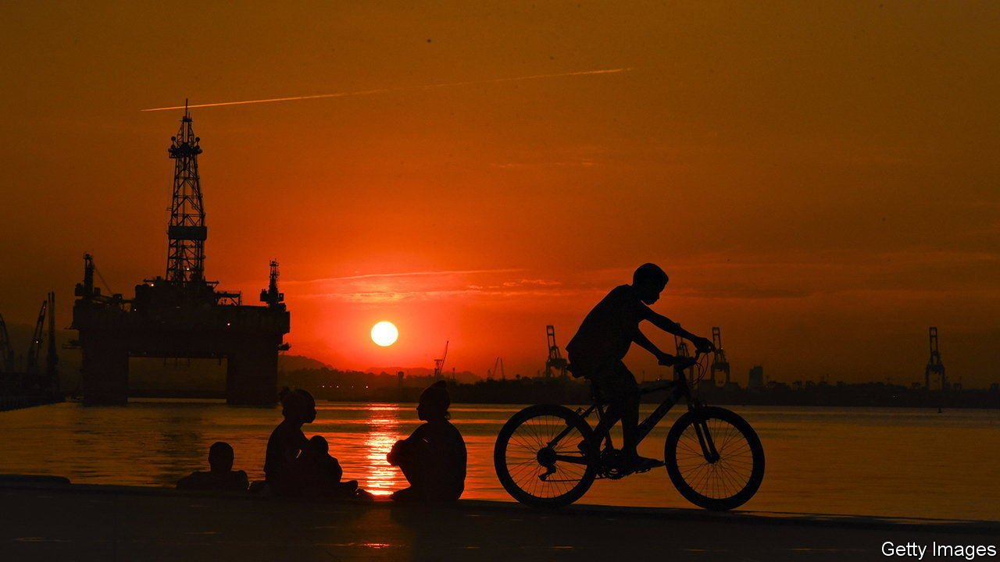

###### A slippery patch

# OPEC grapples with a precariously balanced oil market 

##### Geopolitical drama and a tight market mean that a price of $100 per barrel could be on the cards 

 

> Feb 5th 2022 

OIL AND philosophy rarely mix. But when David Fyfe of Argus Media, a publisher, calls production quotas set by the Organisation of Petroleum Exporting Countries (OPEC) and its allies a “Platonic ideal”—more of a theoretical model than a practical guide—he captures the sense of self-doubt now gripping energy markets. Every month since July, the group has agreed to raise its output by 400,000 barrels per day (bpd). But experts cannot decide whether that is too little or too much—and whether the target means much at all.

The cartel’s latest meeting, on February 2nd, took place against the backdrop of heightened fears about a  (Russia, the world’s second-biggest oil exporter, is a member of the extended cartel, known as OPEC+). Only the week before the price of a barrel of Brent crude had spiked above $90, its highest level in seven years. The alliance promised to raise output again, by the usual amount. That calmed markets a bit. The question is what happens next.


Many Wall Street analysts have lifted their oil-price forecasts for this year above $100 a barrel. War in Ukraine, they say, could push it well past $120. Conflict would probably not physically disrupt supply. By contrast with the , Russia mostly exports oil by sea. Instead, a fear of  on trade may set prices ablaze.

Geopolitics aside, the bull case rests on resurgent demand. The International Energy Agency reckons oil consumption will rise from its present level of about 97m bpd to 100m bpd—a return to pre-covid levels—by the end of the year, even before global aviation fully recovers. Damien Courvalin of Goldman Sachs, a bank, says consumers switching to oil from gas (prices for which have been sky-high in Europe) may have boosted demand by up to 1m bpd, leading to “critically low inventory levels”.

Supply is tight, too. Paul Sheldon of S&amp;P Global Platts, a data firm, reckons global spare production capacity is only about 2.6m bpd. And pledges by OPEC+ cannot be counted on. Many members have struggled to raise output owing both to underinvestment and covid-related bottlenecks. BloombergNEF, a research firm, notes that in December the club produced 747,000 fewer barrels a day than its quotas allowed.

The bear case rests on patience, a Persian restoration and a Permian boom. If Russian exports are not cut off, then the impact of geopolitical tensions should dissipate by the summer. By then America will probably have raised interest rates, cooling growth and oil demand—just as extra supply from OPEC+ hits the market. A resumption of Iran’s nuclear deal, meanwhile, looks likelier than at any point since 2017, when it was torn apart. The associated lifting of sanctions could release another 1m bpd.

The real wild card is shale. Until 2014, when OPEC orchestrated an oil-price crash, shale drillers raised cheap finance to ramp up output, turning America into the world’s biggest producer of oil. But investors, who went on to lose perhaps $300bn, are now .

Oil bosses have talked of stern . Yet lofty prices are hard to resist. Baker Hughes, an oil-services firm, counts 610 active rigs in America in late January, 226 more than a year ago. BNEF predicts output in the Permian basin could rise by as much as 1m bpd by the end of 2023; ExxonMobil, an oil major, plans to increase output there by a quarter this year. As energy philosophers like to say, the best cure for high prices is high prices. ■

For more expert analysis of the biggest stories in economics, business and markets, , our weekly newsletter.

