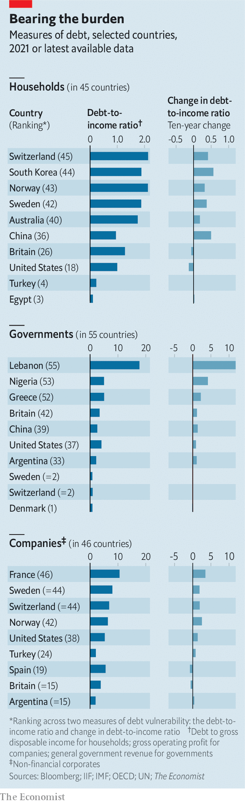
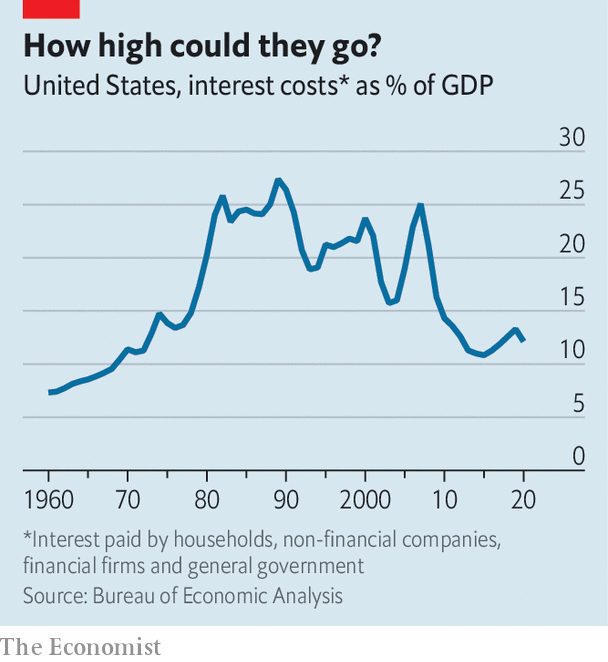

###### The bill balloons

# The global interest bill is about to jump 

##### The world paid $10trn in interest last year. As rates begin to rise, we work out where the bill might go 

 

> Feb 5th 2022 

NEVER BEFORE has the world economy been so indebted. The stock of global debt has gone from $83trn in 2000 to around $295trn in 2021—a rate nearly double the pace of world GDP growth. Debt rose from 230% of GDP in 2000 to 320% on the eve of the pandemic, before covid-19 propelled it to the even greater height of 355% last year.

Part of the reason for this explosion has been the steady decline in borrowing costs over the past two decades. In early 2000 a ten-year Treasury offered a yield of 6.5%. Today it pays 1.8%. The Federal Reserve’s effective policy rate has fallen from 6.5% to around 0.08% in that time. Benchmark rates in the euro area and Japan are sub-zero. Declines in government-bond yields and central banks’ policy rates have fed through to loan rates for private borrowers.


As a result, even though global debt has rocketed over the years, the world’s interest costs, as a share of GDP, are well below their peak in the 1980s. In , for instance, they stood at 12% of GDP in 2021, compared with 27% in 1989.

All this could soon change. The era of super-cheap money is . Central banks are battling a surge in . Those in some emerging economies have been raising interest rates for some time already: Brazil’s central bank raised rates by 1.5 percentage points after a meeting on February 2nd, its third consecutive such increase. At the time of writing, the Bank of England was expected to deliver its second interest-rate rise. The central bank with the most influence on global capital flows—the Fed—has signalled that it will probably put rates up as soon as March, and investors expect four further quarter-percentage-point increases this year. Real borrowing costs for governments, though still negative in many places, are inching up. In America the yield on the five-year Treasury inflation-protected security (TIPS), which hovered around -1.7% for much of 2021, now stands at -1.2%.

The scale of the global interest bill is vast. The Economist estimates that households, companies, financial firms and governments worldwide paid $10.2trn in interest in 2021, equivalent to 12% of GDP. As a guide to the potential impact of rate rises to come, we consider a scenario where the interest rates faced by firms, households and governments in 58 countries rise by a percentage point over the next three years. (By way of comparison, the five-year Treasury yield has risen by a percentage point since spring 2021.)

Our calculations suggest that the global interest bill would exceed $16trn by 2026, equivalent to 15% of projected GDP in that year. And if rates were to rise twice as quickly, say because inflation persists and forces central banks to take drastic action, the interest bill could rise to about $20trn by 2026, nearly a fifth of global GDP.

Working out the effect of rate rises on the interest bill is not straightforward. Some debt is tied to a fixed interest rate, such that higher borrowing costs are passed through only when it is rolled over. The median maturity of government debt, for instance, is five years. Companies tend to borrow for a two-year term; households typically borrow over a longer period. Incomes change over time, affecting borrowers’ ability to afford debt payments.

Borrowers could respond to higher interest costs by paying off debt, so lowering their debt-interest costs. But in aggregate, according to research by the Bank for International Settlements (BIS), a club of central banks, higher rates raise total debt payments (ie, including interest and principal) relative to income. The higher the level of debt, the greater the squeeze, suggesting that the economy has only become more sensitive to rate rises.

Our calculations assume that interest-rate rises feed through over the course of five years to government and household debt, and over two years to company borrowing. We also assume that nominal incomes rise in line with the IMF’s forecasts. As the fund’s projections assume that public debt rises at broadly similar rates, we let debt-to-GDP ratios stay flat. This implies annual budget deficits of around 5% of GDP—narrower than in the years immediately preceding the pandemic.

Picking up the tab

A higher interest burden would not fall on all borrowers equally. Private-sector borrowers in a country tend to foot a much bigger share of the bill than the government, which can borrow more cheaply, for instance. Financial firms and savers, such as wealthier households, receive as well as pay interest. The more exposed the borrower is to rate rises, in terms of higher debt levels, the bigger the interest bill they face, and the more likely it becomes that they cut back spending in order to meet their higher debt costs, or, in more extreme cases, that they fall into distress. That would in turn weigh on economic activity.

 


To see which borrowers may be more sensitive to interest-rate rises, we rank the household, corporate and government sectors for our countries along two dimensions (for this exercise we exclude the financial sector, which intermediates lending). The first measure is the debt-to-income ratio, which gauges the extent to which debt is affordable. The second is the change in the ratio over the past decade, which captures the extent to which exposure to interest rates has increased over time. We then produce an overall ranking for each sector in each country (see chart).

Start with governments. Lebanon, which already defaulted on some of its debt at the start of the pandemic, tops the list, with a high debt-to-revenue ratio that has rocketed over the past decade. Despite being a big exporter of oil, Nigeria’s government revenues only just cover its interest costs. Fortunately, most borrowing by emerging-market governments during the pandemic has been in their own currencies, notes Emre Tiftik of the Institute of International Finance, a bankers’ group, which may make them less exposed to flighty foreign capital.

Our next set of borrowers comprises households. Those in South Korea, Norway and Switzerland have the most debt, relative to their income, in our group of countries. Mortgage debt in Sweden is also sizeable. House prices rose by 11% in 2021, and well over half of mortgage lending is done with variable interest rates. When rates rise, therefore, mortgage bills follow suit. Debt-to-income ratios have more than doubled in China and Russia.

Companies are the third set of borrowers. Those in France and Switzerland have the most debt as a share of gross operating profit, leaving them exposed to rate rises. Among emerging markets, Chinese and Russian firms are also weighed down by their bills. Overall, our findings for the private sector are broadly consistent with an early indicator of financial stress, the credit-to-GDP gap, calculated by the BIS, which measures the degree to which borrowing exceeds its long-run trend. On this measure, the Swiss and South Korean private sectors rank among the five most stretched in the world.

Our rankings help illustrate who is most exposed to rising interest rates. But they cannot predict which sectors or economies will experience trouble as interest rates rise. That is a far more complex picture, which depends among other things on the prospects for economic growth and the reaction of policymakers. Strains in one part of the economy could interact with those in others, say by weakening the banking system.

 


Although households in rich countries are highly indebted, the interest rates they face are low in historical terms. Debt levels in Argentina, by contrast, may not look particularly high, but eye-watering interest rates, of 35% for the private sector, mean that borrowers are experiencing an intense squeeze. Poor countries with gloomy growth prospects may struggle. Rapid  could hamper their recoveries, says Gene Frieda of PIMCO, a bond-fund manager. Incomes may not rise fast enough to meet interest costs.

China faces a combination of threats: the property market has deflated as Evergrande, a large and heavily indebted developer, unravels. Banks have become saddled with bad household debts. But the country’s policymakers have also responded to these risks. The resulting drag on economic growth probably helps explain why the People’s Bank of China is lowering interest rates, not raising them.

Policymakers in the rest of the world may be starting to move in the opposite direction, but the potential of highly indebted borrowers to drag down the economic recovery will nonetheless be weighing on their minds. ■

 The figure for the total interest bill has been corrected, . We have also edited the text in places to clarify that our ranking shows the exposure of various borrowers to interest-rate rises, rather than vulnerability. Sorry. 


For more expert analysis of the biggest stories in economics, business and markets, , our weekly newsletter.

