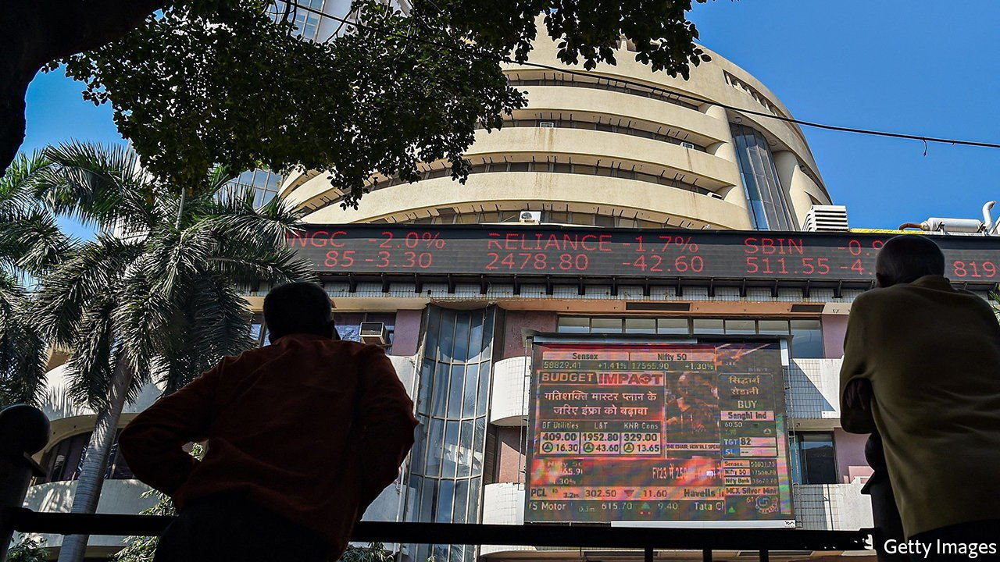
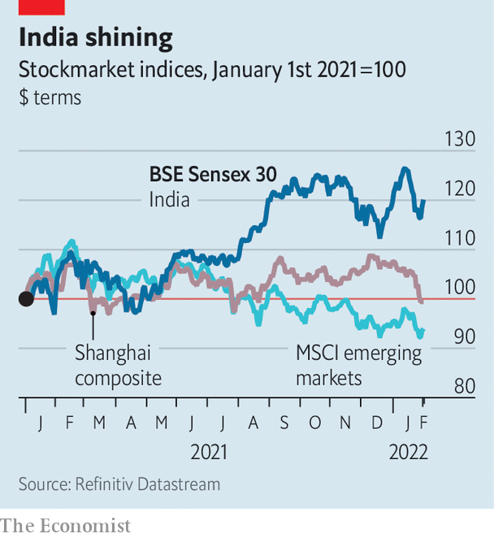

###### The tiger roars

# Why India’s stockmarket is roaring 

##### After a desultory decade, profits are expected to surge 

 

> Feb 5th 2022 

INDIANS CAN BE excused for looking eastward with more than a little envy. In 1980 India’s GDP per person, in purchasing-power-parity terms, was nearly twice that of China. Then the dragon took off. By 2021 Chinese incomes per person were more than double those in India. Yet when it comes to the performance of the stockmarket over the past year, at least, India can declare triumph. The Sensex 30 index of stocks rose by nearly 22% last year, outperforming not just the Shanghai bourse but the MSCI emerging-markets index, and indices in many rich countries, too. As we wrote this, the Sensex was up so far this year, compared with declines elsewhere.

The healthy showing has been enough to lure Indian retail punters to the market. According to Mint, a newspaper, bank accounts opened by customers with the intention of investing in stocks and bonds rose above 77m last year, compared with 39m in 2019. What lies behind the market’s extraordinary performance?


After a desultory decade, profits are roaring back. Company earnings were lacklustre even before the pandemic, as firms coped with high inflation, patchy access to bank loans and obstructive regulation. The spread of covid-19 in 2020, and the strict lockdowns of that year, dealt another blow. But the economy is now on the mend. The IMF expects GDP to grow by 9% this year and 7.1% in 2023, more than any other big economy.

 


Plenty about regulation in India is still forbidding, from the complexity of its tax system to the sheer number of its import tariffs. Yet some modest tweaks over the past three or so years may be beginning to bear fruit. That includes a cut to the corporate-tax rate and a promise, at last, to end the government’s practice of whacking companies with retroactive tax bills. Financial incentives for manufacturers may also have buoyed small firms in particular, which have benefited from the bullish mood as much as large ones. Overall, reckons Ridham Desai of Morgan Stanley, a bank, a new earnings cycle has begun. He predicts annual profit growth of 24% over the next three years.

Big information-technology consultancies, such as Tata Consultancy Services and Infosys, have fared well in the boom. Investors had been cooling on their growth prospects in the years before the pandemic. Covid-induced digitisation, however, rekindled their interest. The share prices of the two firms more than doubled between March 2020 and December last year (although they have since fallen a little from their peaks).

The striking thing, however, is that the recent pickup in the Sensex has been broad-based, says Neelkanth Mishra of Credit Suisse, a bank, as he rattles through one industry after another showing strong returns. Homebuilders, for instance, have been boosted by increasing demand from buyers and accelerating credit growth. That has in turn buoyed the share prices of cement and equipment makers.

The share prices of clothing firms, together with cotton and yarn producers, have done well, as have chemical companies. The hunch is that these might have benefited not just from general optimism about the domestic economy, but also from manufacturing tilting away from its higher-cost, and increasingly geopolitically divisive, neighbour to the east. ■

For more expert analysis of the biggest stories in economics, business and markets, , our weekly newsletter.

