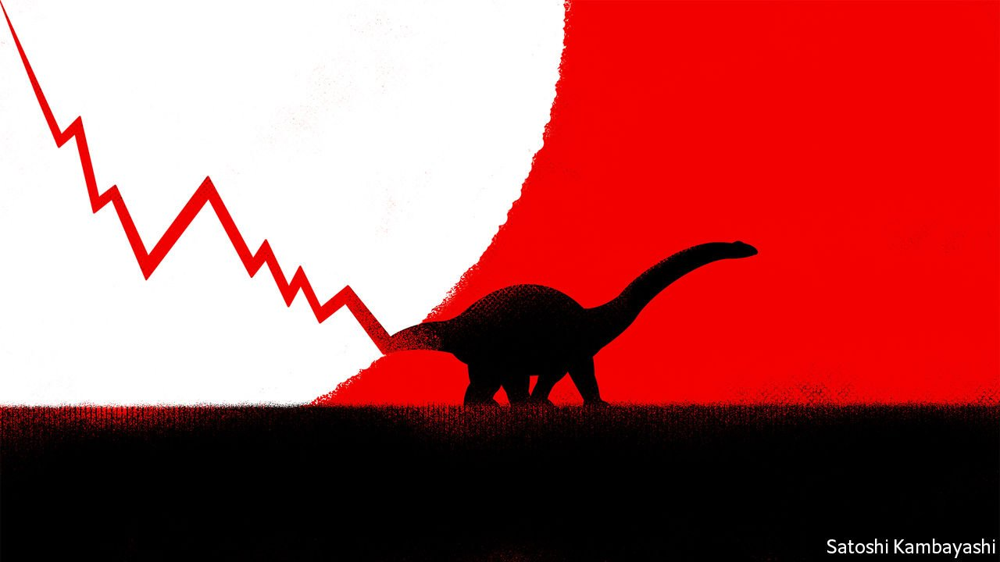

###### Buttonwood

# Why stockmarket jitters have not so far spread to the credit market 

##### Bond-holders tend to be less starry-eyed than stock investors. Still, there are reasons to be watchful 

 

> Feb 4th 2022 

WRITING IN JULY 2007, the fund manager and bubble spotter Jeremy Grantham likened the stockmarket to a brontosaurus. Although credit markets were collapsing around him, share prices remained stubbornly high. It was as if the great sauropod had been bitten on the tail, but the message was still “proceeding up the long backbone, one vertebra at a time” towards its tiny brain. It took its time arriving: America’s S&amp;P 500 index did not reach its nadir for another 20 months.

The story so far this year has been different. Equities, particularly the more speculative ones, have had a brutal start to 2022. The tech-heavy Nasdaq Composite index fell by about 16% in January, before rallying a little. The ARK Innovation fund, a vehicle devoted to young, high-risk tech stocks, declined by 20% last month, and is 53% below its peak in early 2021. Yet even the wilder parts of the credit markets remain comparatively serene. Bank of America’s US high-yield index, a popular barometer for the price of “junk” bonds issued by the least credit worthy borrowers, has fallen by just 2.4% since late December.


The contrast is less surprising than you might think. The value of a stock stems from a stream of potential earnings extending far into the future. By contrast, the value of a bond depends on the issuer’s ability to pay interest until the security matures, and then to find the cash to repay the principal (probably by issuing another bond). That makes bondholders less starry-eyed than shareholders. If a firm wants to change the world, great—but avoiding going broke for a few years is fine, too. So bond markets tend to be less susceptible to swings in sentiment and price. In other words, 2007 was the exception, not the rule.

Moreover, the creditworthiness of junk bonds as a category improved during the pandemic. The difficulties of 2020 hastened the descent of “fallen angels”: companies, such as Kraft Heinz, that were previously rated investment-grade but were then downgraded. Such issuers tend to sit at the safest end of the junk market.

Nonetheless, there are good reasons for investors to be watchful. One is that the shock of monetary-policy tightening could be yet to feed through. The record amount of junk bonds that were issued over the past two years will eventually need refinancing. For American firms such issuance amounted to $869bn, or around half of the outstanding stock of junk bonds, according to Refinitiv, a data provider. Ensuring that firms did not flounder for lack of credit was a key aim of the Federal Reserve’s pandemic-prompted bond-buying. But its asset purchases are soon to end. Borrowers will have to either repay the debt or refinance it in a market that is no longer flooded with liquidity.

More fundamentally, the investment case for high-yield debt has changed as interest rates have declined. Michael Milken, an American investment banker, pioneered the use of junk bonds in the 1980s by arguing that their yields were high enough to compensate investors for the odd default. In that decade, he was right: junk yields averaged 14.5% and just 2.2% of issuers defaulted each year. But the phrase “high-yield” has since lost its meaning. Although central-bank rate rises are on the cards, yields are still anaemic. In America and Europe, average junk-bond yields, of 5.1% and 3.3%, respectively, are well below inflation. The credit market’s resilience amounts to a belief that few of even the riskiest borrowers are likely to go bankrupt. Yet when the yield is in the low single figures, it takes only a handful of defaults to break the investment case.

And borrowers that do default are likely to be in worse financial health, leaving creditors nursing heavier losses. Lender protections have weakened over the past decade, as yield-starved investors chased returns at any cost. Maintenance covenants, which allow lenders to seize the wheel if the borrower’s financial position deteriorates, have long been absent from bonds (and have largely disappeared from private loans, too). Incurrence covenants, which limit borrowers’ ability to issue new debt or pay dividends, have lost their teeth.

Its proponents might point out that bond investors have few attractive alternatives to junk debt. Yields on Treasuries are still low; financial markets expect the Fed’s benchmark rate to peak no higher than 1.8%. But credit markets are priced for a world in which nasty surprises don’t happen and liquidity flows eternal. Those assumptions increasingly look like they belong with the brontosaurus.

Read more from Buttonwood, our columnist on financial markets:

 (Jan 22nd) (Jan 15th) (Jan 8th)

For more expert analysis of the biggest stories in economics, business and markets, , our weekly newsletter.

