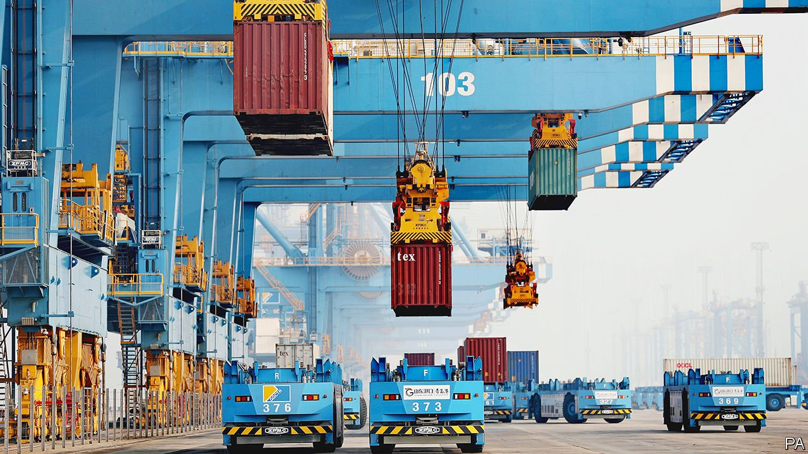
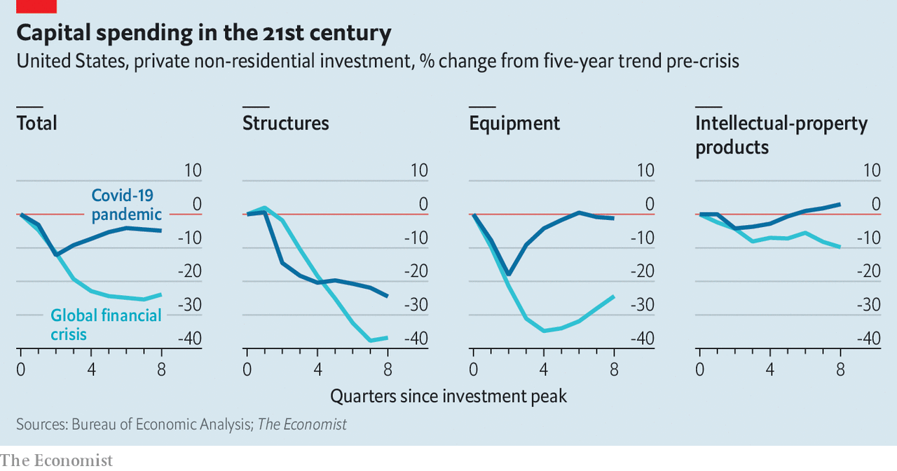

###### The urge to splurge

# Why the impressive pace of investment growth looks likely to endure 

##### Supply chains, technological change and climate targets will all demand more capital spending in the 2020s 

 

> Feb 5th 2022 

FOR YEARS after the global financial crisis the world economy was starved of investment. The aftermath of the covid-19 downturn has been drastically different. In America private non-residential investment is only about 5% below its pre-pandemic trend, compared with a shortfall of nearly 25% in mid-2010, the equivalent point in the previous economic cycle (see chart). The country has enjoyed the fastest rebound in business investment in any recovery since the 1940s, according to Morgan Stanley, a bank. In the rich world as a whole, predicts the World Bank, total investment will have overtaken its pre-pandemic trend by 2023.

 


The lacklustre investment of the 2010s was largely blamed on slow output growth and dismal prospects for the economy. By contrast, the vibrant recovery this time is part of a V-shaped rebound encompassing growth, employment and—less happily—inflation. It helps, too, that investment fell less steeply than it did in 2008-09, even as GDP sank at rates not seen since the Depression. Economies shrank in spring 2020 mainly because consumption disappeared as people stayed home.


Yet the investment rebound is not purely a cyclical bounceback. The changes wrought by the pandemic have necessitated more investment, too. The extent to which such investment continues will depend on whether those changes endure. One feature of the pandemic, for instance, has been soaring demand for everything digital. As a result, investment in computers in America is 17% above its pre-covid trend. Roughly a year ago the Taiwan Semiconductor Manufacturing Corporation announced that it would spend $100bn over three years to expand its chipmaking output. In mid-January 2022 it upped the stakes, saying it would spend $40bn-44bn this year alone. Days later Intel, another chipmaker, said it would invest more than $20bn in two factories in Ohio.

Blockages in the global supply chain for goods have also led to a splurge on new capacity. In 2021 shipping companies ordered the equivalent of 4.2m twenty-foot containers—a record, according to Drewry, a consultancy. Perhaps the archetypal business investment of the pandemic is being made by logistics companies testing whether autonomous cranes can increase throughput at ports and rail terminals.

As the heat of crisis has passed, the pace of the investment rebound has subsided a little. A composite indicator built by JPMorgan Chase, a bank, suggests that global capital spending rose at a underwhelming rate of 2.2% in the fourth quarter of 2021. Economists have recently marked down their forecasts for global GDP growth in 2022 owing to the spread of the Omicron variant of coronavirus and the prospect of tighter monetary policy, both of which might weigh on bosses’ willingness to splash out on risky projects.

There are, however, three reasons why business investment might be stronger in the 2020s than it was in the 2010s. The first is that companies are likely to keep spending on their supply chains as they seek to strengthen and diversify them. During the pandemic many have discovered the inconvenience of distant suppliers shutting down when lockdowns or staff shortages strike: factory closures in Vietnam last year, for instance, imperilled America’s supply of tennis shoes and yoga pants. Firms must also cope with increasingly fraught geopolitics, which increases the chances of tariffs on trade and state meddling. This may not be good news for economic growth, because fragmentation means duplication and inefficiency. But it does mean tying up more capital.

The second reason to expect more investment is the growing optimism about the potential of new technologies to boost productivity growth. Not long ago economists fretted that the world was running out of useful ideas. Yet firms are increasingly betting on technological progress. Intellectual property now makes up 41% of America’s private non-residential investment, compared with 36% before the pandemic and 29% in 2005. In 2021 the big five technology firms—Alphabet, Amazon, Apple, Meta and Microsoft—alone spent $149bn on R&amp;D.

Impressive technological advances are everywhere, from synthetic biology and the “messenger RNA” vaccines with which the world is battling covid-19, to areas such as virtual reality and decentralised finance. The advances in some frontier fields are headline-grabbing. In December Synchron, a medical-technology firm, revealed that a man with one of its chips implanted next to his brain’s motor cortex had sent a tweet just by thinking it. In January surgeons announced that they had successfully implanted a pig’s heart into a man for the first time.

The third force driving investment higher is decarbonisation. A number of countries, together making up 90% of the world economy, have pledged to reduce carbon emissions to net zero over the coming decades in order to fight climate change. If that goal is to be achieved, the world will need everything from electric-vehicle charging infrastructure to battery storage and energy-efficient housing.

Punters are pouring money into green-tinged investment funds, the assets of which amounted to $2.7trn in the fourth quarter of 2021, according to Morningstar, a data provider. Global investment spending on the transition away from fossil fuels reached $755bn last year, about half of which was spent on renewable energy, according to BloombergNEF, a research firm. Spending on electric vehicles has risen particularly quickly, by 77% since 2020 to $273bn, helped along by rapidly shifting consumer preferences and big orders from delivery and car-rental companies.

If net-zero targets are to be met, however, then the green-investment boom still has a long way to run. The Office for Budget Responsibility, Britain’s fiscal watchdog, estimates that achieving the country’s target by 2050 requires investment worth about 60% of its GDP today, three-quarters of which would have to be stumped up by the private sector. If that share were to apply across the rest of the rich world too, then its need for private-sector green investment would exceed $20trn at present values. Other estimates of what is needed are higher still.

An investment boom is hardly nailed on. The mass upheaval of supply chains is still a subject that is more often talked about than seen in the statistics. There were plenty of notable advances in the previous economic recovery, which began only two years after the launch of the first iPhone in 2007. Yet investment remained tepid (perhaps because many new technologies seem not to need much capital). Net-zero targets could always be missed.

But the pay-offs to R&amp;D investment, at least, may be rising. In a recent research note Yulia Zhestkova of Goldman Sachs, another bank, found that in America between 2016 and 2019 there was a positive correlation between an industry’s investment in intellectual property and its labour-productivity growth. It would not take much of a productivity revival to significantly boost the outlook for growth, which is being weighed down by population ageing. So-called total factor productivity growth, which measures increases in GDP that cannot be attributed to more capital or hours worked, averaged 1.2% a year between 1880 and 2020, notes Ms Zhestkova. By contrast, the figure was only about 0.5% in the 2010s. Simply returning to the historical average would create the prospect of a larger economy in the future, giving firms yet another reason to invest. ■

For more expert analysis of the biggest stories in economics, business and markets, , our weekly newsletter. And for more coverage of climate change, register for , our fortnightly newsletter, or visit our 

