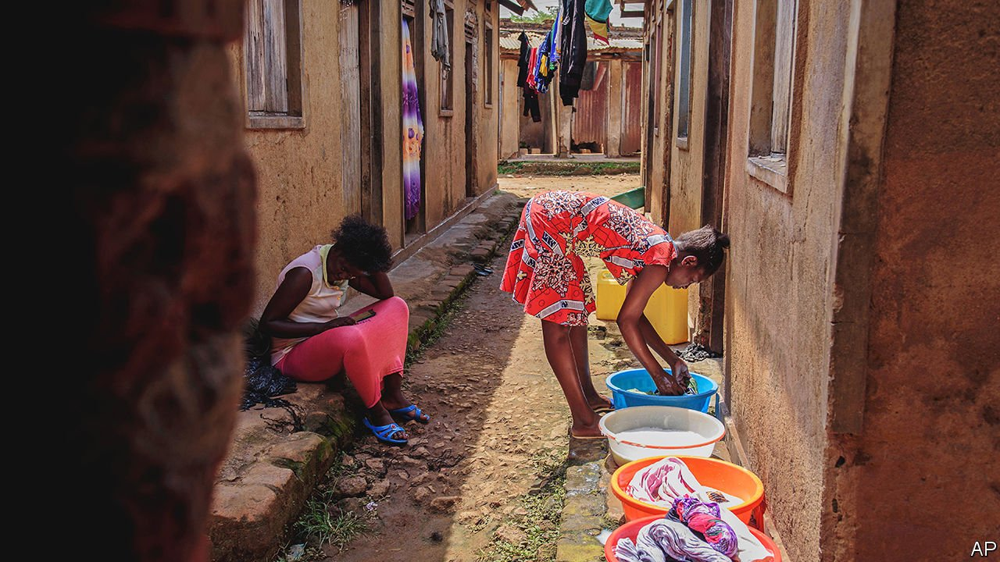
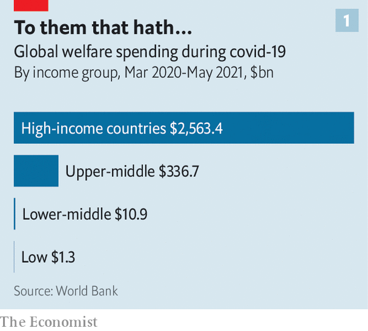
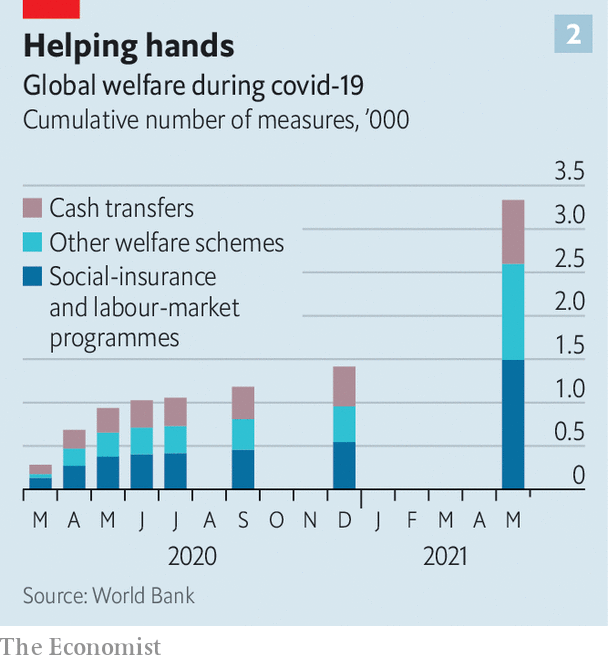
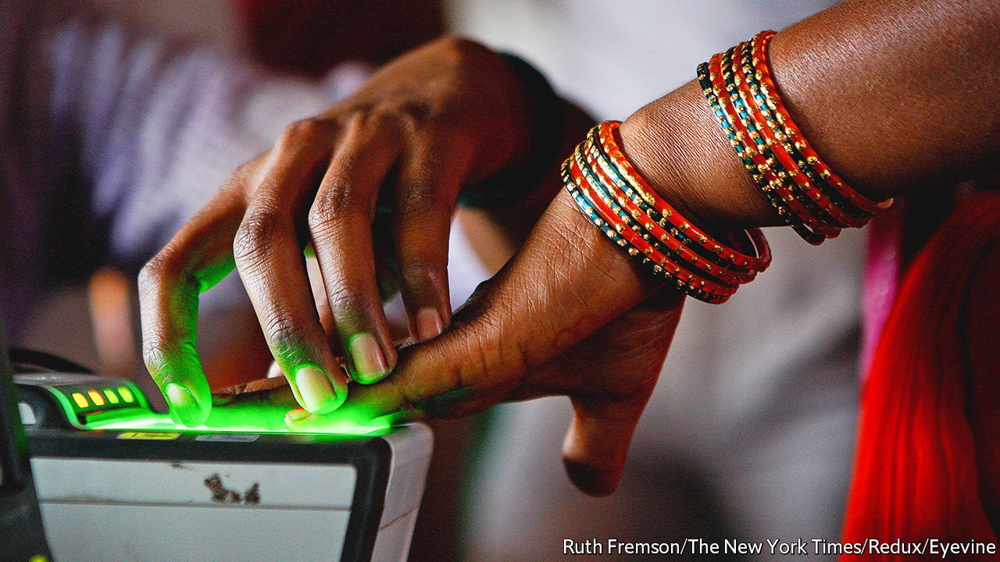

###### Just keep us alive

# Covid-19 has pushed governments to find new ways to help the poor 

##### Even some of the least developed countries are experimenting 

 

> Feb 4th 2022 

FRADIA BULAGE, a school nurse in Kampala, Uganda’s capital, says the 100,000 shillings ($29) the government gave her last year through a scheme to help the country’s poorest 500,000 households was not nearly enough. The one-off payment amounted to about a week of her pre-pandemic salary. Her school, like all Uganda’s, had been closed for the best part of two years, due to covid-19 lockdowns, and reopened only last month. Strapped for cash, she stopped paying utility bills. Instead of turning on the tap she bought water by the jerrycan; for light she relied on candles. Her mother, who lives in a village, sent cassava in the hope of saving Ms Bulage’s household from hunger.

Still, Ms Bulage is luckier than many Ugandans. Barbra Nakyeyune, who runs a liquor shop nearby, was badly hit by the dusk-to-dawn curfew under covid, so she too registered for the handout. “But we never got any money,” Ms Nakyeyune says. “Not even a message apologising.” She was afraid she wouldn’t be able to afford the fees for her children’s education when schools reopened.


Nearby, in an office piled high with bundled documents, Geoffrey Kirabira, the local boss at the lowest rung of government, explains what went wrong. It was a Thursday evening, he recalls, when he was told to draw up lists of beneficiaries by Monday. Who should get help? Uganda has no central database whereby the poorest of the country’s 46m people can be identified. “Who do you leave out?” he asks.

Around the world, covid and the restrictive measures that have been imposed to limit its spread pushed about 110m people into extreme poverty in 2020, says the World Data Lab, a Vienna-based firm funded by the German government that collates statistics from UN agencies, the IMF and the World Bank. It calculates the figures to be around 30m in sub-Saharan Africa, 9m in Latin America and 42m in India.

Covid has thrown hosts of Ugandans, even from the middle class, into difficulties. Teachers, waiters, drivers and traders have all had lives shattered by the virus. “All are needy,” says Mr Kirabira. The distribution of cash handouts, in any case derisorily small, was “haphazardly executed”, he concedes. The payments, even if they had been fairly administered and well targeted, would have reached only the poorest 5-6% of households. Giving money to everyone would have been simpler, but far too expensive. More than a third of Ugandans live in extreme poverty (that is, on less than $1.90 a day), according to the World Data Lab.

The Ugandan state collects about 400,000 shillings ($110) of revenue per person a year. Even with the addition of loans and foreign aid, its budget is meagre. To give every adult a cash transfer of 100,000 shillings would have cost more than the entire annual health-care budget. Uganda has had a relatively low incidence of covid, with around 162,000 cases and 3,500 deaths reported so far. But the true figures are likely to be far higher; barely 4% of the population has been fully vaccinated, according to the Johns Hopkins University’s covid tracker.

Existing social-protection schemes are paltry and narrowly targeted. At the start of the pandemic the government bolstered a grant to those over 80; after a pause for modifications, it now issues two lump-sum payments a year rather than monthly handouts. Such programmes, as in many parts of the poor world, require recipients to have national identification cards. Millions of Ugandans do not.

Some local officials simply registered their friends instead of the neediest. Opposition politicians complained that the ruling party benefited itself. Some bigwigs suggested that giving people free cash would make them lazy.

Uganda’s tribulations illustrate many of the puzzles over how to save the very poorest from destitution and even death. Should schemes concentrate on the distribution of free food, which often skews markets and makes peasant farmers even poorer? Or is the straightforward transfer of cash a more reliable way of averting disaster, albeit in the short term?

If cash is best, how should it be distributed—in wads of paper money, by vouchers, or through mobile-phone payments, such as Kenya’s m-pesa system? And how should the very poorest be identified and targeted, when millions of citizens, especially in sub-Saharan Africa, eke a living entirely outside central databases.

Worldwide some 2bn workers who make ends meet doing informal jobs such as hawking snacks and cleaning homes saw their livelihoods shrivel overnight, as social distancing and lockdowns came into force. As covid hit everyone more or less at once, many millions of people could no longer fall back on their usual last resort, such as loans from family and neighbours, or remittances from relatives abroad.

But the World Bank, among others, spies some glimmers of improvement. Poverty may now be falling slightly again, as governments distribute vaccines and economic activity resumes. Some poor countries have provided emergency assistance to the poor with unprecedented speed. In the first year of the pandemic the World Bank counted more than 3,300 new welfare programmes, roughly a quarter of which have been in poor countries.

 


All told, the world’s governments have spent almost $3trn on covid-related welfare schemes between the start of the pandemic and May last year, at least four times as much as during the global financial crisis of 2008-09. The vast majority of the spending—87%—was in rich countries. The very poorest ones accounted for just 0.05% (see chart 1).

But even governments of similar means have varied in their generosity. Latin American ones spent $90bn on emergency transfers in 2020, falling to $45bn in the first ten months of 2021. Argentina has lavished 5.3% of GDP on its struggling citizens. Mexico, by contrast, has been relatively stingy, shelling out less than 1% of GDP in extra spending and revenue forgone, according to the IMF.

Some poor-country governments have built new welfare programmes from scratch. Togo, for example, has been praised for getting a digital cash-transfer scheme off the ground in just ten days. Citizens could register for the scheme with a mobile phone. Many of Togo’s poorest people work in informal jobs outside the tax system. The government identified them by perusing a recent voters’ register, which included information on what people do and where they live, then created mobile wallets, into which it began depositing about $20 a month. For a dirt-poor country of under 9m people with a GDP per person of only $2,223 a year even after adjusting for the low cost of living, that is quite an achievement.

Uncowed by cash

Other African countries have expanded cash-transfer schemes with rare speed. One in Angola went from covering about 5,800 people before covid to more than 7.7m. In Madagascar coverage rose from 192,000 of its 28m people to about 2m.

 


Since long before the virus struck, development economists have argued about the best methods to raise the poor out of poverty, not to mention how to rescue them in times of emergency. Brazil’s Bolsa Família, which has been credited with reducing the country’s poverty rate by a quarter, has helped build a consensus that cash is generally the most efficient way to help the poor without skewing markets, as handouts of food and guarantees of employment often do. At the same time, subsidising staples, such as bread and rice, or fertilisers and essential fuels, such as petrol and kerosene, is increasingly frowned upon, partly because this cossets the middle class as well as the poor, and so punches big holes in national budgets.

Bolsa Família (now renamed) is a conditional cash-transfer scheme that requires recipients to show that their children get regular health check-ups and go to school. From 2003 to 2010 it grew into the largest such scheme in the world, with more than 30m Brazilians escaping poverty by 2014 out of a population that then numbered 203m. The benefits have been paid mainly to women, by a chip card.

When the virus struck, Brazil’s populist right-wing government under Jair Bolsonaro announced that it would pay 600 reais (then worth $112) a month to 68m Brazilians, a third of the population, in what it called auxílio emergencial (emergency aid). Single mothers got twice as much. Including job-retention schemes, the overall cost of assistance was 8% of GDP. The government has since pared its generosity, but by last October 35m Brazilians still benefited..

A number of governments in Africa, even though they have comparatively tiny economies from which to fund such payments, have been inspired by Brazil’s example. Even before the pandemic they had made big steps towards setting up welfare programmes. In 2013 Senegal started to distribute cash to the poorest households in a scheme that covers about 20% of the population of 17m. Tanzania’s main welfare policy, known as the Productive Social Safety Net, created in the same year, now helps over 1m households. Recipients earn extra cash as labourers on public-works projects or for ensuring that their children go to school and health clinics. Uganda is piloting a cash-for-work scheme in the north-western town of Arua.

One lesson from the pandemic is that cash, however, is not always a panacea. It is of limited use when shops are shut or supply-chain disruptions send the price of basic goods soaring. Housewives in the slums of New Delhi have another worry: when they are given food, they tend to use it immediately to feed their children, but if the government hands out money, landlords and creditors immediately come knocking. Besides, cash handouts can take a long time to reach the very poor. One study of 53 low- and middle-income countries found it took an average of 107 days from the first reported case of covid until the first payments were made.

Even when cash-transfer programmes are up and running in poor countries, the funds on offer are usually measly. Many governments are limited in what they can spend because they are heavily in debt—some on the brink of default—or have puny tax bases. Since covid hit India, its government has made three rounds of cash payments into 200m women’s accounts. Each payment, however, was only 500 rupees ($6.70), barely enough for a few meals for a family in a city like Delhi. In the Republic of Congo the cash transfers can be as low as 5,000 CFA francs ($8.56) a month. New cash-transfer schemes worldwide have lasted on average for just four months.

Just get it there

However miserly or generous handouts are, there is still the problem of distributing them. Technology, naturally, can speed up delivery. Within months of the virus’s arrival in Thailand, the government had managed to register 23m farmers and informal workers, over half the working-age population, for a new scheme. Around 6m of South Africa’s 59m people registered online for a pandemic-aid programme within a few weeks of its inauguration.

Some governments continue to rely on low-tech ways to distribute money. But the pandemic revealed new flaws with that. The Peruvian authorities moved fast to proffer emergency cash when the virus hit but eschewed digital transfers. The long queues of people at branches of the state bank, however, rapidly turned into super-spreaders. Peru had one of the world’s highest death rates from covid.

Other new cash-transfer schemes, especially in sub-Saharan Africa, rely on digital payments. Yet these often exclude the neediest. Over half the world’s population does not use mobile internet. Around 6%, mostly in poor countries, live in areas without any broadband coverage. Getting online can be much too expensive for those living in penury.

The very poor, especially women and the old, tend to lack the most basic tech skills. In New Delhi, Amrita Johri of Satark Nagrik Sangathan, a citizens’ group, spent days helping poor families sign up for emergency food handouts during India’s long lockdown. The process involved filling in a form online, getting a one-time password sent to a mobile phone, photographing the beneficiary’s government identity card, then converting it to the right file format before uploading it. This can baffle even a boffin, says Ms Johri.

In another Delhi slum a woman called Kandadevi, who knows neither her age nor family name, has paid middlemen hundreds of rupees to help her register on Aadhaar, India’s pioneering biometric identity system, to help her get government assistance and a vaccination. Another poor woman, Arpana Haldar, cannot get food handouts for her family because she, like everyone else living in similar shacks, has no proof of address.

Some countries have been been adept at finding ways around such obstacles. Namibia’s government let up to ten applications for emergency aid to be submitted through a single sim card, so that households without a mobile phone could borrow from neighbours. South Africa’s said it would send volunteers into poor townships to help people apply for aid.

In any case, it is exceedingly hard for governments to identify precisely who most deserves help, however delivered, especially when the pot is small. Some development specialists are against “poverty-targeting”, whereby governments try to identify the very poorest by means-testing. Shahra Razavi of the International Labour Organisation (ILO) says unduly tough eligibility rules “erect barriers that people have to jump through to get peanuts at the end”.

Technology can help with selecting beneficiaries. Togo’s government has expanded cash handouts beyond informal workers as lockdowns have been lifted. It has used whizzy methods to find needy households, such as satellite imagery to identify the poorest communities based on population density. It has used algorithms and anonymous mobile-phone records to assess individuals’ consumption and thus how poor they are.

But narrowly targeting programmes can be expensive. The ILO reckons that the cost of selecting beneficiaries soaks up between 10% and 15% of the value of the handouts, not counting any waste from graft. And even then, the administrators often miss the worst off in poor countries, like Uganda, which have incomplete tax and payroll databases.

Some poor governments try to simplify things by offering benefits for particular categories of people. Many countries, such as Bolivia, give specific handouts to pregnant women, the elderly or the disabled—all easily identifiable groups. Others have set up “self-targeted” schemes, such as India’s rural employment guarantee, whereby gruelling manual work is offered with low pay, so there is little risk of the well-off signing on. Last year this provided paid work to 112m people, many of whom would otherwise have been destitute.

 


All this heartening experimentation and innovation encompassed by new welfare schemes in the poor world, however, does not fix their fundamental flaw: there is not enough money behind them. The amounts of cash dished out in the poorest countries, mainly in Africa, remain minuscule. Whereas rich countries spent $847 per person to provide extra benefits, over the first year or so of the pandemic, the World Bank reckons, 17 of the poorest countries spent a pitiable $4 per person.

Beware of cheery statistics

Regional data often disguise this grim reality, since the poorest countries tend to be bundled up statistically with middle-income places. In Africa, for instance, Egypt, Morocco and South Africa skew the numbers on average welfare spending. The World Bank concedes that its estimates, though probably the best available, have gaps. It has full financial data for only about 15% of the welfare programmes it tracks. And its sample includes only 33 out of Africa’s 48 sub-Saharan countries. Most of the missing ones are so poor they struggle to collect proper data.

Still, it is good that governments in countries blighted by poverty have been pondering how to build welfare systems, in some cases virtually from scratch. If covid has prodded them into thinking more flexibly, it is a rare benefit of the dreadful plague. Let it be seized. ■

Dig deeper

All our stories relating to the pandemic can be found on our . You can also find trackers showing ,  and the virus’s spread across .

