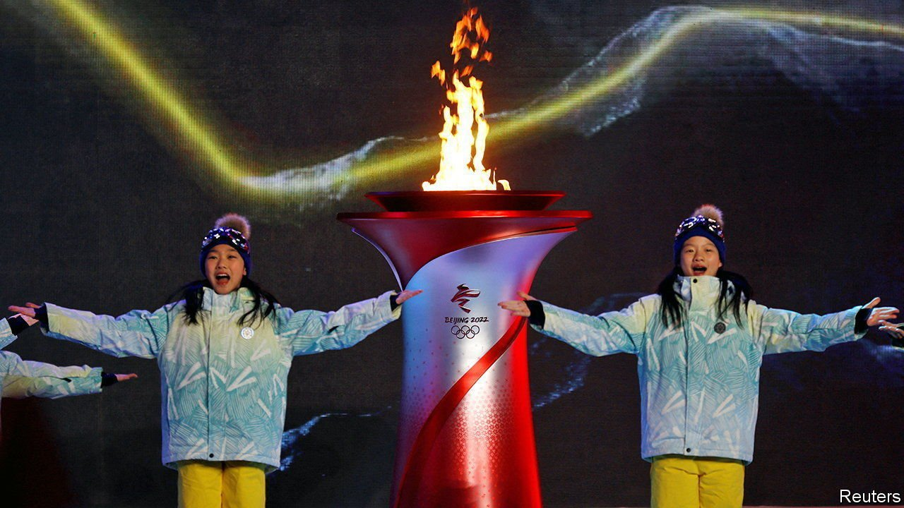

###### An icy chasm

# Beijing’s Winter Olympics symbolise a world divided 

##### The West has rightly concluded that buttering up China will not make it nicer 

 

> Feb 3rd 2022 

“TOGETHER FOR a shared future” is China’s wishful motto for the Winter Olympics, which will formally begin with fireworks and dancing at a ceremony in Beijing on February 4th. Officials say the slogan means humanity should work in harmony to conquer hardships such as the pandemic and its economic fallout. China’s state-run news agency says the games will “break down barriers and prejudices, and illuminate the way forward”. Sadly, they will not. The event symbolises a world divided by politics and the virus, and a China turning inward.

No leader of a big Western power will attend the games. The pandemic has provided some with an excuse for staying away. But the main reason is the scale of the repression that Xi Jinping has unleashed since he took power in 2012. In Xinjiang Mr Xi has sent about 1m people, mostly ethnic Uyghurs, to camps to “cure” them of “extremism”—a euphemism for stamping out their culture and Muslim faith. In Hong Kong he has crushed a liberal society, turning dissent into a crime. His security forces have kept a chokehold on Tibet.


In December America said that it would not “contribute to the fanfare of the games” by sending official representatives. Rightly, a few other Western countries have followed suit. But Russia’s president, Vladimir Putin, does not share their scruples. As tensions mount over Ukraine, he will enjoy the limelight as the most important guest and Mr Xi’s “best friend”.

How the world has changed since China last hosted an Olympic event—the Beijing summer games of 2008. The West worried about China then, too. The country had been waging a fierce campaign to crush unrest in Tibet following widespread protests there. Human-rights groups were calling for boycotts. But many Western officials still believed that engaging with China might nudge it towards acceptance of the Western-led global order, or at least help tame the rise of anti-Western nationalism. America’s president, George W. Bush, and his French counterpart, Nicolas Sarkozy, attended the opening ceremony.

A slippery slope

Their gesture yielded nothing. China has grown ever more bristly in its relations with the West. Mr Xi has fuelled an ugly nationalism and clearly wants a China-centric order. The motto he has chosen for the winter games alludes to this. It is shorthand for one of his favourite catchphrases, about building a “community with a shared future for mankind”. That means a world in which countries co-operate with China regardless of its politics. Many in the West abhor the idea. Negative views of China have grown to record highs. Mr Xi’s call for Olympic togetherness is, in effect, a way of telling Westerners to get over it.

State media suggest that the opening ceremony is unlikely to be such a full-throated celebration of China’s greatness as was seen at the launch of the games in 2008, when thousands of costumed troops took part in grandiose performances. This time Mr Xi has stressed the need to keep things “simple”. But for athletes and others involved in the games, they will not be. The most dramatic symbolism of the event will not be found in the razzmatazz of the start or finish, but in the extraordinary lengths to which China is going to keep the SARS-CoV-2 virus at bay.

No foreign visitors, other than invited guests, have been let into China to watch the games. Tickets are not being sold to people in the country. Fearful of recent outbreaks of covid-19, the government says it will “organise” people to attend. They may clap, but not shout. The athletes, their support staff and journalists are being kept in a “closed loop”, isolated from the local community. Dozens of them are testing positive.

Protections make sense when admitting 30,000 foreigners into a country that lacks a highly effective vaccine (because it has not approved foreign jabs), and whose population has acquired no immunity from infections. But they also show how far China is diverging from the rest of the world in its handling of the pandemic. China is excoriating other countries trying to co-exist with the virus for failing to protect human lives. It sees its zero-covid approach as proof of its own system’s superiority.

The world will watch a frosty games. It will be a gripping athletic spectacle, no doubt, but it will be overshadowed by a bigger competition—a bitter, ugly one between China and the West. That struggle will be the winter games’ shared future. ■

