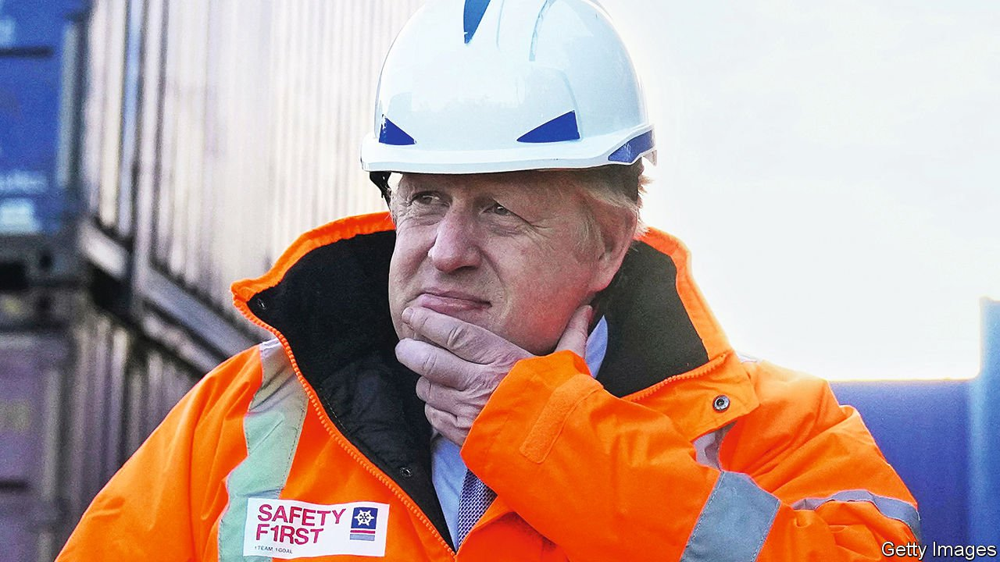

###### Wrong man, wrong plan

# The British government’s white paper on “levelling up” falls short 

##### It fails to devolve enough power and money 

 

> Feb 3rd 2022 

AFTER A MONTH of rows about cake and Prosecco—who consumed them; who invited whom; who knew—Boris Johnson has been badly damaged. Police are investigating a dozen lockdown-busting gatherings, some in his offices and residence. A report by a senior civil servant, published on January 31st, was gutted of detail in order to prevent that investigation being compromised, leading to claims of a cover-up. Despite it all, Conservative MPs seem inclined to wait until after local elections in May to decide whether to depose their prime minister.

No wonder Mr Johnson is desperate for a policy relaunch to knock “Partygate” off the front pages. On February 2nd his government released a  on its big idea for post-Brexit Britain: decreasing regional inequality, or “levelling up”. Mr Johnson is right to sense that his government should be judged by whether this programme succeeds: it is setting out to deal with one of Britain’s most pressing problems. Sadly, the proposals fall short.


Britain is highly geographically unequal. Outside London and the south-east (and a region around Edinburgh) lies a country where wages, literacy and life expectancy are lower, and unemployment and rates of illness higher. It is as if America’s rustbelt or the former East Germany were home to half the population. Average life expectancy for men in Blackpool is 74.1 years; in Westminster it is 84.7. In Barnsley 15% of disadvantaged 18-year-olds go to university; in London 45% do. The ratio between GDP per person in Britain’s richest places and its poorest is 4.8—the biggest of any OECD country. Voters who wanted to leave the European Union were animated by many desires and grievances. But some expressed understandable rage at being left behind and ignored by a distant, self-serving elite.

The work of Michael Gove, one of the government’s most capable ministers, the latest proposals identify 12 “missions”, with numerical targets attached, to be undertaken between today and 2030. They range from increasing healthy-life expectancy and improving literacy and numeracy in what the white paper calls “Britain’s forgotten communities” to rolling out high-speed broadband and encouraging “pride in place”—that is, feeling good about where you live. New directly elected county leaders will be created, and given powers in a “devolution revolution”. By 2030 everywhere in England could in theory have the sort of powers now wielded by metropolitan mayors.

Targeting outcomes is welcome: this government has focused more on inputs (this many new nurses, that many new schools). And more devolution is sorely needed. Measured by where tax-raising power lies, Britain is the most centralised country in the G7. Decision-making is also tightly held, with the Treasury overseeing almost all infrastructure. England’s most powerful mayor, Sadiq Khan, takes dictation from Whitehall on how to balance Transport for London’s budget. Andy Burnham of Manchester, the second-most-powerful, is locked in a battle with central government about the design of a railway station.

Look more closely, and the plans are based on a caricature of Britain. The biggest cities voted to stay in the EU in 2016 and for a Labour government in 2019. Not coincidentally, ministers often talk as if the splits in wealth, well-being and esteem map onto the same pattern. They do not. In some regions, both cities and their hinterlands are rich; in others, both are poor. The north of England will not succeed if Greater Manchester does not; the West Midlands depends utterly on the Birmingham metropolis.

What ails poor places will not be fixed by giving counties a bit of power and cash. The control over how money is raised and spent needs to be pushed out of London—and to handle such powers a region must be large. Better infrastructure, both within cities and connecting them to surrounding areas, is crucial to regional development. But how can the planned new phalanx of mayors and county authorities transform their regions if they cannot even plan transport links?

The intricacies of the white paper are not the only cause for scepticism. An ambition as big as erasing Britain’s patterns of deprivation will require a leader of unusual calibre. The job will take an ability to unite the country in a common cause and to inspire it with a grand vision. It will also take a mastery of policy detail and the discipline to be steadfast when things go awry, results are slow to appear and centralisers cling to power. Mr Johnson’s lockdown shenanigans, dissimulation and U-turns are no mere obsession of the chattering classes. They are evidence that this Herculean task is very probably beyond him. ■

