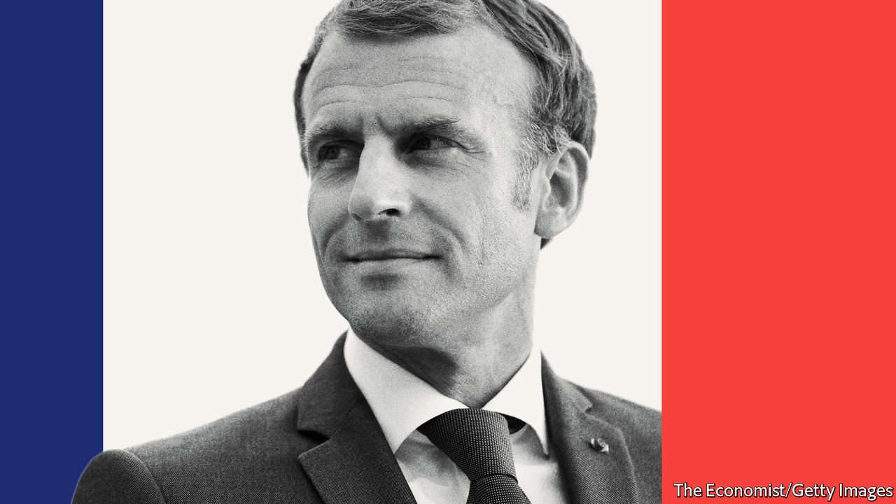

###### Statistically significant

# The Economist’s election modelling should cheer Emmanuel Macron 

##### France’s president has a 79% chance of keeping his job 

 

> Feb 5th 2022 

MOROSITÉ, MALHEUR, dégagisme: these are gloomy times in France. Covid-19 may be on the way out, but it still hampers daily life and the smooth running of the economy. Inflation, driven by disease-induced supply-chain kinks and spiking natural-gas prices, threatens household budgets. Russia and Ukraine are on the brink of war. Small wonder that only 17% of the French think 2022 will be better than 2021, and that some 45% intend in April to cast their first-round vote for a presidential candidate from the political extremes. Yet despite it all, President Emmanuel Macron has a four-in-five chance of winning re-election, according to  that we launch this week.

Our forecast is the latest in a series of statistical models we have built that use data about the reliability of past polling to analyse elections still under way. In America’s presidential contest in 2020, for example, we gave Joe Biden a very high chance of winning even if the polls were off by more than usual. In Germany’s elections last year we calculated a fair chance of success for the Social Democrats, who now lead the government there. And in 2017 we found that Mr Macron was extremely likely to defeat Marine Le Pen even though pundits maintained she had a good chance of prevailing. In short, our forecasting models have proved their worth.


On February 2nd our model, which will be updated daily, gave Emmanuel Macron a 79% chance of victory. This figure will change as the campaign unfolds. We are more bullish than international betting markets, which rate his chances at around 70%. Mr Macron’s comfortable lead in first-round polling suggests only an 8% chance of his being knocked out. And he enjoys a solid advantage over all of his second-round opponents in head-to-head polling, even against Valérie Pécresse, his closest challenger in such match-ups. Against his most likely opponent, Marine Le Pen, our model suggests an 88% chance of victory in round two. Because this is the work of statisticians, not magicians, we are happy to .

 


What the statistics do not explain is the politics behind the polling numbers that are the raw input for our model. In large part they reflect Mr Macron’s success at straddling the centre-right and the centre-left in France, drawing into his government former Socialists and former Republicans alike. The extremes are splintered, which also helps him. And the president has, improbably enough, benefited from covid, which his government has handled reasonably well. The pandemic has engendered a huge expansion of state spending at a time when some of his labour-market reforms might have caused more tensions. He has also used the pandemic as an excuse to shelve pension reforms that might have hurt him. Mrs Pécresse has yet to lay out her full platform, but so far she has not put forward policies that are substantially different.

Even if the election seems almost a formality today, that could easily change. Mrs Pécresse could well beat the president if she can get to the second round. We currently give her only a 32% chance of getting through, but that probability will change as the campaign ramps up. Besides, a 79% chance of success is by no means a certainty—as anyone would attest who has contemplated a game of Russian roulette, where the odds are even better.

This election is worth watching closely. Mr Macron is bidding to be the leader of the European Union, which has a vacancy to fill. Olaf Scholz, Germany’s new chancellor, seems reluctant to take up Angela Merkel’s European mantle. Italy has  by avoiding an early vote, but still faces uncertainty. Britain is gone. France matters more than for a long time. It matters greatly who is in charge. ■

For more coverage of the French election, visit our dedicated 

