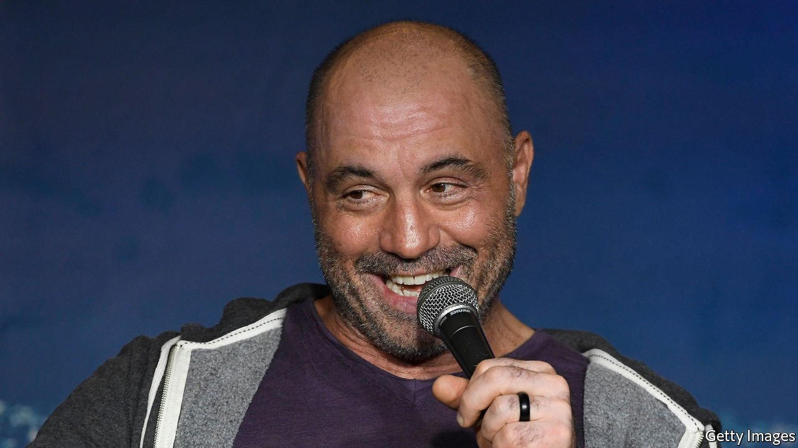

###### Free speech’s new frontier

# What Spotify should learn from the Joe Rogan affair 

##### The content-moderation wars have come to audio 

 

> Feb 5th 2022 

WHEN NEIL YOUNG and Joni Mitchell saw an injustice, they used to attack it by writing protest songs, taking on racism in the “Southern Man” and the Vietnam war in “The Fiddle and the Drum”. Today, the two musicians prefer to speak out by pressing the mute button. The pair have , the world’s biggest music streamer, in protest at “The Joe Rogan Experience”, a podcast that gave airtime to anti-vaxxers. Spotify has decided to hang on to its podcaster.

Mr Rogan is a bigmouth and he has been wrong about covid-19 and . Yet he has broken no laws, nor even, Spotify says, the company’s own content rules. As a matter of principle, Mr Rogan should be free to speak. As a commercial question, Spotify has made a publisher’s gamble that his popular show will attract more customers than it repels. The fact that share prices in Spotify and other platforms such as Meta, the parent of Facebook, are tumbling because of slowing growth underlines how that gamble is, in the most literal sense, Spotify’s business.


But the dispute points to a trickier emerging problem. Most of the 3.2m podcasters on Spotify are not like Mr Rogan, who sold his show to the company in 2020 for a reported $100m. The vast majority are amateurs, uploading their shows to Spotify’s platform as easily as they would to a social network. Likewise, most of the tens of thousands of new songs uploaded to Spotify every day are recorded in bedrooms and garages. The result is that the content mix on audio platforms is starting to look less like the curated library of Netflix and more like the infinite hotch-potch of YouTube. Unlike other social networks, however, audio platforms have little experience in moderating content.

They need to learn fast. The vaccines bust-up is their first taste of an argument that other social networks have grappled with for years and which is now coming to audio. On the one hand, most consumers want protection from the most harmful content, the best example being the incitement to violence, which even America’s First Amendment condemns. Facebook was used to foment genocide in Myanmar: one day audio might be, too. On the other hand, few want tech executives to become censors. Plenty of good music features bad language, disturbing ideas and violence. Some podcasts will stoke controversy. Free speech must be .

The starting point is transparency, which the audio platforms sorely lack. Spotify published its “platform rules” only following the Rogan explosion. Apple, the , has content guidelines for podcasts but a rough style guide for music. Amazon, the third-largest, has published even less in the way of rules. And whereas Facebook and co release regular reports on what content they have taken down and why, the audio streamers are opaque. Amid the Rogan crisis, Spotify casually mentioned that it had removed 20,000 other podcast episodes over covid misinformation. What else is it taking down? No one knows.

Liberals are rightly wary of more moderation online. Count us among them. But clear, predictable rules can protect speech as much as containing it. Rules determine not just what is banned, but also help defend what is allowed. Facebook’s arm’s-length “oversight board” routinely orders the social network to restore deleted posts, if it determines that they fell within its rules. The social networks are far from perfect, but rules that are open to public scrutiny can gradually be improved on.

By contrast, the failure to spell out what is and isn’t allowed risks having a chilling effect, in which people steer clear of controversy. Amateur podcasters may choose not to risk debating the efficacy of vaccines, for example, knowing that 20,000 others have been deleted for overstepping invisible lines drawn around the subject by an unpredictable censor. Worse, the lack of well-defined rules encourages an ongoing free-for-all of the sort seen this week, in which critics hope that by withdrawing their business or shouting loudly enough, they can force companies to cancel acts that they disapprove of.

With his Spotify contract, Mr Rogan is not your average podcaster. But the dispute his show has started should be seen as a warning to Spotify and its fellow streamers of wider arguments that lie ahead. Facebook, Twitter and other social networks have long been the focus of fury over what kinds of speech they do and do not allow. As platforms like Spotify open their gates to more user-generated content, the same free-speech battles are coming to audio. Streamers should get their rules ready now, and prepare for the next, inevitable explosion. ■

