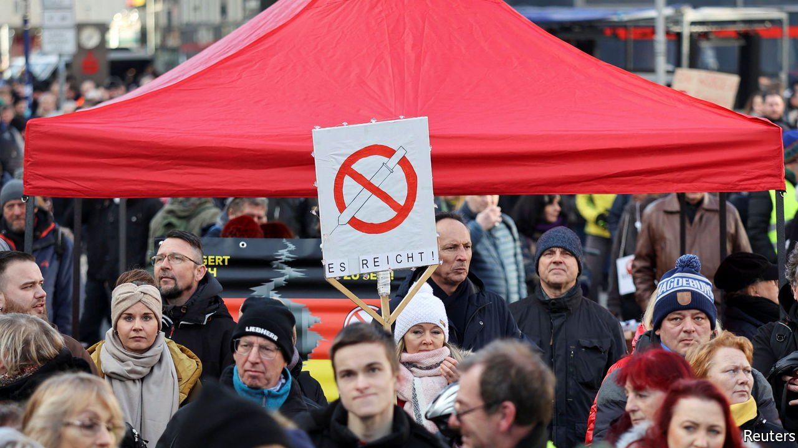
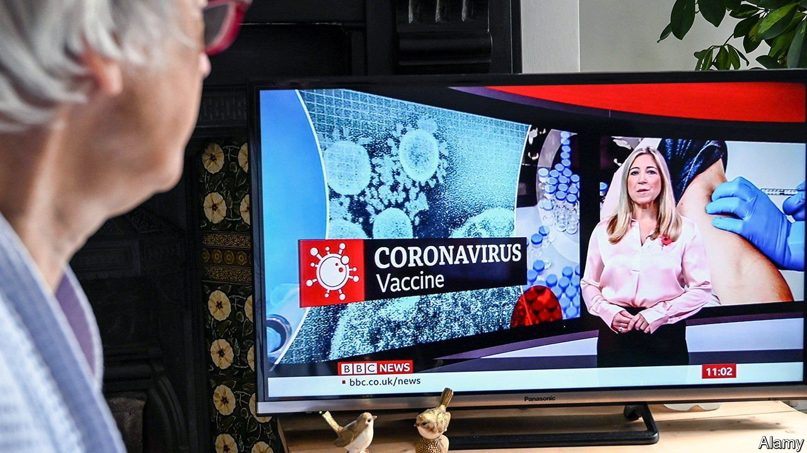
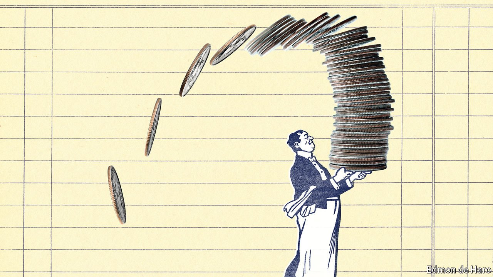

###### On vaccine protests, the BBC, curling, quadratic voting, tipping

# Letters to the editor 

##### A selection of correspondence 

 

> Feb 5th 2022 


Let’s be reasonable

I am a big fan of The Economist’s accurate reporting and liberal values, but I was displeased to see you refer to “anti-vax protests” in Austria and Germany, describing them as “fuelled by the far-right” (“”, January 22nd). You should have a better understanding about why some people are frustrated with covid-19 measures.


The vaccines have saved many lives. I think that getting the vaccine is the best decision for your health as well as other people’s. That said, I want to make the decision on whether I get vaccinated (which I have) after speaking to my doctor and doing my own research. It upsets me greatly that government officials want to make this decision in my stead through compulsion. And it is unclear where the line will be drawn once government has decided in effect to force adults into taking medication. I am in Germany being coerced into getting a booster shot. I am a young person. Government mandates cannot be fine tuned to fit all of us.

Many scientists and lay people have legitimate concerns over governments’ obsession with covid over anything else. Most people protesting in Austria and Germany are not anti-vax, but anti-coercion. They do not want government to micromanage their lives, for example deciding that meeting nine people outside is safe but 11 isn’t. I do not want to be dismissed as simply “anti-vax”.

JOSE GARRIDO RAMAS

Machine-learning scientist

Berlin

The word vaccine does indeed derive from the Latin for cow (, January 1st). But it was not named after a treatment for cowpox. Live cowpox was the vaccine itself. Edward Jenner infected a boy first with cowpox and then with the much more deadly smallpox (variola). Luckily for Jenner, us, and the boy, he survived.

BENJAMIN JOHNSON

London

 


Britain’s public broadcaster

Winston Churchill’s suspicion that the BBC was “run by reds” (“”, January 22nd) went back to what he thought was its unduly impartial coverage of the General Strike of 1926. He complained that the BBC “had no right to be impartial between the fire and the fire-brigade”.

PATRICK BARWISE

Co-author of “The War Against the BBC”

London

No skates allowed

If you got the idea from watching curling being played in China that it is “skaters” who frantically sweep debris and other impediments out of the stone’s way, then I think we have a pretty good idea why China “has not enjoyed much success at the sport” (“”, January 22nd).

PETER ROSS

North Vancouver, Canada

The hives have it

The letter () from the British Beekeepers Association on the problems it had with quadratic voting (QV) illustrated Albert Einstein’s observation that social inno vation in matters like voting systems is often harder than technological advance in things like rockets. The RadcialxChange movement was founded to reform this imbalance by experimenting in open-minded social systems, such as Taiwan’s digital democracy and the Web3 ecosystem. Ironically, the letter’s author, an apiarist, chose perhaps the only context where the adoption of QV requires old thinking, not new.

As Rory Sutherland and I highlighted some years ago, biological evidence suggests honey bees use QV to signal the location of food. If it interests them, we’d be happy to help the British beekeepers take a lesson from their wards.

E. GLEN WEYL

Founder

RadicalxChange Foundation

Kirkland, Washington

 


Servers not included

Another factor behind “” (January 15th) is successful lobbying by the hospitality industry to ensure that restaurants are not included in minimum-wage regulations. Restaurant workers’ pay is boosted by customers’ tips, lowering the owners’ costs. This wage subsidy, a free lunch for the proprietors, has no justification in a sophisticated labour market.

The remuneration of waiting staff is a cost of doing business. So the service should be included in the bill as part of the cost of the meal, which is the norm in most of Europe. Restaurant employees should become fully fledged members of the normal labour force, with minimum wages and benefits, including health care, unemployment insurance and so on. Waiting staff will adapt, as they will to the coming robotisation of restaurants, when diners will be able to choose low-cost meals with no service. Tasks that can be automated include digital menus, online payment and robots to perform chores such as removing dishes.

Call this structural change, without which living standards would stagnate.

IRA SOHN

Emeritus professor of economics and finance

Montclair State University

Upper Montclair, New Jersey

Many American states have lower minimum wages for restaurant servers, using the practice of tipping as a justification. That has led customers to tip more generously, which in turn is used by policy makers to justify the lower minimum wage, creating a never-ending low-wage cycle.

ROBERT CHECCHIO

Dunellen, New Jersey

In 2019 it was estimated that $300bn dollars was spent in full-service restaurants in the United States, which equated to $60bn for tipped employees. More than 13m people were employed in American restaurants, approximately 10% of all American workers. Many of these employees count on tips from customers for their lifestyles. I personally believe that everywhere in America these tips should be legally and morally divided among the entire staff for each service.

This was a well-researched, well-written and well-argued article, but it is obvious that the differences in tipping customs from Tokyo to Paris to New York cannot be compared in any way from the customer’s or the tipped employee’s point of view. It’s different strokes for different folks.

ALAN STILLMAN

Founder of Smith &amp; Wollensky restaurants

New York

Brazil, Italy, Japan, South Korea and many other countries provide much better service than places where the tipping system applies. Actually, the higher the expected add-on, the worse the service is. America and the Netherlands top my tip list for abysmal service and food. “But you must tip!” is the common cry by the establishment. Really? Ditch tipping. You will have a less fictional, hypocritical server and a more relaxed customer.

DAVIDE CARDARELLI

Johannesburg

What an elaborate discussion on tipping. The most common reason for leaving a tip in my experience has been to compensate food servers who have universally been paid a cut-rate wage. During this pandemic the tips I give for even take-out food have been larger, since the job market has become more precarious. God forbid that I should tip a dental hygienist, car mechanic, or a vet, all of whom earn far more than food-service workers. Except in New York.

LELA HUGILL

Brush Prairie, Washington

