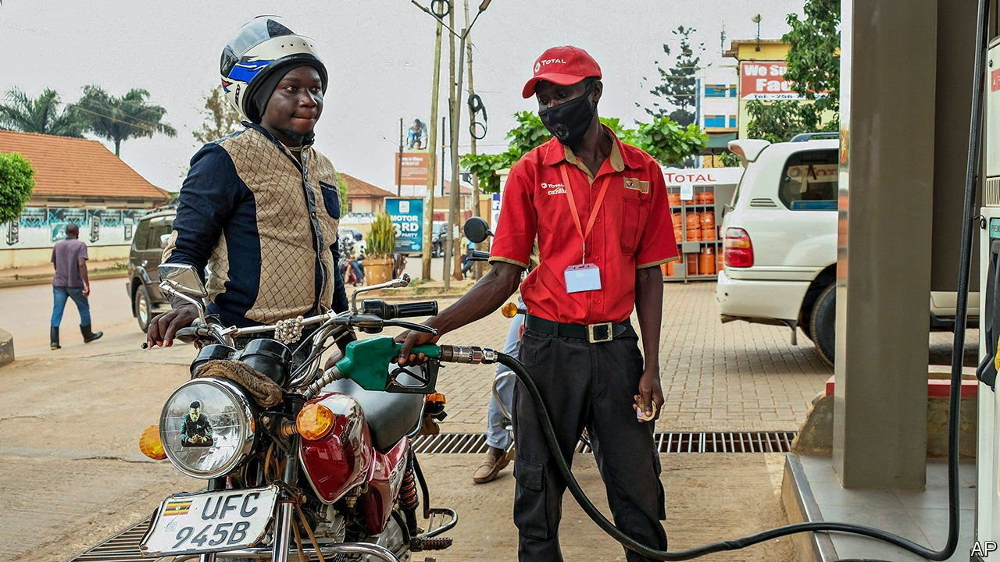
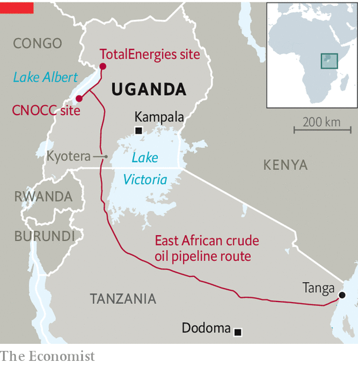

###### Pipe dreams

# A big Ugandan oil project is progressing at last 

##### But in a world moving away from oil, does it still make sense? 

 

> Feb 5th 2022 

SOON MORE than 200,000 barrels of oil a day will flow through Fred Lubowa’s garden: past his tin-roofed house, under his banana trees, and beneath the spot which currently houses the family graves. But for now the only sign of the disruption to come is a line of wooden stakes in the undergrowth. It is three years since surveyors came to his village in Kyotera district, central Uganda, to mark the route for the longest heated pipeline in the world. It will carry oil 1,443 kilometres from the shores of Lake Albert to the Tanzanian coast. He has waited, in limbo.

On February 1st TotalEnergies, a French oil giant, and CNOOC, a state-owned Chinese firm, and their partners announced a “final investment decision” on Ugandan oil, the last milestone before work can begin. The field to be exploited was declared viable in 2006, but progress stalled as the government arm-wrestled with foreign companies over tax and a planned refinery. Covid-19 caused further hold-ups. For people in Uganda’s oil region, life now follows the rhythms of distant boardrooms. They are not the only ones wondering whether the project makes sense.


By the time the first oil flows, in 2025, oil infrastructure will have uprooted 2,000 households and directly affected more than 20,000. Farmers will not receive compensation for crops planted after a cut-off date, which in Mr Lubowa’s village was almost three years ago. He cannot plant the coffee that would pay for his children’s school fees. His mother, Annet Nakyanja, looks forlornly at her wilting banana trees, unable to replace them. Last year one of their neighbours, Robert Birimuye, organised people to object to compensation rates and was arrested on charges of “inciting violence, sabotage of government programmes and unlawful assembly”.

The state takes a dim view of dissent. In 2019 a man who travelled to France as a witness in an ongoing lawsuit, challenging TotalEnergies’ compliance with French law, was questioned for nine hours at the airport on his return; another witness had unknown men trying to break into his home. The Ugandan authorities have suspended the African Institute for Energy Governance, an NGO that is supporting the case, and in October arrested six of its staff. TotalEnergies says it has repeatedly urged the government to respect human rights.

The unspoken logic of the project might be this: that land acquisition is always messy, and politics brutal, but the price is worth paying if oil makes Uganda richer. Officials reckon the development phase will bring $15bn-20bn of investment, of which they hope 40% might go to Uganda-based companies, in a country with a GDP of around $40bn a year. A UN study forecasts that oil will raise government revenues by a third over the estimated three-decade life of the project.

 


The first risk is that oil money lubricates the very politics of patronage that are holding Uganda back. The president, Yoweri Museveni, will be in his 80s when oil starts to flow. Frustration at his 36 years of rule is mounting. The question of who will succeed him looms. Spending on the security forces that suppress his opponents has increased three-fold since 2017, overtaking spending on education or health.

The second problem is the climate. “There is no possibility of petroleum kudiba”—Luganda for “not having buyers”—said Mr Museveni. Markets may decide otherwise. In 2020 researchers at the Climate Policy Initiative, an international NGO, estimated that the value of Ugandan reserves had fallen by 70% since TotalEnergies and CNOOC acquired their stakes in 2013, partly because of lower forecasts of oil prices. The value would halve again if the world’s leaders reduce the use of fossil fuels in order to stick to their pledge to keep global temperatures to “well below” 2°C above pre-industrial levels. The oil companies are still seeking funders for the pipeline, after several big banks said no.

The oil giants extracted sweeteners before putting pen to paper. Ernest Rubondo, Uganda’s top oil regulator, says that production-sharing agreements have been amended since 2019 to give the companies a larger share of the profits when oil prices are low. In effect, they have passed on some of the financial risks of a global transition to low-carbon energy to the Ugandan government. Meanwhile, without radical emissions cuts, the project remains an attractive prospect for TotalEnergies. It will produce about 20% of the firm’s African cash flows and 13-15% of its growth in worldwide production over the next decade, says Juma Mlawa of Wood Mackenzie, a consulting firm.

The irony is that Uganda is already suffering for the carbon emissions of rich countries. Unless it takes steps to adapt to climate change, global warming could impose costs amounting to some 3-4% of GDP a year in coming decades, the government reckons. Seasons are already being muddled and farmers do not know when to plant. The oil that will flow beneath Mr Lubowa’s garden may well further scramble the rains that sustain it. ■

For more coverage of climate change, register for , our fortnightly newsletter, or visit our 

