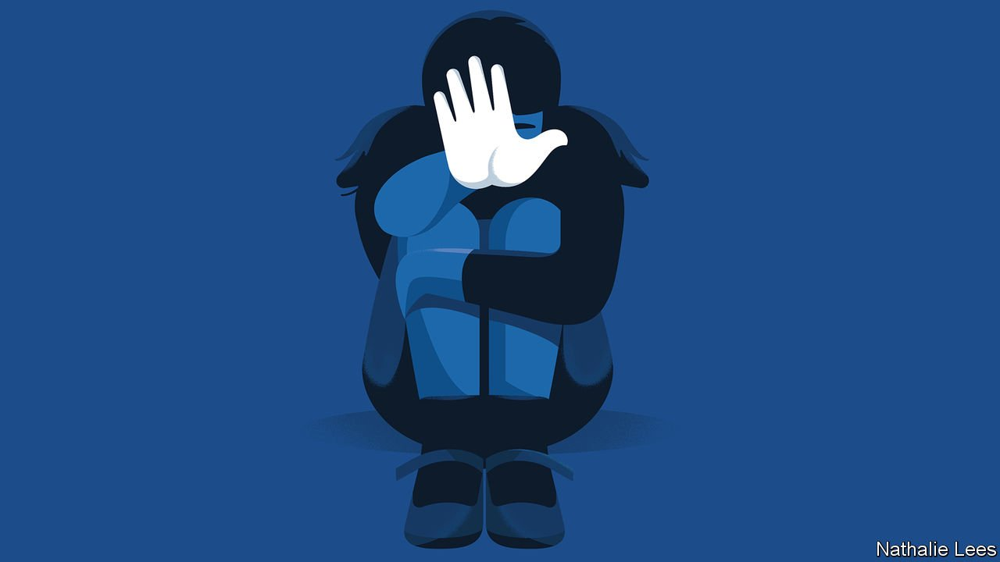

###### A continuing horror

# Child rape is far too common in some war-torn African countries 

##### Trauma, social breakdown and impunity all seem to play a role 

 

> Feb 3rd 2022 

FOR A FLEETING instant it is possible to believe that Yei (not her real name) is a normal, if shy, three-year-old. “Smart Brave Amazing'' declares her pyjama top, the words smiling up in red, yellow and green. But the woman Yei clings to is not her mother and the building she is in is not her home. She is in a UN-funded government shelter for survivors of sexual assault in northern Liberia. A few months earlier her grandmother trusted a familiar motorbike taxi driver to take Yei to her parents. Instead he raped her. Yei spent two weeks in hospital as doctors tried to repair the damage. She no longer speaks and has been in the shelter for three months. Her parents, wary of the rapist’s family, are scared to bring her home.

Sexual abuse of young children happens all around the world. But children living in war-torn countries are at much higher risk. Those in countries recovering from conflict, such as Liberia, may also face greater dangers. The UN has recorded 15,000 cases of rape and sexual violence against children in conflict zones over the past 15 years. This, it warns, is probably a fraction of the true number. Around 72m children live in war zones in which fighters sexually attack children, according to research by Ragnhild Nordås of the University of Michigan and co-authors. That is almost ten times the number in 1990.


Reliable data about sexual assaults on young children in post-conflict places are scarce. As happens elsewhere, many attacks go unreported. Last year Liberia recorded 1,275 sexual assaults or rapes of people of all ages, according to official figures. Fully 10% of the victims were younger than six and 36% were younger than 13.

At a sexual-violence clinic in Monrovia, the capital, a nurse recounts how an eight-month-old baby was raped by her step father. A soft toy to comfort children perches on the examination table next to a large doll which young victims, often unable to speak, can point at to show what happened to them. About a year before Yei was attacked, another three-year-old was lured away from a water pump by a 15-year-old who used a razor blade to cut open her genital area to penetrate her. That attack caused large protests in Monrovia, which prompted President George Weah to declare rape a “national emergency”.

Why so many men rape young children in war and its aftermath is not well understood. Some experts think that war warps not just morality but also common sense. Between 2013 and 2016 in Kavumu, a village in eastern Congo, at least 11 men kidnapped and raped about 40 girls under the age of ten. Some were as young as 18 months. After each rape the men would take some blood from the victim’s hymen, believing this would protect them from bullets in battle. In 2017 a court convicted the 11 men of murder and rape.

Many of their victims were treated at Panzi Hospital, which was founded by Denis Mukwege, who was jointly awarded the Nobel peace prize in 2018 for his efforts to end sexual violence in war. The number of babies and infants treated for rape at the hospital dipped in the year after the trial, says Sylvain Mwambali, a doctor who works there. But it soon shot up again, to a higher level than in the three years before the convictions. In the past three years the hospital has treated 103 raped children aged five or younger, or about one every ten days. In 2020 Dr Mwambali treated a baby just a few months old whose vagina and intestines were mutilated by rape. “I could not sleep for weeks,” she says. “How can someone carry on, creating a wound like that? She would have been suffering, crying, they destroyed her vulva, up until the anus, yet they continued.”

War and warped beliefs

Sometimes rebels may rape children to terrorise and control the population. Other men may copy them, perhaps because it makes them feel powerful. A breakdown in law and order may allow rapists to escape any punishment. “There is a social deterioration,” says Dr Mwambali. “People can rape your mother in front of you…there are rapes in churches.”

In Liberia, warped beliefs of a different kind are a common explanation for why men rape young children. Some traditional healers tell people, “If you have intercourse with a young girl, you will become rich,” says Margaret Taylor of Women Empowerment Network, an NGO. “The younger the person is, the more riches they get.”

Research elsewhere suggests that the sexual abuse of children is more common in societies that are more violent in other ways and, in particular, where rape or sexual abuse of adults is widespread. Liberia suffered back-to-back civil wars between 1989 and 2003 in which tens of thousands of child soldiers—some as young as nine or ten—fought and, in many cases, were forced to execute prisoners. Many of them are now back in their villages, but have received little or no treatment for the psychological trauma they suffered. Drug-taking, a huge problem in Liberia, has been shown elsewhere to lead to the abuse of children. Much remains unknown. “We haven’t really put our finger on it,” admits Williametta Saydee-Tarr, the minister of gender and children.

That makes combating child rape more difficult. It does not help that prosecutors often struggle to convict perpetrators. The government in Liberia has three DNA machines to try to better identify those responsible, says Ms Saydee-Tarr. But the courts are overwhelmed and prisons are overflowing. The head of the clinic in Monrovia complains that prosecutions of those who rape children are rare and slow. She follows the cases of the many victims of all ages who are seen in the clinic. For “more than a year,” she laments, “we have not heard of a conviction.” ■

