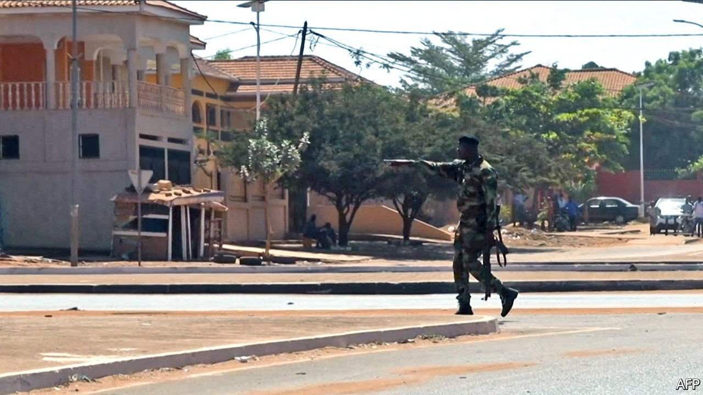
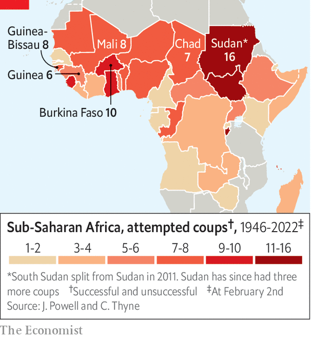

###### Pushers and putschists

# Guinea-Bissau sees off an attempted coup 

##### The president says it was linked to the powerful drug trade 

 

> Feb 3rd 2022 

FOR THE second time in just over a week heavy gunfire rang out from government buildings in a west African capital, this time in Guinea-Bissau’s. This coup attempt failed, unlike the earlier putsch in Burkina Faso. On February 1st President Umaro Sissoco Embaló declared he had faced down not just a coup, but “an attempt to kill the president, the prime minister and all the cabinet”. At least 11 people died in the firefight. Mr Embaló, a former army man, suggested the coup could “be related to people involved in drug-trafficking”, without elaborating.

Although it is not yet clear how drug-smugglers may have been involved, the idea that they may have tried to overthrow the government is not as far fetched as it sounds. People linked to the trade have done so several times in the past in order to control or protect a cocaine route linking South America to Europe. It is run with the connivance of army officers and politicians. The trade started in the mid-2000s after João Bernardo “Nino” Vieira won a well-funded campaign for president. But he then seems to have fallen out with the cartels. In 2009 the army chief was blown up in his headquarters and hours later Vieira was gunned down by soldiers.


The two killings, which locals blame on the cartels, allowed a new group of army officers to take over the drug business. Among them, according to charges filed by American prosecutors, was Antonio Indjai, another army chief who led a failed coup in 2010 and a successful one two years later. The latter was known as the “cocaine coup”, because smuggling of the drug surged soon afterwards. Although America has offered a $5m reward for the arrest of Mr Indjai, he is thus far untouchable, flitting between his various homes. He was seen publicly supporting Mr Embaló during his contested election in 2019. Since then the president has refused to extradite Mr Indjai, saying that no Guinean should face justice in another country.

 


Drug money has been able to corrode politics in Guinea-Bissau so thoroughly because its institutions were pitifully weak to begin with. Since independence from Portugal in 1974, Guinea-Bissau has suffered four successful coups and several more attempted ones. The latest putsch may also have been inspired by a spate of others in recent months in nearby countries including Burkina Faso, Guinea and Mali (see map). Guinea-Bissau is not suffering from the sort of jihadist insurgency that has undermined faith in elected governments and sparked the mutinies that led to coups in some other countries in the region. But it, too, suffers from grinding poverty. Meanwhile, the regional bloc, ECOWAS, has done little to stand up for democracy. Covid-19 is not the only plague working its way across the region of late. ■

