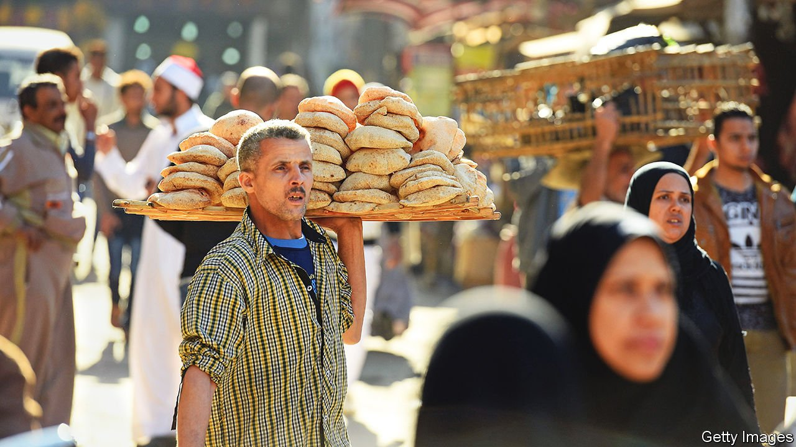

###### Grains of wrath

# How tensions in Ukraine could rile Egypt 

##### A disruption in the wheat market would cause serious harm to the biggest Arab country 

 

> Feb 3rd 2022 

THE BIGGEST buyer of wheat in the world is Egypt, which will import over 13m tonnes of the grain this year. Odd, then, that the way it makes these purchases is so archaic. Every few weeks it summons traders to a ramshackle building in Cairo. Agents from the big firms that source, store and ship foodstuffs are told to bring an envelope with their best price inside. These are then opened and the prices revealed to all. That’s when the haggling begins. The tenders drag on for hours, but eventually Egypt announces a purchase so big that global wheat prices move in response.

Egypt’s stability depends on these imports. The government uses the wheat to make subsidised bread, on which many families rely. When Anwar Sadat, a former president, lifted the subsidy in 1977 there were riots and he quickly backtracked. When Egyptians revolted in 2011, their three main demands were “bread, freedom and social justice”. The latter two proved elusive, but the provision of cheap loaves continues. A small one sells for 0.05 Egyptian pounds, or a third of a penny, a fraction of what it costs to make.


Now, though, a potential disruption in commodity markets threatens this Egyptian staple. The vast majority of the wheat Egypt imports comes from Russia and Ukraine, which are lurching towards war.

Wheat prices already reached their highest levels in almost a decade last year. A number of factors were to blame, including higher fuel and fertiliser prices, poor weather and backlogs at ports exacerbated by the pandemic. A Russian tax on exports, intended to keep excess stocks at home, didn’t help. At Egypt’s latest tender, on January 28th, it paid $350 per tonne, $100 more than what it had budgeted for. At that price Egypt will pay an extra $1.5bn (0.4% of GDP) this year for wheat.

Things will probably get worse. When Russia seized Crimea from Ukraine in 2014, wheat prices spiked. Ukraine has since become a grains powerhouse. Last year its wheat sales grew by 28%, making it the fourth-largest exporter of the stuff. Russia comes first. Together they account for 30% of global wheat exports, twice their share in 2014. (Ukraine also sells maize, barley and cooking oil to the Middle East.) “Tensions in Ukraine are only going to make wheat prices jump further,” says a trader. “It can easily hit the 400s.”

How will that affect the price of bread in Egypt? President Abdel-Fattah al-Sisi knows it is a sensitive issue. When his government signed a deal with the IMF in 2016, it agreed to slash subsidies on petrol, electricity and vegetable oil. Bread was left out. But last year, as commodity prices rose, Mr Sisi reconsidered. He warned that food rations would soon be limited to two beneficiaries per family and that newly-weds would be cut off entirely. The government is mulling replacing the entire system with cash payments. The plans are vague, but one thing is clear: Egypt cannot afford to pay such a high price for wheat and continue providing cheap loaves to the masses. ■

