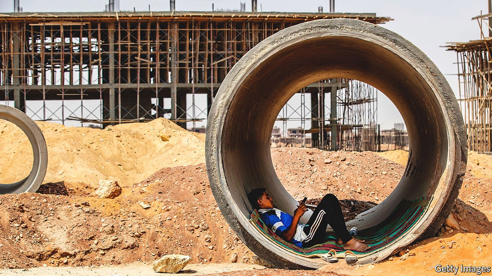
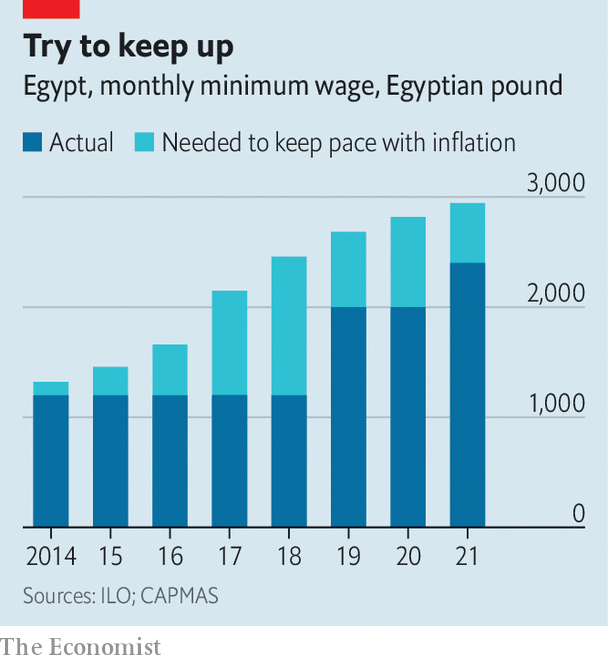

###### Rise and shine

# The president of Egypt does a U-turn on economic policy 

##### Abdel-Fattah al-Sisi suddenly wants to empower the private sector 

 

> Feb 5th 2022 

TACT IS NOT Abdel-Fattah al-Sisi’s strong suit. Egypt’s authoritarian president, who overthrew an elected government in 2013, lectures his citizens for being fat and spoiled and chides foreign leaders who mention his dismal human-rights record. In recent weeks he has aimed criticism at his own government. Inaugurating a new chemical plant on December 28th, the president observed that the state was not great at running the economy. “We need the private sector,” he said. “We have been proven incompetent in management.”

Executives in Egypt were surprised by his comments, but not his conclusion. They have complained for years about unfair competition from state-owned firms, which enjoy tax breaks and other perks. The ever-expanding economic empire of the armed forces crowds out private firms.


The IMF warned in 2017 that this could hinder growth, and indeed it has. Annual growth was more than 4% from 2015 to 2019, and stayed above 3% during the pandemic. But most of it comes from a booming gas sector and lavish public spending. The purchasing-managers index, a gauge of business activity, showed private output contracting in all but nine of the past 60 months. Foreign direct investment fell from 3.4% of GDP in the 2016-17 fiscal year to 1.3% in 2020-21.

In several recent speeches Mr Sisi has acknowledged the problem. Adam Smith he is not: he describes the private sector as a partner for the state. Still, some businesspeople are encouraged by the change in tone. With the IMF’s urging, Egypt has taken steps to improve the business climate. Yet even if Mr Sisi is serious about reining in the state—and it is too early to tell—private growth may not come quickly.

The case for optimism starts with Egypt’s much-maligned bureaucracy. In 2017 parliament passed an investment law that offered a range of incentives, one of Egypt’s obligations under a $12bn deal with the IMF signed a year before. Then in 2018 it approved a bankruptcy law that, in effect, decriminalised default.

Ministries have started to digitise services, including land registration. Last year Egypt started rolling out a digital customs system, replacing the old mess of papers and stamps. That should make it easier for firms to clear goods through ports, and for the state to collect revenue.

When Mr Sisi took office, regular blackouts were a nuisance for citizens and a disaster for industry. Today Egypt has more power than it can use. Big gasfields in the Mediterranean provide ample fuel for three new gas-fired plants that produce a combined 14.4 gigawatts. Investments in solar energy are growing fast, too. Ministers hope to start exporting the surplus.

The government has spent billions on new roads and bridges that have helped Egypt’s notorious traffic. A new industrial zone along the Suez Canal has drawn investments from China, Russia, the United Arab Emirates and elsewhere. Broadband speeds, still sluggish by global standards, have increased sixfold since 2018.

All of this has laid the groundwork for growth. Yet there are reasons to be sceptical. First is whether Mr Sisi, a former general, means what he says. Some of his men talk of privatising army-owned firms. But the army’s role is opaque; no one knows the full scale of its holdings. In 2016 Sherif Ismail, then the prime minister, said the army would reduce its economic activity within a few years. Instead, it expanded.

Then there is the state-security agency, which insists on vetting foreign investors, a process that has held up big deals. “If you don’t have a foreign shareholder in your company, establishing a business will take a few days,” says one CEO. “If you have one, it could take a month, two, three.”

Even if the army and security services back off, there are questions about what Egyptian firms will produce and where they will sell it. Many operate only at either end of the supply chain. Over half of Egypt’s exports are primary commodities. At the other end, finished goods rely on inputs from elsewhere. The World Bank estimates that just 20% of Egypt’s electrical exports rely on local components. The car industry sources less than a quarter of parts domestically, compared with 60% for some carmakers in Morocco.

To create jobs and boost exports, Egypt needs to make these products, not just assemble them. Bosses say inefficient state-owned firms are an obstacle, along with poor education and training and expensive financing. None of these are easy to fix.

At home, years of new taxes and cuts in subsidies have left domestic consumers strapped. Almost a third of Egyptians live below the official poverty line, a paltry 857 pounds ($54) a month. The middle class grumbles at endless new fees. In December the education ministry said it would start charging students to take the mandatory exams required for advancement.

 


On January 18th Mr Sisi raised the minimum wage to 2,700 pounds a month, the third increase since he took office in 2014, when it was 1,200 pounds. This is not as generous as it looks, though. The minimum wage has not kept pace with inflation (see chart). Egyptians earning it have less purchasing power than they did eight years ago. That matters little to the two-thirds of Egyptians whose work is informal. All in all, more than 80% of working-age adults are either sitting at home or toiling in low-paid, insecure jobs.

The next few years will be more difficult.  will fuel inflation in a country where foodstuffs make up 21% of imports. Another worry is public debt, which was 91% of GDP last year, up from 73% a decade earlier. Debt service consumes about a third of revenue. The government has relied on interest-starved foreign investors to finance megaprojects and big arms deals. Fitch and Moody’s, two rating agencies, assess Egypt as less than copper-bottomed.

Now Egypt faces rising interest rates in America and other rich countries. This will reduce the relative return on Egyptian debt and so dampen foreigners’ enthusiasm, just as higher commodity prices widen the trade deficit. An analysis of emerging markets by The Economist ranks Egypt as the third-most vulnerable to tighter monetary policy at the Federal Reserve.

Mr Sisi’s newfound enthusiasm for the private sector may be the child of necessity. The state cannot sustain its high level of spending. But after years of underinvestment in firms and people, and with consumers so squeezed, the private sector may not be ready to scale up. “People have barely had a chance to catch their breath,” says an executive. “And now we’re going into a much less benign global environment.” ■

