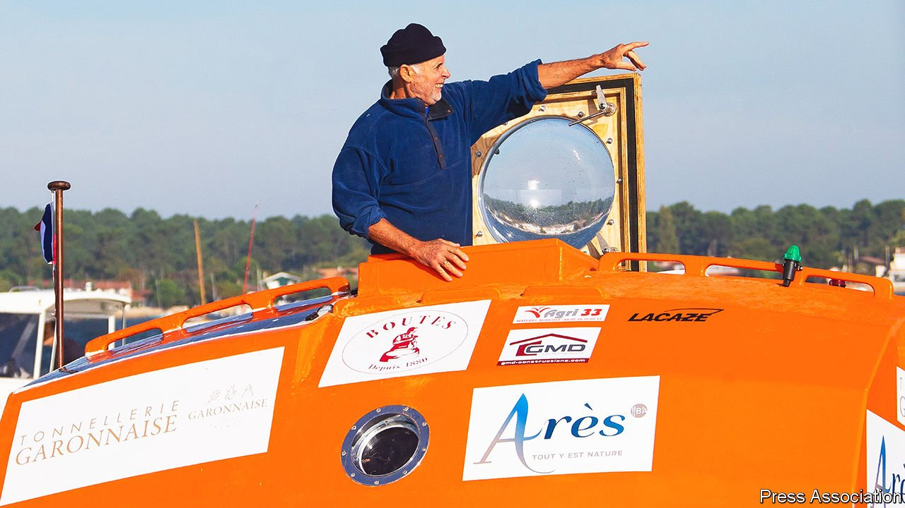

###### To sea in a barrel

# Jean-Jacques Savin wanted to defy old age 

##### The intrepid adventurer died on January 21st while rowing solo across the Atlantic, aged 75 

 

> Feb 5th 2022 

EDWARD LEAR’S Jumblies, seeking the hills of the Chankly Bore, went to sea in a sieve. They had a beautiful pea-green sail tied with a ribbon to a tobacco-pipe mast, and slept in a crockery jar. In 2018-19 Jean-Jacques Savin, aiming for the Caribbean from the Canaries, crossed the Atlantic in a Bordeaux tonneau made of plywood and painted a gaudy orange. It had no sail or engine, but flew the flag of France. Inside, in a space scarcely bigger than a crockery jar, he installed a bunk, a sink, a captain’s chair, a card-table and a porthole in the floor through which to watch the fish. His barrel-baby, as he thought of it, was baptised on the beach after mass in Arès, his home town in the Gironde, and named Audacieux, because it was. It would drift to America in the arms of the ocean, with no man-made power at all.

The Jumblies, after landfall over the Western Sea, stocked up with an owl, a useful cart, a pound of rice, a cranberry tart and “no end of Stilton Cheese”. Mr Savin was equipped with two solar panels, a desalinator, GPS, a Globalstar spotlight to make him trackable on the internet, gel batteries and a floating anchor and no end of nylon rope. He also carried his favourite adventure books, a mandolin, a bottle of Saint-Emilion, another of champagne, a bottle of Sauternes and a tin of foie gras, to celebrate the new year and his birthday at sea.


The birthday, on January 14th, was his 72nd. At an age when many men take to gardening, he was setting out on a voyage where he almost collided with two ships, was knocked off his barrel in a storm (swinging like a yo-yo on his rope, underwater and out again), spent days lashed to his bunk and lost four kilograms, “Quite risky”, he confessed. But it earned him worldwide celebrity and thousands of Facebook followers, as the tiny orange craft floated its way west on ocean currents and the trade winds.

His father had been a prosperous oyster-farmer in Arès, which was famous for them. Outside town lay the Bay of Arcachon, mile after mile of muddy sand and huge shifting dunes, where the young Jean-Jacques larked about rather than bother with school. Beyond stretched the immense Atlantic, beckoning to be crossed. He tried other adventures first, though. As a teenager he scaled the bell-tower of the church in Arès by way of the lightning conductor. He did military service as a paratrooper in elite units, prospected for gold in Africa and became a near-champion in triathlon. Back home he threw himself into whatever needed doing, whether diving to fix boats, repairing roads with oyster shells or harvesting the cordgrass that covered the dunes. With his jaunty cap and gappy teeth he never looked his age, or felt it. Late in his 60s he climbed Mont Blanc and swam four times across the local bay, combining the feat with mud-skating. But his greatest dé fi to age and a boring life was to set out on that blue, open ocean.

Four times he sailed across. What he really wanted, though, was to do it as a man adrift after a shipwreck, at the mercy of the sea. His favourite boyhood book was “The Voluntary Castaway” by Alain Bombard, a French doctor who had crossed the Atlantic in an inflatable dinghy, with a sail and oars, in 1952. (He was a mere 28, and took Shakespeare and Rabelais with him.) “Docteur Fou”, as his countrymen mostly called him, set out to prove that castaways could live for several weeks on what the ocean provided: water, plankton and fish. Plankton, filtered through a special net, was full of vitamin C to ward off scurvy. Sea water was fine to drink if taken in small doses. As for fish, Bombard had learned from Polynesians that big fish, tuna and sharks, had a liquid just beneath the skin that could be drawn off and mixed with sea water, making a drink at least as pleasant as Vichy water. All these became Captain Savin’s diet. But the part of Bombard’s book that most seized him was a single sentence: “A barrique [225 litres, half the size of his tonneau] launched in the Canaries will take three months to reach the Caribbean.” He took 127 days.

The voyage was not just a boy’s dream but also, he stressed, scientific. He recorded his observations daily and minutely. Doctors were going to measure his vital signs. Even the Sauternes would be subtly compared with a bottle left on shore. He also noted his morale, since Bombard had said it was the key to survival, and his was resoundingly good. He was free on the ocean, completely free. Out there, in a bobbing barrel, there were no rules beyond instinct and common sense. In his paratrooper days he had struggled with taking orders: where to go, what to do. But if you chose to put yourself through tough times and solitude, it changed everything. His voyage became a holiday.

That was why, three years later, he decided to cross the Atlantic in an 8-metre rowing boat shaped like a canoe. This too was called Audacieux, because he still was. There was more space on board, and the IT had improved. The main drawback was that the sea was no longer gently carrying him over, but had to be rowed through for eight hours a day. And he was older—if he made it, the oldest person ever to row across. On the barrel voyage, à la cool, he had played a lot of bluegrass on his mandolin and written large chunks of his book, “127 Days Adrift: The Atlantic in a Barrel”. Now, with the sea between Portugal and the Azores bucking and plunging like a rollercoaster, there was no time for music or books, only the Three Rs: ramer, ravitailler, ronfler, row, stoke up, snore. On his 75th birthday the champagne and foie gras came out again. On January 19th his solar panel stopped working, but his message ended on a merry note: his morale was fine, and he was absolutely not giving up. On the 21st he triggered two distress flares.

Had he failed? Not necessarily. The voyage had hardly begun, and he had more or less decided to get repairs done in the Azores and start again. It had been his choice to build the canoe, his choice to set out alone, his choice to flick away old age like a nothing. He had notched up all those successes in any case, revelling in freedom. But freedom also meant, as on his barrel voyage, that he chose to entrust himself to the ocean in which his craft now floated without power towards the west, and in which he was lost. ■

