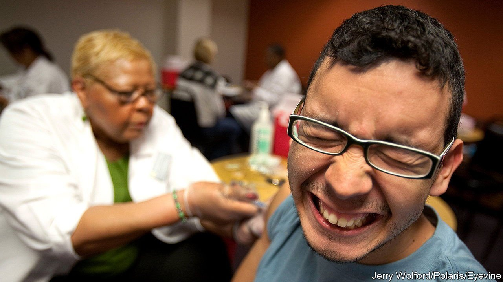

###### Trypanophobics rejoice!

# A new way to deliver delicate drugs, no jabbing required 

##### It will be a relief for anyone who has a distaste for needles 

 

> Feb 5th 2022 

PLENTY OF PEOPLE hate needles. Indeed, it is probably the case that a portion of those refusing to be vaccinated against SARS-CoV-2 might be doing so simply because they do not want the discomfort of being jabbed. A new invention could help—for those who are needle-shy, how about taking a pill instead?

Two of the most successful covid-19 vaccines, from Pfizer-BioNTech and Moderna, need to be administered via injections because their active ingredients are fragile molecules of mRNA. These vaccines cannot be administered orally, since the mRNA would be quickly destroyed by acids in the stomach.


Aware of these challenges, Robert Langer and Giovanni Traverso, engineers at the Massachusetts Institute of Technology (MIT), wondered if it might be possible instead to smuggle mRNA into the stomach inside a protective capsule that is engineered to jab patients from the inside, where they would feel nothing.

This is not new ground for the researchers. Several years ago they collaborated to create a star-shaped structure that could be folded up inside a capsule and then released when the capsule dissolved in the stomach. Once free, the structure remained in the stomach for a month, slowly releasing contraceptives, malaria drugs or HIV treatments as needed by a patient.

With this in mind, Dr Langer and Dr Traverso wondered whether they could design something that could linger in the stomach and then inject its medication there.

The device they invented is the size of a large pill, encased in gelatine and shaped like the shell of a tortoise. It carries a needle that is engineered to penetrate the lining of the stomach only when the device’s flat section sits flush against it. So aligned, the needle can then inject its payload painlessly into the stomach wall.

The researchers knew, however, that this trick alone would not be enough for safe passage of the delicate molecules. Naked mRNA is not readily taken up by cells, but needs to be encased inside a protective envelope to gain entry.

The mRNA molecules of covid-19 vaccines are delivered into cells inside tiny bubbles of fat. But the sort of delivery mechanism needed for Dr Langer’s and Dr Traverso’s device was not immediately clear. To investigate further, the engineers worked with colleagues at MIT to test several hundred specially shaped polymers that they thought might be able to protect their mRNA molecules as they transferred into stomach cells. They found three polymers that could carry the mRNA payloads successfully and also support a transfer into living cells.

The engineers loaded these polymer-encased mRNA molecules into their turtle-shell pills, which were then swallowed by six mice. As expected, they subsequently found evidence that the mRNA had transferred successfully into the stomach tissue of all the mice.

The researchers then went on to test their technology on pigs, which have stomachs that are very similar to those found in humans. They introduced their turtle-shell pills into three animals and studied their stomachs a day later. Two showed clear evidence of the mRNA having entered their cells. One did not.

Dr Traverso and Dr Langer published details of their work this week in the journal Matter. Their device shows the potential to get mRNA into the body without the need for an uncomfortable jab in the arm.

More work is needed, however, both to understand why one trial in the pigs failed to yield results and also to work out if the mRNA molecules like those found in covid-19 vaccines can also be successfully delivered via something like Dr Langer’s and Dr Traverso’s turtle-shell pills. ■

To enjoy more of our mind-expanding science coverage, , our weekly newsletter.

