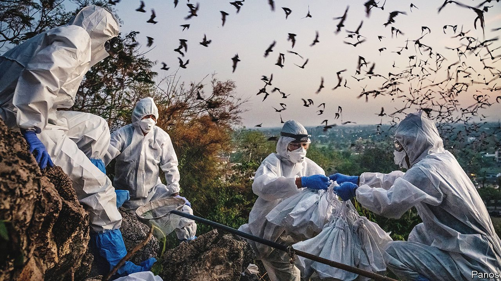

###### Scientific publishing

# Preprints on the coronavirus have been impressively reliable 

##### The case for publishing in expensive, restrictive scientific journals continues to weaken 

 

> Feb 5th 2022 

SCIENTIFIC PUBLISHING moves slowly. Depending on the academic field, it can take years for a single paper to get published in a well-regarded journal. In that time, a paper might undergo several rounds of peer-review by academic volunteers, followed by corrections—and possibly rejections—before a new scientific result sees the light of day.

This rigmarole is meant to ensure that the research that enters the scientific record is reputable, rigorous and trustworthy. That is admirable—and the system generally works well—but it also introduces a bottleneck, delaying the circulation of new scientific results. To get around this, scientists can release a “preprint”: a manuscript of a paper posted to a public server online before it has completed a formal peer-review process.


Preprints are commonplace in physics and mathematics. During the covid-19 pandemic, these publications took off in bio logy, genomics and medicine too, reflecting the urgency of communicating corona virus-related findings to other scientists, government officials, and the public.

Some have expressed concerns over the quality of preprints, however, arguing that publishing research prematurely risks undermining the integrity of science if conclusions may later need to be revised, after comments from peer-reviewers, say. Fortunately, a study published in the journal PLOS Biology this week suggests that they have little to worry about.

A team of researchers led by Jonathon Coates, a biologist at Queen Mary University in London, decided to analyse how reliable preprints were early in the covid-19 pandemic. They compiled a set of 184 research papers in the life sciences that had initially been posted as preprints on bio Rxiv and medRxiv—two large preprint servers—and later published in one of 23 major scientific journals in the first four months of the pandemic.

They compared each preprint with its more polished version that had later appeared in a journal. They looked for content that had been added or removed from the body of the manuscript, tables or figures that had been rearranged, and when key wording had been changed.

Dr Coates’s analysis found that 82.8% of coronavirus-related preprints and 92.8% of non-coronavirus-related preprints saw no material change to their conclusions upon journal publication. Of the changes that were made, most involved only strengthening or weakening of conclusions. Only one paper out of 184 saw one of its conclusions reversed. “This is a welcome finding,” says Dr Coates. “Ultimately, scientists share preprints because they think the work is ready, not simply to rush it out—the results of our study reflect that.”

That more coronavirus-related papers saw changes upon publication than non-coronavirus papers could reflect two factors, suggests Dr Coates. The first is that scientists were moving as quickly as possible to make coronavirus-related results public to aid the early pandemic response, meaning that the language in early covid-19 preprints was more likely to require a final edit. Dr Coates adds that, in his experience, journal editors were also being more rigorous in their treatment of early covid-19 research, precisely because the stakes were so high.

These findings support arguments made by advocates of “open science”, who say that new scientific results should be made available to other researchers and the public freely and quickly. Dr Coates’s work suggests that the usual gatekeepers of the research, scientific journals, may add little scientific value to the original research manuscripts. Their large subscription fees, therefore, look increasingly at odds with the value they provide.

Dr Coates also discovered an annoying wrinkle in the publishing and sharing of data in the life sciences. Whenever his team tried to gain access to the supplementary data for a journal-published version of an article, all too often the links were dead or did not lead to the data they were looking for. That seems troubling, not least during a public-health crisis in which access to timely data has been critical in working out what to do and when. ■

To enjoy more of our mind-expanding science coverage, , our weekly newsletter.

