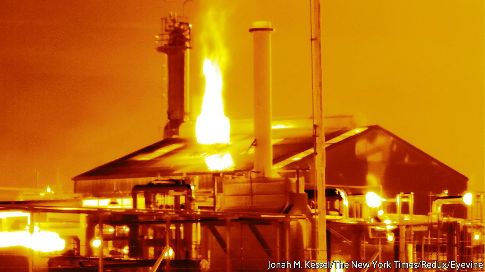
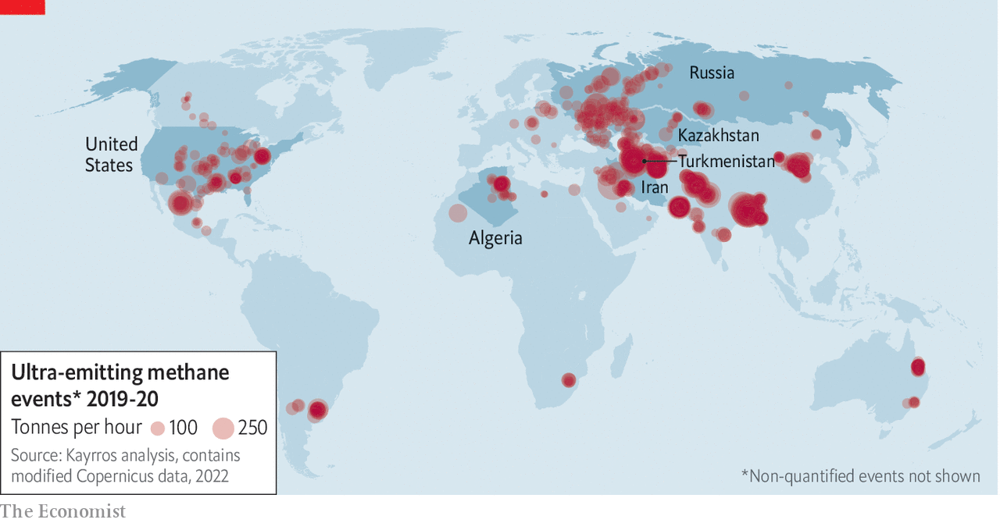

###### Climate change

# Targeting methane “ultra-emitters” could cheaply slow climate change 

##### Patching up leaky oil-and-gas works across the world would be a good place to start 

 

> Feb 5th 2022 

ON FEBRUARY 15TH 2018 a gas well blew up in Ohio’s Belmont county. Flying overhead shortly before 1pm, a state highway-patrol helicopter captured images of a column of flames and a billowing plume of soot and gases rising high into the sky from the rolling hills. Although the flames were soon put out, the bust wellhead was not patched up for 20 days. A subsequent study using satellite data calculated that during that time, some 58,000 tonnes of methane was released, equivalent to one-quarter of what Ohio’s entire oil-and-gas infrastructure reportedly produces every year and more than the annual methane emissions of similar fossil-fuel infrastructure in most European countries.

Methane is a colourless, odourless greenhouse gas that makes up the bulk of the natural gas burned to heat homes, cook food and generate electricity. It is also the second largest driver of global warming after carbon dioxide, responsible for at least one-quarter of the rise in global average temperatures since the Industrial Revolution. Once emitted, methane molecules degrade in around a decade so they do not pile up in the atmosphere in the same way as carbon dioxide, which can persist for hundreds of years.


Slashing methane emissions, therefore, could help reduce the overall atmospheric volume of greenhouse gases and slow the pace of global warming in the near term. Patching up leaky oil-and-gas infrastructure, responsible for 22% of all man-made methane emissions, would help meet those goals. This has led to efforts to quantify methane leaks.

According to a new study published this week in the journal Science, lengthy blow-ups on pipelines and at wellheads—as happened in the Belmont county explosion—are behind the release of roughly 8m tonnes of methane every year. That is equivalent to between 8% and 12% of the estimated total released from the global oil-and-gas infrastructure each year. By identifying and mapping the leaks in such detail, the study offers an opportunity: focus on tackling these big leaks and a significant chunk of the world’s greenhouse-gas emissions could be removed.

Thomas Lauvaux, an atmospheric scientist at the University of Saclay in France, and his colleagues used imagery and data collected in 2019 and 2020 by the Tropospheric Monitoring Instrument (TROPOMI) which is flying aboard an Earth-monitoring satellite launched by the European Space Agency. The researchers found more than 1,800 single “ultra-emitting” events, defined as producing 25 tonnes or more of methane each hour. Some events released several hundred tonnes of the greenhouse gas per hour, generating plumes that spanned hundreds of kilometres.

 


Two-thirds of the ultra-emitting events were co-located with oil and gas production sites and pipelines; the rest came from coal production, agricultural or waste-management facilities. Accounting for 1.3m tonnes of methane per year, Turkmenistan was home to some of the largest sources. Dr Lauvaux and his colleagues noted that the events they documented were not included in national emissions inventories and suggest that official numbers may underestimate total emissions by half. After Turkmenistan, the largest emissions were found over Russia, America, Iran, Kazakhstan and Algeria.

The 8m tonnes of methane picked up in the latest study have the same warming effect as the carbon footprint of 18m Americans. Eliminating all these emissions would avoid between 0.003°C to 0.007°C of warming over the next one to three decades, according to Dr Lauvaux.

Improving monitoring and patching up leaky infrastructure would also be in the interests of fossil-fuel producers in places including Algeria, America, Kazakhstan, Russia, Turkmenistan. The researchers calculated that companies forgo revenue of between $100 and $400 per tonne of methane that leaks out.

At the United Nations COP26 climate negotiations, held last November in Glasgow, leaders of more than 100 countries made a pact to reduce global emissions of methane by 30% by 2030. The cheapest, most cost-effective way of doing this will be to patch up oil-and-gas infrastructure, starting with the ultra-emitters identified by Dr Lauvaux. Inventories like his, and further data from a new generation of satellites capable of detecting point sources of methane, are important steps in meeting those global ambitions. ■

