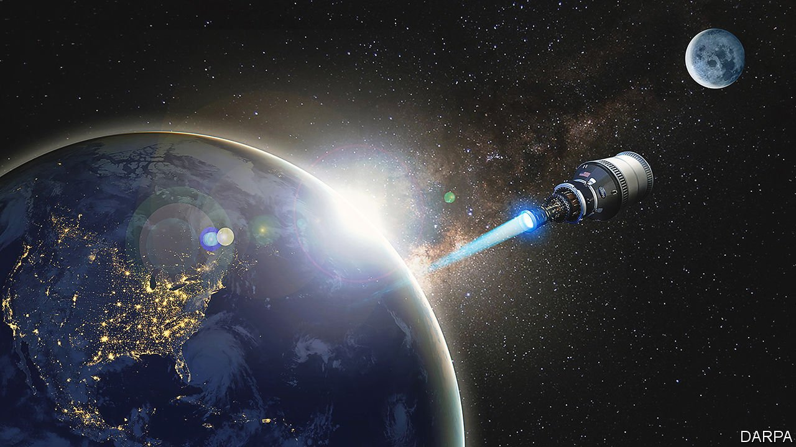
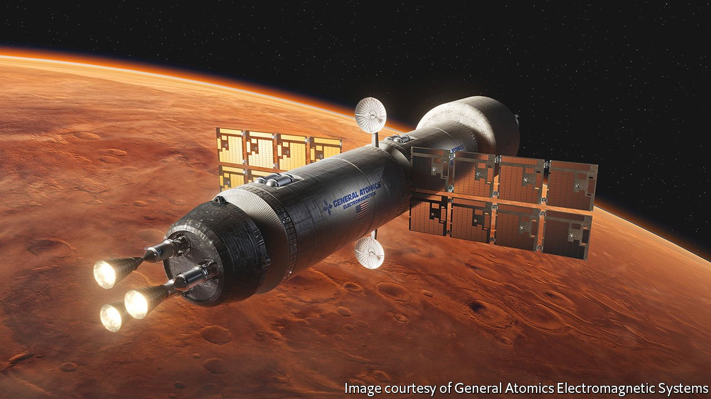

###### Faster, higher, stronger

# Why space is about to enter its nuclear age 

##### Fission-powered engines would make satellites speedier and more manoeuvrable 

 

> Feb 5th 2022 

IN NOVEMBER LAST year , creating shrapnel that will orbit the Earth for decades. The “direct ascent” missile test was a first for Russia and echoed a similar weapons test carried out by China in 2007, which also created an enduring cloud of debris. India and America have shot at inoperative satellites, too, although fortunately without creating as much associated long-lasting space junk.

All this target-practice concerns American defence chiefs, who would struggle to fight a war if critical satellites were knocked out. The Pentagon, therefore, wants its next generation of satellites to have enough power to be capable of evading attacks. It thinks the answer lies with nuclear-powered propulsion.


Two initiatives will investigate the concept. The first, led by the Defence Advanced Research Projects Agency (DARPA), will test a technology known as “nuclear thermal propulsion”. Working with American firms, including Blue Origin, General Atomics and Lockheed Martin, DARPA spacecraft will carry a small nuclear reactor. Inside, uranium atoms will be split to generate tremendous heat. That heat will be absorbed by liquid hydrogen sucked from a tank on board the spacecraft. The hydrogen, which will start at a storage temperature colder than -253°C, will rapidly expand as it warms. As that hot gas shoots out of a nozzle at the back of the spacecraft, it will produce thrust.

Such a spacecraft could climb to a geostationary orbit above the Earth, nearly 36,000km up, in mere hours. Satellites that burn normal rocket fuel need several days for the same trip. Nuclear-powered satellites with abundant power would also be hard to destroy—their trajectories could be changed often enough to become unpredictable. DARPA wants to test its spacecraft, dubbed DRACO (Demonstration Rocket for Agile Cislunar Operations), in orbit in 2025. This is an ambitious timetable, given that nuclear thermal propulsion has never been tried out in space.

The Pentagon’s Defence Innovation Unit (DIU) runs the second nuclear initiative. In September 2021 it solicited proposals for nuclear systems for satellite propulsion or, alternatively, to power onboard electronics. Companies pitching ideas need to meet a few conditions: they should steer clear of the nuclear-thermal-propulsion technology that DARPA is already working on; they should be able to build a prototype within three to five years; and they need a credible plan for testing in space. Out of the dozens of proposals received by the DIU, the first two winners are set to be announced later this month.

Beyond the dragon

Ryan Weed, a captain in the United States Air Force (USAF) who leads the DIU programme, says the submitted proposals fall into distinct categories. Some incorporate nuclear reactors, but not to heat liquid hydrogen. Instead, the heat will be used to generate electricity that will then be applied to a propellant gas such as xenon. This will ionise the gas which, thanks to an electric or magnetic field, will zip out of a nozzle to produce thrust.

Ion thrusters are not a new idea but a nuclear reactor could produce far more electricity to power them than even a large solar array. Satellites without solar panels would, usefully for military purposes, also be harder for enemies to track and disable.

Many of the designs for nuclear electric propulsion call for the same process of splitting atoms used in terrestrial nuclear-power plants. The kit for space would weigh at least a tonne, so it would only power big satellites.

Other proposals are for radioisotope thermoelectric generators (RTGs). These kinds of “nuclear batteries” have long been used to power probes sent into deep space, where solar power is especially feeble. Instead of building a nuclear reactor, an RTG uses devices called thermocouples to produce a modest wattage from heat released by the decay of radioactive isotopes. Plutonium-238, which is a by-product of weapons development, has been used by NASA to power both the Voyager probes, launched in the 1970s and still functioning, as well as the Curiosity rover currently trundling around Mars.

Plutonium-238, however, is heavily regulated and in short supply. And with a half-life of 87.7 years, the heat it produces from radioactive decay is spread over a long time. The DIU is therefore looking for alternatives with a shorter half-life and a “much higher thermal power density”, says Captain Weed. Cobalt-60, with a half-life of 5.3 years, is a promising alternative and available commercially. He would like RTGs to provide electricity for thrust and also the onboard electronics for satellites that are the size of a washing machine.

First, do no harm

How safe is it, however, to send nuclear devices, especially reactors, into space? Nathan Greiner, a major in the USAF who leads DARPA’s programme, says that one concern he often hears is about the potential explosion of a DRACO spacecraft on the launchpad. He says that such an event would not present any more danger than the explosion of a conventional spacecraft—because the reactor would not have been switched on at that point, its uranium fuel would pose no radiological hazard.

A bigger problem would be if the nuclear reactor crashed into the sea. Water can encourage the start of a nuclear chain reaction in which uranium atoms split and release neutrons that can go on to split further uranium atoms. If uncontrolled, this chain reaction can lead to a meltdown. DRACO is therefore configured so that even if submerged in water, “poison wires” made from boron will remain in place. Boron is used in nuclear reactors to moderate—or even stop—nuclear fission.

Another danger is accidental atmospheric re-entry. The Soviet Union flew at least 33 spy satellites with nuclear reactors for onboard power (but not propulsion). In one accident, the reactor in a satellite named Kosmos 954 failed to ascend into a high-enough “disposal orbit” at the end of its mission. In 1978 it ended up spraying radioactive debris over a swathe of Canada’s Northwest Territories. To avoid a similar accident, DARPA’s nuclear reactor will not be flown in low orbits, says Tabitha Dodson, DRACO’s top engineer.

The recent swell in interest in nuclear power for space can be directly traced to improvements in engineers’ ability to use computers to model their reactor designs. For a long time, scientists believed that, for a nuclear reactor to be able to fit on a rocket, it would need to run on fuel that was highly enriched with uranium-235, an isotope of uranium that easily splits apart. The fuel for the Soviet Kosmos 954, for example, was 90% uranium-235, similar to the material used in the atom bomb detonated over Hiroshima in 1945.

Given the fuel’s worrying potential for dual use, therefore, scientists have had to deal with thick bureaucracy, long delays and huge costs when building nuclear reactors. And, even if all went well, “a lot of guards and guns”, says Michael Eades, head of engineering for USNC Advanced Technologies, a Seattle subcontractor involved in DRACO. But better computer modelling has, in recent years, allowed scientists to design reactors in which the fuel is enriched to less than 20% uranium-235. That is below weapons grade, so government restrictions will be less onerous.

 


America is not alone in its nuclear quest. China and Russia are also developing nuclear power for space. China’s wish list includes a fleet of nuclear-powered space shuttles. Russia is designing an electric-propulsion cargo spacecraft called Zeus, which will be powered by a nuclear reactor. Roscosmos, Russia’s space agency, hopes to launch it in 2030.

The prospect of more capable satellites will, no doubt, raise suspicions among spacefaring nations. Nuclear spacecraft with abundant electrical energy could be used to jam satellite communications. Documents from KB Arsenal, a St Petersburg firm at work on Zeus and, reportedly, another nuclear spacecraft called Ekipazh, refer to the possibility of using large antennae to flood an area with lots of electromagnetic radiation—this could overwhelm the relatively weak radio signals normally sent and received by communications satellites. Such stirrings may have focused minds. In 2019 the then president, Donald Trump, issued a memorandum declaring that nuclear-powered space systems were “vital” to America’s dominance in space. In that and subsequent presidential actions, Mr Trump simplified regulations. His successor, Joe Biden, has not changed course, fuelling subsequent research and development in both government and the private sector.

To boldly go

And not all of the interest in nuclear power comes from the armed forces. NASA, keen to put astronauts on Mars one day, is studying reactor-powered electric propulsion and is also working on a project to develop nuclear thermal propulsion. The second system is named PADME—Power-Adjusted Demonstration Mars Engine—and its prototype is slated for testing in 2026.

PADME will weigh about 3.5 tonnes and, once in orbit, will be able to accelerate a large spacecraft to 12km a second in around 15 minutes. Such a craft could reach Mars in under six months, three less than with chemical propulsion. NASA wants to test it on a possible cargo mission to Mars in the 2030s. By the end of this decade, NASA also wants a nuclear plant to power a base on the Moon. Proposals for a ten kilowatt “fission surface power” facility are due in to the space agency by the middle of February. All this means that one way or another, space is entering its nuclear age. ■

To enjoy more of our mind-expanding science coverage, , our weekly newsletter.

