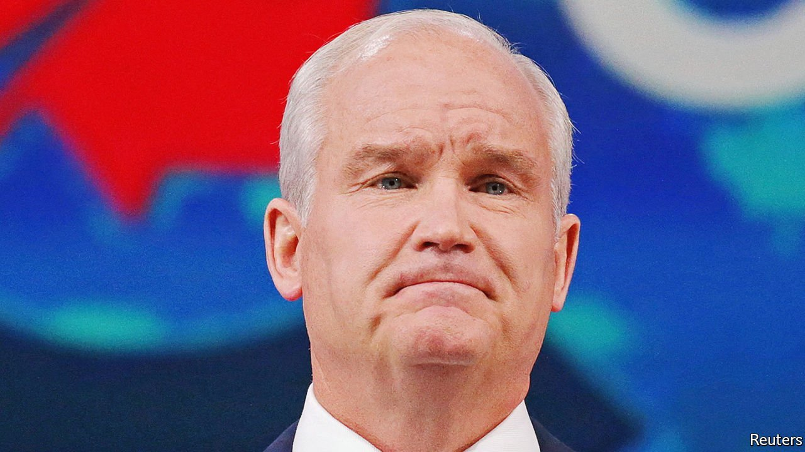

###### A populist turn

# Erin O’Toole is voted out as Canada’s Conservative leader 

##### A week after protests in Ottawa, it suggests that a new kind of right wing is ascendant 

 

> Feb 5th 2022 

IT HAS BEEN a bad week for moderate conservatives in Canada. On January 28th a “Freedom Convoy” of tens of thousands of protesters in pick-up trucks, eighteen-wheelers and SUVs shut down much of downtown Ottawa, where they stayed for several days. The spark for the protest was the introduction of a law which requires lorry-drivers who enter the country, including Canadian ones, either to be fully vaccinated or to stick to quarantine rules.

Although the protesters called for the resignation of Justin Trudeau, the Liberal prime minister, it was the main opposition leader who got the boot. On February 2nd 73 of the 118 Conservative members of parliament voted to sack Erin O’Toole, the party’s relatively centrist leader. Mr O’Toole has only been in the job for 17 months. Candice Bergen, his deputy, was voted in as interim leader.


It was not just the Conservative leadership that changed; so did the protests. Initially they involved a rowdy display of honking horns, booze and loud music. “It looked like a massive street party,” remarked Matt Luloff, a city councillor. But as the demonstrations grew, they also became more extreme. Participants wielded signs with swastikas and Confederate flags. On January 30th Ottawa’s police force announced that it would investigate various illegal activities, including the desecration of public monuments.

Both events are striking. The surprising part of the protests, aside from the fact that they became so unpleasant, is that for most Canadians, Mr Trudeau’s vaccine mandate is not controversial. One poll found that over two-thirds of those asked felt there should be a screening process for lorry-drivers crossing the border.

Indeed the country boasts high inoculation rates, with 85% of eligible adults having had one dose and 79% both doses. In the United States, in contrast, only 75% have had one dose and 63% two or more. Another poll found that Canadians were more likely than Americans to support covid-related restrictions, too.

But a minority of Canadians are tired of public-health measures. The recent protests shows they are becoming more vocal and better organised. As the lorry-drivers made their way across the country they whipped up donations, and now boast over C$10m ($8m) in funds. Many of those anti-lockdown types are tempted by the People’s Party, a far-right alternative that challenged the Conservatives during the most recent general election in September.

Mr O’Toole’s sacking suggests that his party is shifting to the right to fight back. During the election, Mr O’Toole attempted to woo moderate voters. The Conservatives ran on a platform broadly similar to the Liberals on issues such as climate change, child care and indigenous rights. He also flip-flopped on gun control, having initially espoused a pro-gun stance.

Similarly, Mr O’Toole tried to navigate the events of recent weeks by not taking sides. He met protesters, ostensibly celebrating the right to demonstrate. He also denounced a “handful of unacceptable incidents”. Other right-wing politicians have more actively supported the protesters. They appear to see votes in a more forthright stance. ■

