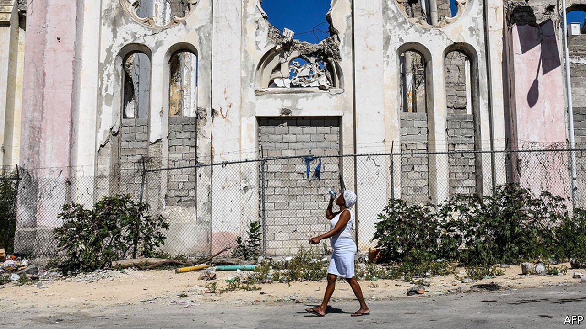
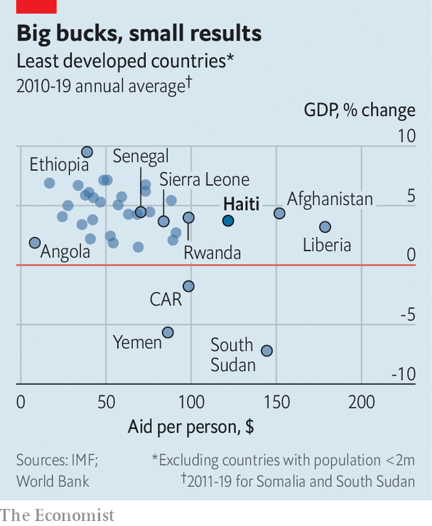

###### Aiding and abetting

# Foreign aid has done little to help Haiti 

##### By avoiding giving the government money, donors undermine it 

 

> Feb 5th 2022 

FOR MANY Haitians it felt wearily familiar. On January 24th a large earthquake hit the south-west part of the country, the second in the area in less than six months. The victims would of course need help, and the dysfunctional government of the western hemisphere’s poorest country was unlikely to provide much. But the prospect of yet more foreign aid workers descending on the place once dubbed the “Republic of NGOs” did not inspire much enthusiasm either. They are “like vultures”, complains Monique Clesca, a journalist and activist: they live off disasters, but do little to improve things. It is a common view.

Haiti’s situation is dire. Since Jovenel Moïse, the president, was assassinated in July last year gangs have taken over more of the country. Even the well-off are struggling. Rose-May Guignard, a former civil servant who lives in a once-prosperous neighbourhood to the south of Port-au-Prince, the capital, said she only leaves her home for short trips to get food and see her family. Travelling on the highway would put her at risk of kidnapping.


This lawlessness is compounding Haiti’s poverty. Even before the pandemic, three-fifths of its 11m residents lived on less than $2 per day. It is placed 170th out of 189 countries on the most recent Human Development Index, a UN ranking of the quality of life derived from data on life expectancy, education, health and the like.

What makes this misery all the more depressing is that Haiti has been receiving vast quantities of foreign aid for decades. Since 2000 rich countries have handed over $17bn: worth almost 8% of gross national income between 2000 and 2019, and roughly equal to government spending over that period. After an earthquake in 2010 which killed perhaps 200,000, aid surged.

 


This bonanza, however, has done little good. Haiti’s economy has grown more slowly over the past ten years than those of many other poor countries that receive much less aid per person (see chart). Relative to the citizens of countries that benefit from similar largesse, Haitians have lower life expectancy and are less likely to finish primary school. Other places that have suffered catastrophes, such as Rwanda and Cambodia, have grown much more quickly in the aftermath.

The received wisdom is that corruption has sapped the effectiveness of aid to Haiti. Indeed, Western donors have been wary of the Haitian government since the 1950s, when a kleptocratic dictator, François Duvalier, took power. He was succeeded by his son, Jean-Claude Duvalier, who is thought to have stolen as much as $800m in aid money during his 15-year rule, according to a report in 2004 by Transparency International, a watchdog.

Haiti’s fitful transition to democracy in the 1990s does not appear to have fixed the problem. Two recent presidents, Moïse and Michel Martelly, a former pop singer elected after the earthquake in 2010, have been accused of diverting aid from PetroCaribe, a scheme whereby Venezuela provides oil on easy terms to Caribbean countries. (Both denied the accusation.) Haiti ranks 164th out of 180 countries in Transparency International’s corruption index, a measure of perceived public-sector graft.

In addition to corruption, Haiti also suffers from frequent political upheaval. Since Moïse’s assassination, a long-standing constitutional crisis has merely intensified. Two men claimed to be in charge after the killing. After weeks of confusion, Ariel Henry, who had been nominated as prime minister by Moïse but had not yet taken office at the time of the assassination, became acting president. He is unpopular, and survived an apparent assassination attempt in January. He says he will not step down on February 7th, the date that would have marked the end of Moïse’s presidential term. On January 31st Mr Henry rejected a resolution of the body set up last year to elect a provisional president and prime minister. Elections originally scheduled for last year have not been held.

The corruption and turmoil have caused donors to steer aid away from the government. In the decade after the earthquake in 2010 they promised more than $13bn to Haiti, but hardly any of that went to the authorities. In the two years after the earthquake, it was less than 1%. The United States Agency for International Development (USAID) has funnelled 97% of its aid since 2010 through non-Haitian agencies or charities. Most of that went to a handful of organisations based in Washington, DC.

One problem when donors dodge the government is that the organisations they turn to instead often fail to take local advice. In 2008 an NGO funded by USAID spent $22m in Haiti on early education and teacher training. At the launch of the programme, the minister of education asked USAID to align its support with the government’s education plan in the future. After the 2010 earthquake, a commission to direct aid money paid for less than a fifth of rubble-removal projects that the government asked for, but four times the number of infrastructure projects. (The commission, co-chaired by Bill Clinton, then UN special envoy to Haiti, and the Haitian prime minister, was intended to include Haitians in decisions. But Haitian members of the committee said their opinions were largely ignored.)

Left to their own devices, aid agencies tend to focus on vanity projects. Ms Guignard, who worked in the land-management ministry, says that in 2015 she agreed with a French NGO that an isolated neighbourhood needed a better road. The NGO spent money on cultural projects instead.

Similarly, in 2011 USAID pledged $124m towards a project to build an industrial park in northern Haiti. Foreign economists thought that, before the earthquake, Haiti could develop by exporting cheap clothes. But according to Jonathan Katz, an American journalist, the park never reached full capacity. It created a fraction of the expected 65,000 jobs, and booted hundreds of farmers off their land. An expansion of a nearby port never happened—although USAID spent $72m on the project even after an appraisal suggested it was not viable.

Foreign donors can also be inefficient. After the earthquake in 2010 the American army spent at least $368,000 earmarked for aid on posh hotels in the United States and the Dominican Republic. The American Red Cross raised $488m to help victims. But an investigation by ProPublica, a website, found that 40% went on overheads.

According to Lant Pritchett at Oxford University, aid organisations often define success as creating tangible assets (building schools) as opposed to practical benefits (higher literacy). They can create the impression of helping without actually achieving much. In fact, foreign aid can sometimes make things worse. Donors tend to poach the best civil servants. Ms Guignard, for one, left the government for a job at an NGO. They diminish the state’s standing by providing basic services. And when aid disappoints, locals assume sticky-fingered bureaucrats are to blame.

Direct aid to governments can work. A study by the OECD, a club mostly of rich countries, found that seven African governments that were given money directly between 2010 and 2014 became better at delivering services, and did so more cheaply. Graft did not increase; in some cases ministries became more transparent.

A way to diminish worries about graft is to find parts of government that are working and channel aid to them, says Mr Pritchett. In Haiti the agency in charge of responding to disasters fits the bill. Since 2017 it has been run by a respected doctor, Jerry Chandler. At the moment, however, Mr Chandler’s budget does not cover the salaries of his employees. Outsiders want to donate flashy items such as emergency vehicles instead of funding routine expenses, he complains. “We can’t just take a photo op,” he says, “and be done.” ■

