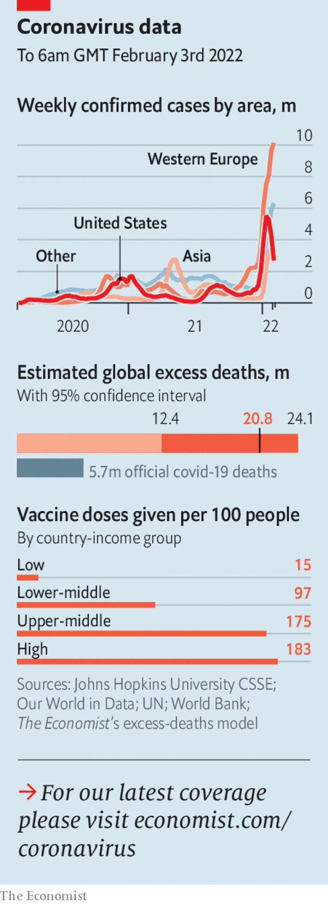

###### The world this week

# Politics 

#####  

 

> Feb 3rd 2022 

Joe Biden dispatched thousands more American troops to  that neighbour Ukraine. A Pentagon spokesman said the troops were not intended for combat but “to ensure the robust defence of our NATO allies”. Boris Johnson visited Ukraine to express his support. Vladimir Putin accused the West of trying to provoke war, and insisted his intentions were peaceful. NATO said Russia’s troop build-up near Ukraine was continuing. Some analysts believe conflict is unlikely during the Winter Olympics in Beijing, which will last until February 20th.


An electoral college of 1,009 politicians reappointed Sergio Mattarella as Italy’s president for a second seven-year term. The prime minister, Mario Draghi, had wanted the job, but his political allies balked, as they could not agree on a replacement to lead the government. An election is still required by the middle of next year. There is speculation that Mr Mattarella, who is 80, may not serve the full term. Mr Draghi might well then take his place.

Portugal’s prime minister, António Costa, won a surprise outright victory at a general election. His Social Democrats will no longer have to govern in coalition with the leftist parties that brought down his previous government.

Britain’s Conservative government  for “levelling up”, its signature policy for tackling regional inequalities. But its ideas to redress structural differences in life expectancy, pay, unemployment and so on focused on infrastructure projects still overseen by Westminster, rather than devolving any real power to cities and regions. And in the short-term a huge jump in energy prices and rampant inflation means that many Britons are facing a big rise in the cost of living.

Partygate

Boris Johnson was in more hot water, as the delayed civil-service investigation into “gatherings” in Downing Street during strict covid-19 lockdowns . Of the 16 events looked into, 12 are being investigated by police. More Conservative MPs said they had lost confidence in the prime minister, though not yet enough to force a leadership contest.

Erin O’Toole  as the leader of  Canada’s Conservative Party and replaced by an interim leader. Mr O’Toole had been criticised within the ranks for being too centrist; his sacking heralds a shift to the right for the biggest opposition party to the ruling Liberals. Populists wanted him to show more support for the tens of thousands of lorry-drivers who descended recently on Ottawa, the capital, to protest against vaccine mandates.

Argentina’s recent provisional agreement with the IMF appeared to be at risk when Máximo Kirchner, the son of Cristina Fernández de Kirchner, the powerful vice-president, resigned as head of the ruling coalition in the lower house of Congress. The IMF deal is less exacting than usual and does not require pension or labour reforms. However the details have yet to be approved by the fund. A final deal would need to be passed by Congress, too.

India’s central bank will launch a digital currency, the finance minister said in her budget speech. She also announced a tax on gains from trading cryptocurrency and other crypto assets such as non-fungible tokens. The announcements are seen as the legalisation, in effect, of crypto assets in a country that had toyed with banning them.

New Zealand’s stringent pandemic border restrictions are to be eased gradually over the year. Even citizens have found it difficult to gain entry; many have been stranded abroad. Jacinda Ardern, the prime minister, has seen her popularity slump. Later this month vaccinated New Zealanders in Australia will be allowed to return. The opening will later be expanded to other countries.

Tonga, a Pacific island nation that had avoided an outbreak of covid-19 over the past two years, entered lockdown after the discovery of community transmission. An earthquake in the Tongan archipelago in January triggered a tsunami and widespread damage to inhabited areas. The virus is thought to have arrived with aid workers.

America’s gross national debt reached $30trn. That is years ahead of previous forecasts, but inevitable given the $5trn in federal spending programmes that cushioned the economy during covid.

Building his war chest

Donald Trump’s political committee has accumulated $122m, an extraordinary sum that he can dole out to candidates he favours in the mid-term elections and to campaign ahead of a possible decision on whether to run for president again in 2024. Mr Trump’s committee and related groups raised $1.1bn in the election of 2020.

 


Mali expelled the French ambassador after Jean-Yves Le Drian, the French foreign minister, called the junta that has seized power in a coup “illegitimate”. Mali also ordered Denmark to withdraw 105 commandos who had been sent to help it fight jihadists. The row has prompted France and the EU to reconsider their military presence in Mali.

Leaders of ECOWAS, the west African regional bloc, are considering imposing sanctions on Burkina Faso after its government was overthrown in a military coup. ECOWAS, which has already suspended Burkina Faso as a member, is demanding a return to civilian rule.

A militia group attacked a camp for people displaced by conflict in the east of the Democratic Republic of Congo, reportedly using machetes to hack at least 60 of its inhabitants to death. Long-simmering feuds between different ethnic groups in the Djugu area, where the camp is located, have claimed tens of thousands of lives in the past.

Galloping annual inflation of 61% is once again eroding confidence in Zimbabwe’s local currency just a few years after it was reintroduced in 2019. Many in the country fear a return of the hyperinflation that forced Zimbabwe to dump its currency and adopt the American dollar in 2009.

