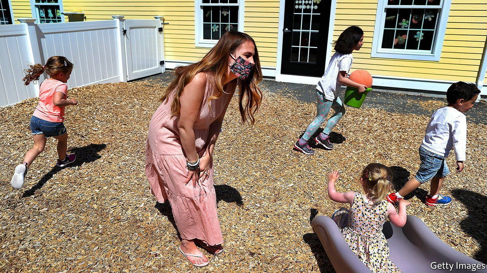
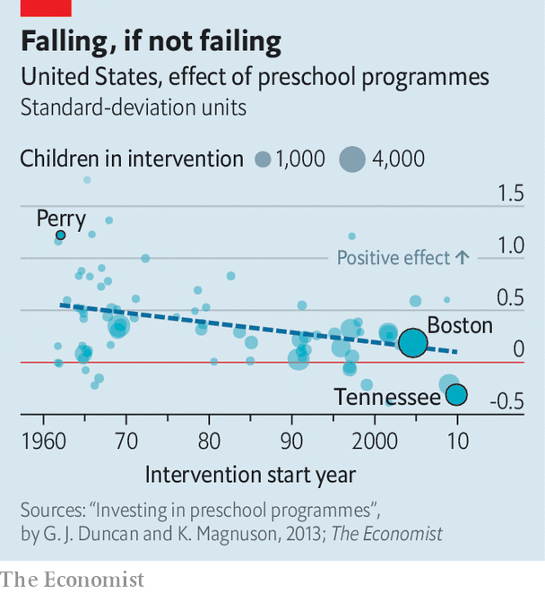

###### Preschool education

# A new study finds preschool can be detrimental to children 

##### But the picture may not be as gloomy as it seems 

 

> Feb 3rd 2022 

FREE, UNIVERSAL preschool for three- and four-year-olds is a key component of the Democrats’ agenda. Proponents say pre-kindergarten, or pre-K, education can be transformative for children, particularly those from disadvantaged backgrounds. A new study seems to contradict this. It finds that children who attended a pre-K programme in Tennessee actually scored worse on a range of education and behavioural measures. Yet this might reflect general improvements in early education rather than the impact of one programme.

Studies from the 1960s and 70s suggested that pre-K might be a silver bullet for improving the outcomes of poor children. In one striking example, those enrolled in the Perry Preschool Project, which targeted African-American children from low-income families, were by the age of five more than twice as likely to have an IQ above 90. As adults, they committed fewer crimes and earned more money. For every dollar spent, the programme generated nearly $13 in economic returns.

 


More recent results are far more nuanced (see chart). A meta-analysis of 22 experiments conducted between 1960 and 2016 shows that children who were enrolled in preschool were less likely to need special-education services or repeat years and graduated from high school at higher rates. But the improvements were small. One study published in 2021 of programmes in Boston found that attending preschool did not affect test scores in adolescence but did boost high-school graduation and college attendance.


The new study complicates the picture further. Researchers at Vanderbilt University followed nearly 3,000 disadvantaged Tennessee children, some of whom were randomly assigned places in a free pre-K programme. Like previous studies they found that attending preschool made children better-prepared for kindergarten. But the benefits ended there. Between third and sixth grade, the children who attended preschool did worse on standardised tests, had lower school attendance, racked up more disciplinary infractions and needed more special-education services.

The effects were small, however. The biggest differences were in sixth grade, where scores in reading and maths were between 1% and 4% lower than for children who were not given spots in the programmes. In the context of previous studies, this difference is modest.

Measuring the impact of pre-K is difficult. Many of the effects don’t emerge until later in life. And the effect of individual programmes is becoming harder to isolate. In the Tennessee study 18% of children in the control group enrolled in Head Start, a programme offering early education, nutrition and health care to children from low-income families. A further 16% attended private day-care centres. Parenting has also changed a lot since the 1960s: parents are more hands-on, and home-educational resources have vastly improved.

The quality of pre-K instruction may have deteriorated, too. Programmes have expanded. Teacher-student ratios in Tennessee were double those in the Perry project. And America has the third-lowest spending on early-childhood education among 36 mostly rich OECD countries.

Even if pre-K programmes are only as good as the alternatives, they help in other ways. They allow parents to return to work. A number of papers have found that the economic benefits of child-care or pre-K programmes vastly outweigh the costs. ■

