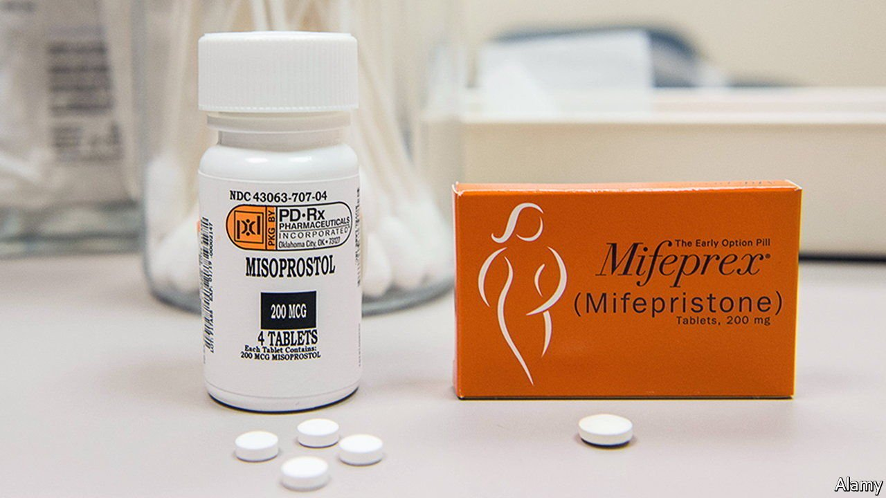

###### Abortion by mail in America

# A safe and simple abortion option becomes more readily available 

##### If the Supreme Court ends Roe, the benefits of abortion-by-mail will be even more obvious 

 

> Feb 3rd 2022 

MEDICATION THAT allows women to end pregnancies at home up to ten weeks after conception has transformed abortion health care in many countries. Data are patchy but more than two-thirds of abortions in northern European countries and 90% in India are thought to happen this way. America, however, has lagged. Restrictions imposed by the Food and Drug Administration (FDA) since the drugs were approved for this purpose in 2000 mean that only around 40% of abortions in America are chemically induced.

That is beginning to change. In December the FDA lifted its most onerous requirement, that women collect the first of the two drugs used to end pregnancies from a clinic or medical office in person. This made permanent a relaxation the FDA introduced during the pandemic. Now women can be prescribed mifepristone, which blocks the pregnancy-enabling hormone progesterone, after an online consultation, and receive it in the post. A second drug, misoprostol, which causes the uterus to contract and expel the fetus, taken several hours later, has several uses and is available over the counter in pharmacies.


The advantages of medication abortion are many. Research suggests it is largely safe. In conservative states with few abortion clinics (six states have only one left), removing the need for women to travel, often long distances, to in-clinic appointments is particularly beneficial. Being prescribed abortion medication in this way is also cheaper than going to a clinic, a big advantage in a country where federal money cannot be used to pay for abortions. In a clinic the cost of a drug-induced abortion is between $500 and $800. Buying the pills from one of a growing number of telemedicine startups costs around $200.

Medication abortion may also have the potential to dampen the flames of America’s abortion war. Increasing its use is likely to reduce the number of abortions performed later (surgically) in pregnancy, the sort that give antiabortionists their most grisly and potent campaign imagery.

The successes of America’s anti-abortion movement will limit the impact of the FDA’s action, however. Some 19 states have laws requiring a doctor to be present when mifepristone is taken. In December Texas introduced harsh jail sentences and a $10,000 fine for anyone who prescribed abortion medication by telemedicine. In all, 15 states introduced bills restricting medication abortion last year; nine of these were enacted. Women in many parts of the country will still have to travel across state lines if they want an abortion.

But removing the in-person requirement will make things easier for them. Lauren Dubey, a nurse and co-founder of Choix, a sexual and reproductive telehealth startup that offers asynchronous care (dispensing with the need for a live consultation), says that a woman can order the pills to an address in a state where this is legal and travel when she is able, without having to keep to an appointment. She adds that allowing women to order the pills by mail will free capacity in bricks-and-mortar clinics for those who need in-person care—women whose pregnancies have passed the ten-week point, say, or who want to keep their abortion secret from their partner or parents.

If the Supreme Court overturns Roe v Wade this year, as many expect it to when it rules on a case involving Mississippi’s ban on most abortions after 15 weeks of pregnancy, the benefits of abortion-by-mail will become even more obvious. Nearly half of America’s states would ban most abortions if Roe was ditched.

Abortion-rights activists are working to raise awareness that abortion medication is a safe option. Some stress that it is available even when it is not legal: Aid Access, a charity based in Europe, prescribes and sends the drugs to women in any state. It has seen a surge in demand from Texas since most abortions were banned there. Women can also buy the pills direct from overseas pharmacies. If Roe is overturned, more women are likely to get abortion drugs this way, whatever the FDA says. ■

