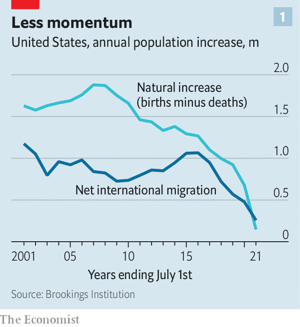
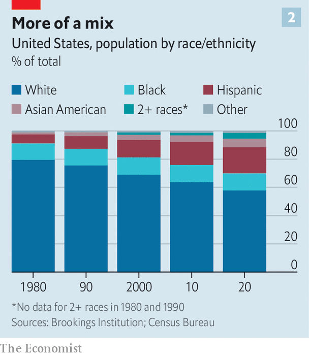

###### The US census

# America is stagnating—demographically, that is 

##### A decline in birth rate and immigration is making the country more European 

 

> Feb 5th 2022 

IT IS THE cars’ fault, apparently. Because the rear seats of American automobiles are inadequately enormous, only two child seats will fit in the back. Parents wanting three children must therefore buy a minivan, which many do not wish to do. Hence, smaller families. According to “Car Seats as Contraception” (we’re not making this up), a research paper by Jordan Nickerson of the Massachusetts Institute of Technology and David Solomon of Boston College, child-safety seats have resulted in about 130,000 fewer births since 2000.

That is only a small share of the decline in the number of births, which was over 142,000 in 2019-20 alone. But tiny social and legal constraints do make a difference. According to the Census Bureau, America’s population grew by just 0.12% in the year to July 2021, the smallest annual rise since the bureau began collecting such data in 1900. America’s white population is falling. So is the number of those under 18. Politicians and commentators fret about a “baby bust”.


Demographers elsewhere might wonder what the fuss is about. America’s population is still rising, unlike that in Russia and Japan. Even at the modest growth rates of 2010-20 (when the US population expanded by 7%), the number of Americans could increase over the next 40 years to over 410m, from 332m in 2021.

But among rich countries, the United States has long been an outlier, with relatively high and rising fertility, robust immigration and an expanding labour force. Trends that Europeans view without anxiety can seem alarming to Americans accustomed to demographic dynamism. Nicholas Eberstadt, at the American Enterprise Institute, a think-tank, fears the possibility of “indefinite population decline barring only offsetting immigration”. Monica Duffy Toft of Tufts University even asked if America might collapse under the weight of its demographic stagnation, as the Soviet Union did (she concluded it wouldn’t).

Against that background, it makes sense to consider what the data from the ten-year census of 2020 actually say about the severity of the population downturn. A county’s population increase or decline is determined by two trends: natural increase (births minus deaths) and net migration (arrivals from abroad minus those returning home). Both are falling.

The covid-19 pandemic pushed America’s death rate up and birth rate down. Deaths soared from 2.8m in 2018 to 3.4m in pandemic-stricken 2020. Research by the Federal Reserve Bank of St Louis argues that the pandemic affected fertility among women aged 30-34 (prime child-bearing age) the most. As a result there were only 150,000 more births than deaths in 2021, one of the country’s lowest rates ever.

This may be, Mr Eberstadt suggests, a blip. Death rates and perhaps birth rates will return to normal when the pandemic eases. But what is normal? The decline in America’s natural increase long predates covid. It has fallen steeply since 2007, when births outstripped deaths by 1.9m people. The total fertility rate—how many children women will bear in their lives—was 2.1 in 2007, the “replacement rate” which keeps the population stable. Now it is 1.64. This change reflects the ageing of the population (there are fewer women of child-bearing years) and young adults’ decisions to postpone having children as a result of the Great Recession of 2007-09 (economic uncertainty is often associated with a fall in the birth rate).

 


For a while, this did not matter much because of immigration. By adding around 1m people each year to America’s population in 2000-15, net migration cushioned the impact of a smaller natural increase. In 2016, however, migration fell off a cliff (see chart 1). In the 2010s, the foreign-born population saw its smallest increase in 40 years and net migration is now little more than 250,000 a year. Initially, the squeeze was imposed by President Donald Trump’s anti-immigration policies. Recently the pandemic has sent workers scurrying home. This element of America’s demographic stagnation was partly the result of policy choice.

All this makes America more European than it was. But it is worth remembering that “Europe” covers a multitude of sins. There are two European demographies, the eastern one (Russia, the Balkans), with falling populations and what demographers call “low, low fertility”, and the western (France, Britain, Scandinavia), where populations are still growing slowly and fertility is higher. America is not identical to the second group and remains nothing like the first. Despite a decline, America’s fertility is not low by rich-country standards: in 2015-20 it was just below that of France, which has relatively robust demography, and higher than Germany’s and Britain’s.

America’s urban population continues to expand. Of the 50 largest cities, 32 saw faster population growth during the 2010s than in the 2000s. New York City, for example, grew by 8% in the 2010s to 8.8m, nearly four times the rate in the 2000s (covid has since taken some of the gloss off that achievement). Despite the return home of many Latino immigrants, the United States has not lost its capacity to attract the best and brightest, at least from Asia. Asian immigrants now outstrip those from Latin America by more than two to one, and 87% of new immigrants have college degrees. If—a big if—the country could liberalise its immigration policies again and expand access to child care, it could go some way to slowing down its demographic decline.

 


Perhaps most important, ethnic minorities show little of the stagnation affecting whites (see chart 2). The number of Hispanic and Asian Americans grew by 23% and 36% respectively during the 2010s whereas that of whites contracted by 2.6%. The under-18s became majority non-white in 2020 and the 18-29 age group will follow suit within five years. The number of people describing themselves on the census form as “two or more” races soared from 9m in 2010 to 34m in 2020, though this reflects decisions to switch racial identification as well as the birth of more multiracial Americans. As William Frey, at the Brookings Institution, points out, without ethnic minorities, in its demography America would resemble Japan or eastern Europe.

As it is, it looks more like western Europe: older, with more births postponed. According to the census, the population of those aged 55 or more rose by 27% in 2010-20. That of the under-55s rose by just 1.3%. Women are having children later. Americans’ average age of first birth in 2019 was 27, the highest ever. In 1990, women aged 15 to 19 had about 60 births per 1,000; in 2019, that had fallen to just 17. In contrast, birth rates for women aged 40 to 44 have increased by a third since 2007.

Farewell, exceptionalism

Lastly, some of the distinctiveness of Americans’ attitudes that accompanied (or perhaps caused) their unusual demography is disappearing. These included greater religiosity than in Europe, more optimism and a willingness to move from place to place. Recent global polls by the Pew Research Centre on what makes life worth living and attitudes to political rights suggested there is little difference between Americans and Europeans, though older Americans are more likely to say faith is important to them.

In 2019, less than 10% of Americans moved house, the smallest share of the population to do so since 1947 and a far cry from the heady days of the post-war mobility boom when twice as many Americans upped sticks and moved annually. Ageing and double-income households have made Americans less footloose, more reluctant to pile into their (child-safe) automobiles and head to new life. ■

