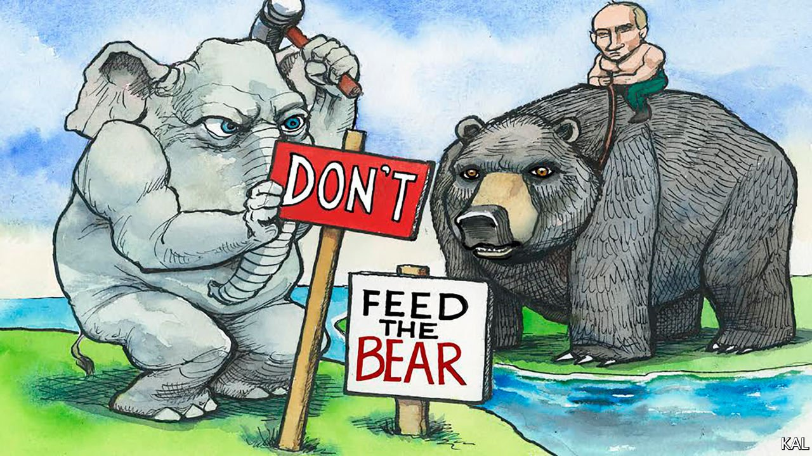

###### Lexington

# America is uniting against Vladimir Putin 

##### Republicans are playing a more constructive role in the Ukraine crisis than Donald Trump must like 

 

> Feb 5th 2022 

WHEN WALTER CRONKITE turned sadly against the war in Vietnam, legend has it, Lyndon Johnson knew he’d lost Middle America. By contrast, there is nothing reluctant about the denunciations of America’s much more modest military posture towards Ukraine by today’s most popular news anchor. For weeks Tucker Carlson of Trump-loving Fox News has been pushing an “America First” cocktail of disdainful isolationism, paranoid anti-elitism and Vladimir Putin fandom.

Ukraine is “strategically irrelevant” to America, he insists. “Senile” Joe Biden is running a neoconservative “war machine”. The machine is being fuelled by defence contractors who stand to profit from a war, suggests Mr Carlson. Mr Putin, perfectly understandably, “just wants to keep his Western borders secure”. And any elected Republican who backs Mr Biden’s effort to deter him should be “ruthlessly” primaried. Mr Carlson’s views have gone down a storm with Russian state media.


Mr Carlson is so influential on the Trumpian right that he has himself been touted as a future president. Inevitably, therefore, some of his 3m viewers have told their congressional representatives that they should be backing Russia, not Ukraine. Yet, in another contrast with Cronkite, who had almost ten times as many viewers, Mr Carlson’s is now a marginal voice on national security. Most Americans view the Russian troop build-up as a threat to American interests and want to support Ukraine by all means short of troop deployments—and there is little distance between Republicans and Democrats on this issue. A year after Mr Trump left office, Republicans’ view of the bear has normalised.

This has encouraged many Republicans in Congress to revert to their pre-Trump Russia positions. Those in the House have predictably found it hardest. A faction of Trumpian diehards, such as Paul Gosar of Arizona, agree with Mr Carlson; and some of their colleagues—including the party’s leader in the House, Kevin McCarthy—are afraid to disagree with him openly. Yet many of the same Republican House members who in 2019 shrugged off Mr Trump’s underhand effort to lean on Volodymyr Zelensky are now among the Ukrainian leader’s fiercest defenders. Liz Cheney, who called the scandal Mr Trump’s coercion of Mr Zelensky elicited “a political set-up”, is one of them.

Republicans in both houses are blaming Mr Biden excessively for the crisis. “Biden is weak and Putin preys on weakness,” says one senator. But their sniping has not prevented the Senate drafting a bipartisan list of sanctions on Mr Putin’s regime, which could soon be passed. Including lend-lease arrangements for Ukraine and curbs on the Nord Stream 2 gas pipeline, it represents an effort to defuse earlier partisan disagreements on the conflict. The idea, according to Jeanne Shaheen of New Hampshire, was “both to support Ukraine and to show Vladimir Putin that he’s not going to divide Democrats and Republicans on this issue.”

On national-security policy, in other words, Mr Trump has changed his party much less than many feared. It was the realm where Republican senators felt ablest to resist him even during his presidency. Thus, for example, their near-unanimous support for a bill forbidding him from lifting sanctions on Russia in 2017—a rare act of Republican defiance against Mr Trump. Its architects were emboldened by the relative independence of the Senate’s foreign-policy committees, a last vestige of bipartisanship. They could also count on Mr Trump’s voters being relatively unfussed about foreign policy. Meanwhile, the fact that Mr Trump’s foreign-policy chiefs were often able to moderate or obstruct his isolationist diktats encouraged many Republicans simply to ignore them.

Post-Trump dynamics in both parties have further steeled America’s response to the Russian threat. To distinguish itself from Mr Trump, the Biden administration took early pains to signal its support for Ukrainian sovereignty. In an effort to define Mr Biden as weak, Republicans nonetheless demanded it do more. The result, says Fiona Hill, a Kremlinologist and bruised former witness to Mr Trump’s misuse of Mr Zelensky, has been a far more unified political response than Mr Putin—or she herself—could have expected. “My experience during the impeachment trial made me feel we were incapable of collective action on national security,” she says. “But we are pulling together.”

Three qualifiers must be admitted. First, that conclusion may be premature. The combination of sanctions and security pledges that most Democrats and Republican have agreed upon is politically easy. They might disagree wildly on whatever additional measures could be necessary if the situation escalates. Most Republicans will certainly blame Mr Biden if it does.

Second, even if Trump-style isolationism has little influence in Congress, it matters in Republican primaries. Candidates in the most fraught current contests—including Senate races in Arizona and Ohio—are parroting Mr Carlson. That is a promise of a more populist Republican Senate conference, especially if Mr Trump maintains his hold on the party, which is the third big caveat.

Putin things in perspective

The former president has said little about the Ukraine crisis, beyond claiming that it “wouldn’t have happened” on his watch. But it will not make him less anti-NATO or pro-Putin. His former national security adviser John Bolton predicted that Mr Trump would withdraw America from the alliance if he won re-election. And the more Mr Biden stands by NATO and confronts Mr Putin, the likelier that would seem. One of the organising principles of Mr Trump’s time as president was his efforts to dismantle Barack Obama’s legacy. In a second term he would try even harder to undo anything associated with Mr Biden. And the Republican establishment, even if willing to oppose him at the margins on security issues, would not stop him. ■

Read more from Lexington, our columnist on American politics: (Jan 29th)

 (Jan 22nd)

 (Jan 15th)

For coverage of Joe Biden’s presidency, visit our dedicated  and follow along as we track shifts in his . For exclusive insight and reading recommendations from our correspondents in America, , our weekly newsletter.

