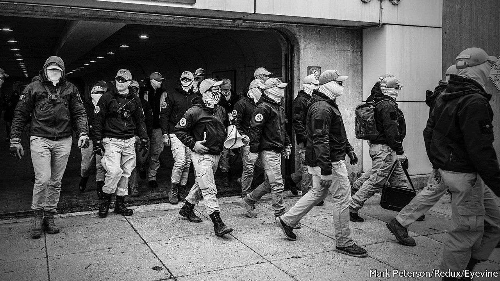

###### Crypto and the far right

# The charm of cryptocurrencies for white supremacists 

##### White power, dark money 

 

> Feb 5th 2022 

ON AUGUST 11TH 2017 far-right groups from all over America came to Charlottesville, Virginia, to protest against the removal of a Confederate statue. The next day a white supremacist drove his car into a crowd of counter-protesters, killing one of them. In the aftermath PayPal, an online-payment platform whose terms of service forbid raising money to promote hate, suspended extremists’ accounts. So did Apple Pay and Google Wallet. Visa and Discover, two credit-card firms, followed suit, as did Patreon, a crowdfunding site. Far-right groups found themselves in search of other places to raise money. What many of them embraced was cryptocurrency.

The Southern Poverty Law Centre (SPLC), an advocacy group, has identified over 600 cryptocurrency addresses used by members of the far right. They include ones associated with Andrew Anglin, publisher of a neo-Nazi website, the Daily Stormer; Andrew Auernheimer, a white-supremacist hacker; and Don Black, founder of a white-power online forum. They advertise their wallets on their websites and social media, asking for donations. And they get them. Stefan Molyneux, a far-right podcaster who was ousted from YouTube, has received over $1.67m in bitcoin. Mr Anglin has reportedly received over 100 bitcoins ($3.8m).


About 16% of Americans hold or trade crypto. But the authors of an SPLC report published in December struggled to find a prominent American far-right figure without a cryptocurrency presence. Tim Squirrell of the Institute for Strategic Dialogue, a think-tank concerned with extremism, believes much of this has to do with deplatforming efforts.

That cryptocurrencies can be used by all appeals to those cast out by payments platforms. But bitcoin was not a panacea for far-right groups. Because any transaction on the bitcoin blockchain is public and transparent, researchers were for a long time able to monitor individuals’ dealings once an anonymous wallet had been identified as belonging to a radical-right group. Neonazi BTC Tracker, a Twitter account created by John Bambenek, a cyberthreat expert, chronicled transactions in real time for three years. Technological advances in crypto have since made privacy tokens like Monero, which hide transactions, possible. These groups have probably flocked to them.

The wider crypto scene is often imbued with an anti-establishment spirit. Its fans proclaim that decentralised blockchains will revolutionise finance. This idea appeals to libertarians or those who distrust the traditional banking system. But it also appeals to anti-Semites. Those who believe banks hold too much power because they fear Jewish control over business will be seduced by the idea of an independent or decentralised financial system. Cryptocurrency can therefore be both a useful funding tool and seen as a revolutionary technology which distances people and their money from “elites and banksters”.

This idea extends into other industries, such as tech, that have tried to quash white supremacists from using their platforms. “One of the dreams of the far right is not just a blockchain cryptocurrency, but a decentralised future where they don’t have to rely on mainstream structures,” says Mr Squirrell. “They want blockchain blogging websites, blockchain streaming websites” to escape deplatforming.

Others’ angst is grist to their mill. “Breathless, pearl-clutching ‘exposés’ about powerless political dissidents using cryptocurrencies are transparent smear campaigns by hirelings of the political and economic establishment that fears the erosion of its power,” says Greg Johnson, author of “The White Nationalist Manifesto”.

As long as bitcoin and its ilk are decentralised, the ability of far-right groups to use them will remain. (Intermediaries, exchanges such as Coinbase and Binance, are another matter.) But crypto still has plenty of disadvantages that may stymie extremist adopters. In May 2021 Monero reached $480; it now stands at $150. Bitcoin has shed 40% of its value since November. ■

