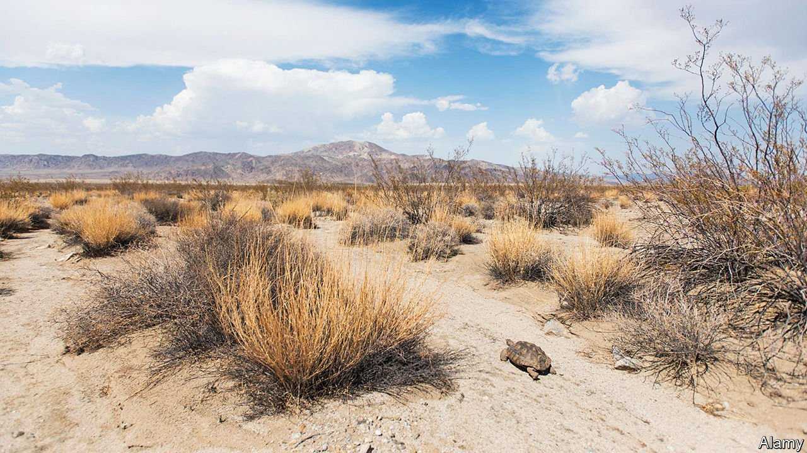

###### Drought victim

# The loneliness of the desert tortoise 

##### A once-abundant species struggles to survive 

 

> Feb 5th 2022 

THE SOUTHERN CALIFORNIA desert is not for the faint of heart. The temperature rises above 100°F (38°C) in the summer. There are months of suffocating dryness, and flash flooding during monsoon season. Yet the desert in Joshua Tree National Park is filled with life.

The desert tortoise is one of Joshua Tree’s many species. Despite its name, it is not faring well in the desert. Since the 1980s the population has declined by about 90%. Michael Vamstad, a wildlife ecologist at the park, describes what is happening as “thirty to three”: where once researchers would count 30 or more tortoises per square kilometre, now they count three.


This has dire implications. “There’s a minimum population density that is required for the tortoises, and three tortoises per square kilometre is right below that limit,” says Mr Vamstad. Below this threshold, tortoises struggle to find a mate. It becomes nearly impossible for mature adults to reproduce with enough frequency to sustain the already dramatically reduced numbers.

Two things have conspired against the tortoises. First, the West’s mega drought has made conditions difficult. The summer monsoon season should bring heavy rains that sustain the plants and wildlife through dry times. Desert tortoises can store a quart of water for about a year and will spend roughly 95% of their time below ground, making them excellent at conserving water. Mature tortoises can withstand drought conditions but it is harder for hatchlings.

And even for adults, drought reduces resilience. An infection has made its way into the tortoise population, giving some of them a runny nose. That may seem innocuous enough, but the water lost and the increased difficulty of finding water to replace it is proving a fatal combination for some tortoises, including breeding females.

“We feel that we are at the very edge right now,” says Mr Vamstad, though he remains optimistic: “They seem to be holding the line.” Ecologists are beginning to look at captive breeding programmes if the tortoises are not able to bring their numbers up on their own. For now, the tortoises are still burrowing their way through the desert.

For more coverage of climate change, register for , our fortnightly newsletter, or visit our 

