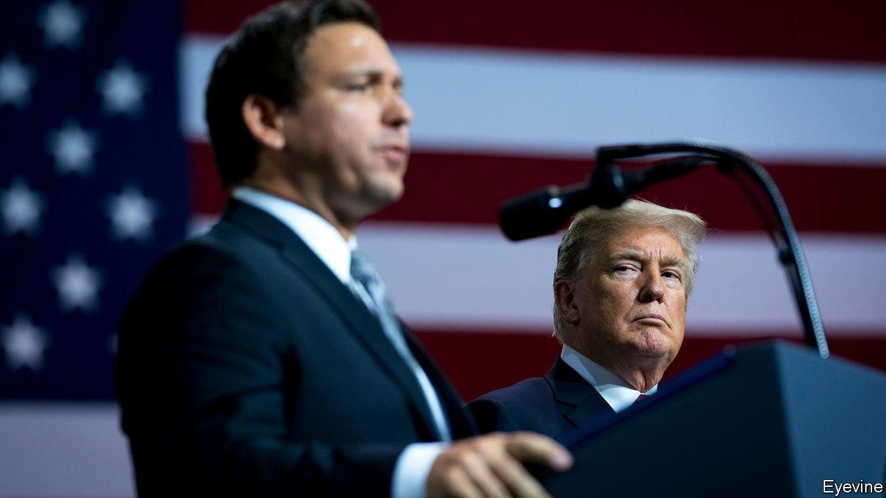

###### “Freedom First”

# Why Florida is lurching to the right 

##### Ron DeSantis uses his state as a peninsula podium to advertise his policies 

 

> Feb 5th 2022 

FLORIDA’S REPUBLICAN governor, Ron DeSantis, recently released his “Freedom First” annual budget. If that sounds like a campaign slogan, it’s no accident.  is running for re-election as governor in November and is believed to be plotting a run for the presidency in 2024. With the state government’s legislative session in full swing (it ends in March), the goings-on at the Capitol in Tallahassee are worth watching for what they show about Mr DeSantis’s ambition, as well as Florida’s political direction. America’s third-most-populous state is veering to the right.

In 2018 Donald Trump, a fellow Floridian who happened to be in the White House, transformed Mr DeSantis’s career, helping the then unremarkable House member win the Republican gubernatorial primary by unexpectedly endorsing him. Mr DeSantis’s defiant response to covid-19—fighting restrictions such as mask mandates and pushing for schools to reopen—elevated his stature nationally, as have his frequent attacks on  and his “biomedical security state”. He describes Florida as the “freest state in the United States”. His record on covid-19 has won him both friends and foes: Florida’s 64,000 deaths represent a higher rate per head than America’s as a whole, but not as high as some predicted, given his aversion to restrictions common elsewhere.


Mr DeSantis is using Florida as a peninsular podium to advertise his policies. In his proposed $100bn budget, he is pushing for a special police force to oversee state elections, which he calls an “election integrity unit”, and wants to make it easier to penalise companies that “facilitate illegal migration” to Florida. He envisages bonuses for police officers who move to Florida, and wants to create a state militia of volunteers that could work with the National Guard in emergencies.

The federal government and Mr Biden may be Mr DeSantis’s favourite foes, but they are also funding parts of his agenda. Mr DeSantis proposes pay rises for teachers and police, as well as $1bn to offer Floridians a holiday from the state’s petrol tax. Florida will use at least $3.8bn in federal stimulus for programmes like these in the coming fiscal year, reckons the Florida Policy Institute, a think-tank.

The legislature is allied with the governor in taking aim at social issues. It is trying to block classroom discussions about subjects that make pupils feel “discomfort, guilt, anguish or any other form of psychological distress on account of his or her race”, an allusion to critical-race theory, a topic that helped a Republican win election as governor in Virginia. Another proposal would ban discussions of sexuality and gender identity in public schools.

 is likely to become law before long. Lawmakers are designing it so that if the Supreme Court rules in favour of Mississippi, which pioneered the 15-week cut-off with its own controversial law, Florida will “have a law on the books that can be enforceable”, says Chris Sprowls, speaker of the Florida House of Representatives.

What explains Florida’s lurch to the right? Recently the number of voters registered as Republican exceeded the number of registered Democrats for the first time in modern history. Now 35.9% of registered voters identify themselves as Republican. Democrats and independents are at 35.6% and 26.8% respectively. Republicans see momentum on their side. Mr Sprowls says people moving to Florida are “realising that there’s a reason that they chose to come here”; which is, Republican policies.

The DeSantis bandwagon also plays its part. “This is a company town, and the Republicans you meet here are very DeSantis-oriented,” explains Steve Schale, a Democratic operative. Many remark that they have never seen so little dissent within the Republican Party when it comes to the governor’s agenda. Mr DeSantis “has emerged as the most powerful governor in state history”, according to James Clark, the author of “Hidden History of Florida”.

With Republicans holding close to a supermajority in the state House, Democrats are powerless to stop them. Evan Jenne, the House minority co-leader, says Democrats have “a definite gallows sense of humour”. He likens their current experience in state government to having to “lay down on the train track, even though we know [the train] will drive right over us”.

This legislative session will test the extent of Mr DeSantis’s power. He has intervened in the legislature’s redistricting process, submitting his own proposed maps that would strengthen Republicans’ position in future elections—the first known time that a governor of Florida has gone so far. Opponents say the proposal could violate state law. Another test will be whether the legislature creates his proposed election police force, which has received a lukewarm reception and is more “transparently political than some other things he’s proposed”, says Aubrey Jewett, a professor at the University of Central Florida.

All this suggests that those who hope Mr DeSantis offers a more moderate brand of Republicanism than Mr Trump may be mistaken. Post-election pragmatism has given way to a penchant for grandstanding. The man rehearsing for a national role is a complex one: well-educated and wonkish, but lacking charisma. His wife Casey, who has been battling cancer, is impressive, quietly pushing his national campaign and advocating among donors for her husband’s “faith-based” policies.

For the moment the governor seems to be heading towards re-election. Florida is booming: businesses stayed mostly open despite covid-19, and people are moving to the state. That makes it harder for a Democratic opponent to make a persuasive pitch. Charlie Crist, a former Republican governor, is now running as a Democrat, as is Nikki Fried, the state’s agriculture commissioner (though she muddied her prospects when she compared Mr DeSantis to Hitler for acting like a dictator).

The most compelling candidate is Annette Taddeo, the first Latina Democrat to be elected as a state senator, representing Miami-Dade County. She thinks Mr DeSantis’s biggest weakness “is that he is concerned about Iowa and New Hampshire voters, not Floridians”. In November, Sunshine State voters will be able to express at the polls whether their governor’s pitch for national attention irks them. One Floridian watching closely will be Mr Trump, who has been taking oblique potshots at his protégé-turned-potential-rival. ■

For exclusive insight and reading recommendations from our correspondents in America, , our weekly newsletter.

