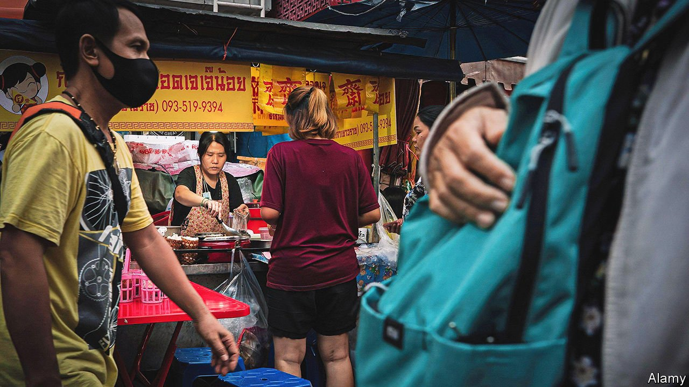

###### Sidewalk ballet

# Bangkok is trying to evict its street hawkers 

##### The city’s residents would like their pavements back 

 

> Feb 12th 2022 

SNAILS AND fermented fish, bamboo shavings and cured buffalo skin: these are among the delights that Wannee Junrut has laid out on trays at her stall in Lao Market in Bangkok, Thailand’s capital, every morning for the past 28 years. Hawking is the family business: Ms Wannee’s mother tended the stall before her, and her children are also in the trade. They may soon need to find other work, however. The local government is threatening to demolish their stall.

When the Thai army seized power in 2014, it vowed to bring order to the streets of Bangkok. Tens of thousands of hawkers ply their trade on the city’s roads, selling not just food but everything from clothing to cleaning products. Bangkok’s local government reckons they are a nuisance, responsible for all manner of ills including bad hygiene and obstructing traffic. In 2014 it launched a campaign called “returning walkways to the public” and started evicting hawkers, licence or no licence. It claims to have since closed nearly 75% of informal markets and shooed away some 12,000 vendors, nearly 60% of the total.


Hawkers are “a health-and-safety issue”, says Ton Panon, a property developer. He lists a litany of complaints: they force pedestrians onto the road; they do not clean up after themselves; they pour cooking oil down the drains, clogging sewers and exacerbating flooding (vendors pooh-pooh these claims). He does not want them banned from the city—“They are a way of life here”—but wishes they could be relocated to designated food courts and markets. Many Bangkokians share Mr Ton’s frustrations. Facebook groups such as ThailandFootpath, which chronicle broken and blocked pavements, have hundreds of thousands of members.

Vendors and skint backpackers will suffer if the stalls vanish. So, too, will ordinary Bangkokians. The city’s residents get nearly half of their weekly meals from street vendors, suggests one survey. Many stalls cater to people with low incomes. Besides, banishing hawking from pavements will not magically render them safe and passable: Bangkok’s motorcyclists seem convinced that they are an extension of the carriageway.

