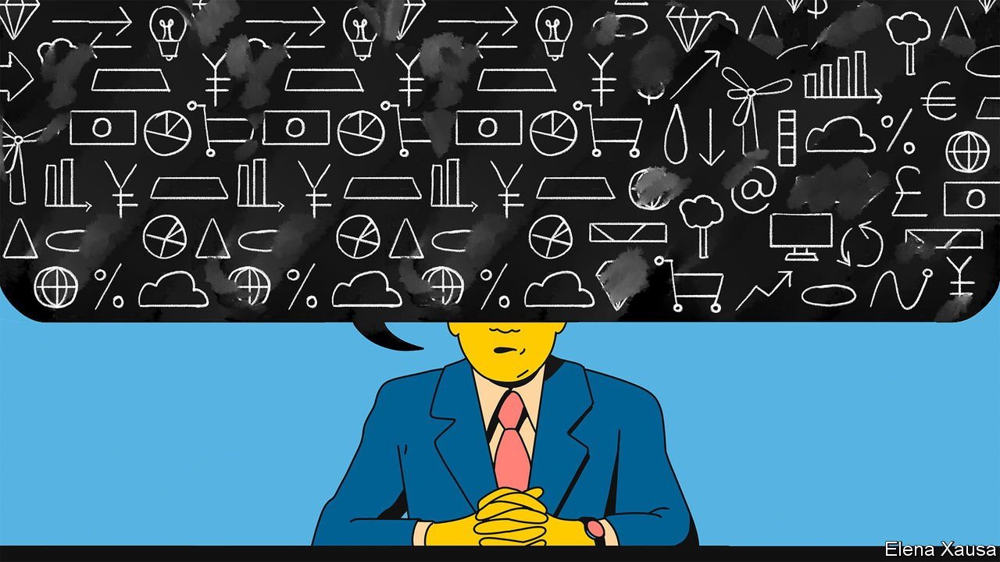

###### Banyan

# Kishida Fumio’s “new capitalism” is many things, but it is not new 

##### The prime minister’s big idea to reinvigorate Japan is better politics than economics 

 

> Feb 12th 2022 

THE PHRASE “new capitalism” may not arouse as much passion as “down with capitalism”, but it would at the very least seem to promise—the clue is in the name—a fresh approach. When Kishida Fumio first used the phrase last year in his campaign to lead Japan’s ruling Liberal Democratic Party (LDP), and thus the country, its meaning was still unclear. “Ask me in a few months—we’re supposed to figure it out,” one of the members of Mr Kishida’s New Capitalism Realisation Council replied when Banyan made discreet inquiries in October.

Mr Kishida has since sought to clarify his signature initiative. He cannot be accused of a lack of ambition: “We want to lead the world’s economic thinking with a ‘new capitalism’ originating in Japan,” he told a conference in December. Yet that thinking remains a mishmash of old ideas and empty buzzwords. Mr Kishida’s list of plans under the banner includes raising wages, fostering startups, revitalising rural regions and reducing carbon emissions. All sensible ideas, but hardly unfamiliar.


Take wages, which have been stagnant for decades. Mr Kishida is right to say that raising them could help invigorate the economy. There are many novel things he might try, starting with sharply boosting the average minimum wage, which is low by rich-country standards, at ¥930 ($8) per hour. He could enforce Japan’s equal-pay-for-equal-work laws. Or he might make it easier for workers to move between firms. Instead, Mr Kishida has offered some public-sector employees a one-off raise and hectored private firms to do the same, rewarding with subsidies those that comply. Abe Shinzo, prime minister from 2012 to 2020, employed similar tools to little avail.

Another chronic problem is Japan’s shrinking pool of labour. A new approach might involve letting in more foreign workers. Instead, the prime minister has stubbornly stuck to strict border policies that have kept out almost all new arrivals since the pandemic started, drawing comparisons to the sakoku (“closed country”) period of 1633-1853, when Japan largely shut itself off from the world. New thinking on climate change might include taxing carbon emissions and ditching coal. Mr Kishida has resisted both steps in deference to industry.

Old ideas animate his plans for development, too. Mr Kishida’s “digital garden-city nation”, a collection of investments in digital infrastructure to revive rural areas, is an update of the “garden city” concept that Ohira Masayoshi, a former prime minister, advocated in the 1970s. To help realise his plans, he will rely on massive fiscal stimulus and relatively loose monetary policy—or what Mr Abe called the first two of the three arrows of his “Abenomics”.

The biggest changes under Mr Kishida have been rhetorical. He intones against “neoliberalism”—shorthand in Japan for market-friendly reforms to encourage competition—for worsening inequality and poverty. The word “reform” is virtually absent from Mr Kishida’s lexicon. Whereas Mr Abe began his term by promising more shareholder-friendly corporate governance, the new prime minister talks about the importance of other stakeholders in businesses, such as workers and customers, evoking the Edo-era merchant philosophy of sanpo-yoshi, or “three-way good” for buyers, sellers and society.

Mr Kishida’s rhetoric reveals a misdiagnosis of his country’s ills. Japan is hardly a neoliberal bastion. It could be more equal: based on market incomes, its Gini coefficient, a measure of this, is slightly worse than the average of the OECD, a rich-country club. But after tax and transfers, it has barely budged since the 1990s. Growing inequality is less of a problem than a lack of dynamism.

If there is coherence in Mr Kishida’s “new capitalism”, it is as canny domestic politics. Preaching against the evils of neoliberalism deprives Japan’s opposition of a useful talking point. Sniping at Abenomics allows Mr Kishida to differentiate himself from his still-influential predecessor. Hyper-cautious covid-19 policies, however damaging to Japan’s soft power, insulate Mr Kishida from the accusations of indifference that helped fell Suga Yoshihide, who followed Mr Abe. Voters seem happy: Mr Kishida’s approval ratings have stayed near 60%.

Barring a major pandemic-related setback, that puts him in a good position to sail through upper-house elections due this summer. After that, Mr Kishida will have three years before he needs to face voters again. Plenty of time, then, to come up with something new.

Read more from Banyan, our columnist on Asia: (Feb 5th)

 (Jan 29th)

 (Jan 22nd)

