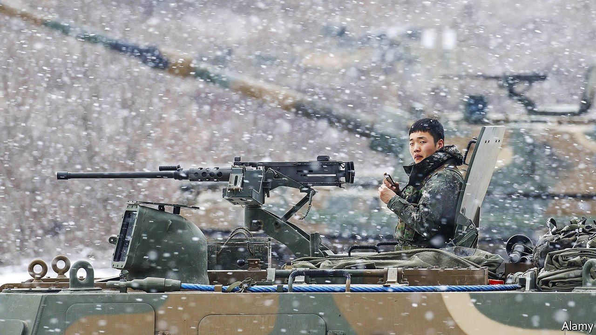

###### Explosive growth

# South Korea wants to become one of the world’s biggest arms exporters 

##### A legacy of defence spending and support from America are boosting the weapons industry 

 

> Feb 12th 2022 

MOON JAE-IN began his five-year tenure as South Korea’s president in 2017 with a pledge to act as his country’s chief peacemaker, repairing relations with North Korea and ending the decades-long state of war on the Korean peninsula. Having failed to achieve that objective, Mr Moon looks likely to end his tenure—elections are due next month—with a reputation as his country’s chief arms dealer.

Last month Mr Moon returned from a trip to the Middle East with a $3.5bn contract to sell a home-grown missile system to the United Arab Emirates (UAE), the biggest deal in the history of South Korea’s defence industry. As a belated outcome of the same trip a $1.7bn agreement to sell an artillery system to Egypt was completed earlier this month, after a decade of negotiations. Mr Moon also signed a deal worth $700m to sell the same guns (pictured) to Australia when he visited Canberra, its capital, in December.


The flurry of dealmaking is proof of South Korea’s ambition to join the ranks of the world’s big arms exporters. The country has long sought to capitalise on its substantial domestic spending on arms development by finding foreign customers for its weapons. The strategy has paid dividends. South Korea’s arms exports have increased more than sixfold since 2005; in 2021 they exceeded imports for the first time. The government sees the defence industry as a big source of future growth.

South Korea’s potential as an arms exporter results from its enduring confrontation with its northern neighbour. The need to keep up its guard against North Korea has meant that, despite its middling size, South Korea has long been one of the world’s biggest spenders on troops and armaments. In 2020 it ranked 10th in the world for military spending, according to the Stockholm International Peace Research Institute, a think-tank. That year defence accounted for 12.4% of the annual government budget and 2.8% of GDP, more than in Britain (at 2.2%) and about the same as in India (2.9%).

The growing discord between America and China and uncertainties about America’s commitment to its global alliances have only confirmed the importance of greater self-sufficiency in matters of security. Under Mr Moon South Korea has boosted spending on acquiring and developing new weapons systems in an effort to modernise the armed forces, while reducing the proportion of the defence budget spent on salaries and maintenance. In December Mr Moon said South Korea should be “proud” of its military prowess and growing defence exports.

As home-grown military technology has improved, exporting it has become both more plausible and more lucrative, says Sheen Seong-ho of Seoul National University. Many domestic weapons systems are now of similar quality to those produced by America, South Korea’s main ally, with which it has many technology-sharing arrangements. But they remain cheaper, attracting customers in emerging markets. More than half of exports are sold to other Asian countries, notably the Philippines and Thailand.

Exporting more also makes sense for South Korean defence companies, which have long catered only to their own armed forces. Producing larger quantities should lower production costs per unit and help defray the expense of development.

South Korea’s emerging role as an arms-export powerhouse has other benefits for the government, too. Defence deals often come with bilateral security agreements and technology co-operation, making them a useful tool of foreign policy. The deal with Egypt came with a promise of mutual military co-operation in the future.

Yet the new export industry also carries certain risks. The government is not particularly discriminating in its customers. It suspended weapons sales to Myanmar only several weeks after last year’s coup, following a public outcry. Egypt, Thailand and the UAE are no beacons of liberal democracy. But with the exception of Myanmar, public criticism of the deals has so far ranged from muted to non-existent.

Simpler worries are emerging, too. A fifth of the cost of an indigenously developed fighter jet will supposedly be paid for by Indonesia under a partnership agreement. But Indonesia is said to be behind on its payments. It remains unclear how much of the promised contribution South Korea will actually receive. Not every export deal is a good one. ■

