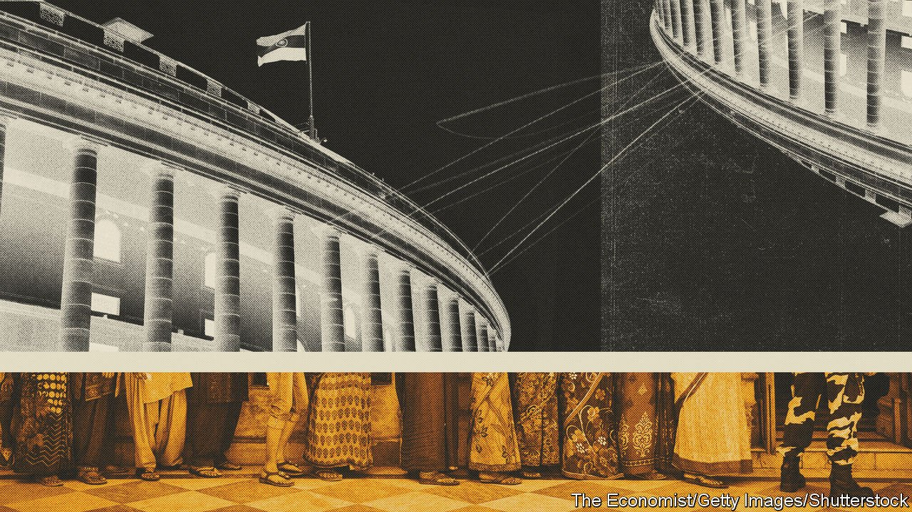
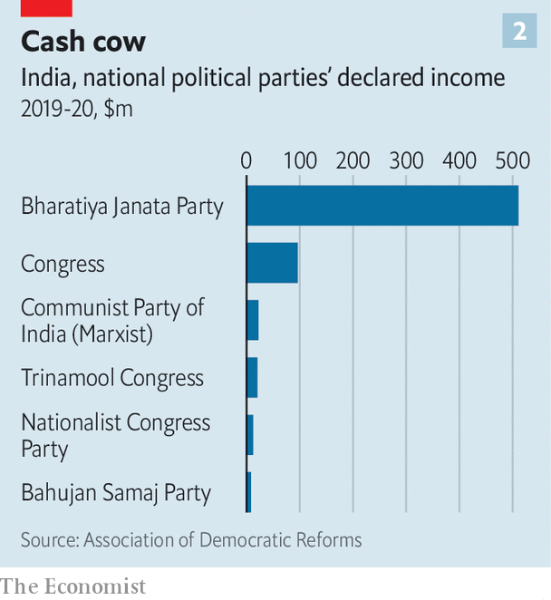

###### The ailing body politic

# The organs of India’s democracy are decaying 

##### It takes more than elections for a country to be democratic 

 

> Feb 12th 2022 

IN THE NEXT four weeks some 175m Indians will vote in elections across five states with a combined population approaching 300m. Their legislatures will determine the make-up of the Rajya Sabha, the upper house of Parliament, and thus the selection of the president. The outcome in Uttar Pradesh, India’s most populous state, could well shake Narendra Modi, India’s most domineering prime minister in decades. As an advertisement for democracy, India’s periodic mobilisation of millions of polling officers to provide a say for hundreds of millions of voters is difficult to beat.

But while the face of Indian democracy, in the form of elections, looks healthy, the rest of the body is not. From courts and police to politicians and parties to campaign finance and the mechanics of legislation, the bones, sinews and organs of Indian democracy look alarmingly unwell. According to the Democracy Index produced by the Economist Intelligence Unit, our sister company, over the past decade India has slipped or stayed still on every measure except political participation (see chart 1).


An x-ray of India’s Parliament reveals several missing or half-functioning vital systems. The number of days per year that the national Parliament actually meets has fallen from more than 100 in the 1950s to 66 in the 2014-19 term and further still during covid-19. America’s Congress, by comparison, is typically in session for more than 160 days a year.

 


Many laws do still get passed, but they receive less and less scrutiny. The proportion of bills referred to standing committees in the lower house, the Lok Sabha, has dropped from around 60-70% under the previous government to 27% in Mr Modi’s first term and just 13% in his second. Attendance records in committee meetings in both houses for the past three years reveal a meagre average of 46%.

Of the 15 bills rushed into law during the monsoon session last year, not one had been deliberated in committee, and many were passed by perfunctory voice votes. This was partly because of opposition walkouts and noisy protests. But Mr Modi’s Bharatiya Janata Party (BJP) similarly rammed through a package of agriculture-market reforms in 2020. The result: a 14-month mass revolt by farmers, ending only when the laws were scrapped.

State legislatures are no better. For all the fuss—and immense expense—over this month’s elections to the state assembly of Uttar Pradesh, the fact is that the body met for only 17 days last year and a mere 13 in 2020. This compares with more than 80 days in the 1950s.

It is not just the BJP at fault; the legislature in Uttar Pradesh met on just 24 days in the year before the party took power. Congress-ruled Punjab, whose lawmakers met for a stately 11 days, was last year’s lowest scorer. And while its rivals bemoan the BJP’s bullying of the national Parliament, the opposition-dominated assembly of the state of Maharashtra attempted to bar 12 unruly BJP deputies from the building for a year, until the Supreme Court intervened.

So what do India’s 5,000 elected state and national legislators do, if they spend so little time legislating? Many are dedicated to serving their constituents. But many appear more devoted to winning back what they spent getting voted in, and more. According to the Association for Democratic Reforms, a research group, a record 43% of MPs who won seats in the 2019 general election had been charged with a crime, with 29% booked for grave offences such as rape and murder. This represented a 109% increase on the cohort of ten years earlier.

Crime seems to pay: analysis shows that a candidate with a criminal record is three times more likely to win than one without. Similarly, one with declared assets of more than 50m rupees ($670,000) is six times more likely to succeed than one with less. Term after term, compulsory declarations of assets reveal suspiciously huge rises in the wealth of incumbents.

 


If riches and ruthlessness are crucial for nabbing votes at street level, they are also needed at the top. Here, the BJP must take a bow, having struck a gusher with an ingenious mechanism called electoral bonds. Introduced in 2018, ostensibly as a reform to weed out illicit cash, the scheme allows for unlimited, opaque financing of political parties. A reporter would be unable, for example, to trace links between a billionaire whose fortune spiked after securing lucrative deals from the government, and his or her donations to enabling politicians. The sole indicator of political funding that is now disclosed is the total amount received (see chart 2). Not surprisingly, the ruling party is gaining the lion’s share. In 2020 the BJP’s declared assets of $655m outweighed those of the next 51 political parties combined. More striking, its stash rose by 443% in just five years.

In most democracies, courts would have tossed out electoral bonds as a flagrant obstruction of voters’ right to know who was funding their political parties. But in another sign of creaking democratic infrastructure, India’s Supreme Court has dragged out hearings on the issue indefinitely. Nor have the top judges bothered to take up other obvious challenges to normal democratic functions, such as the stripping of statehood from and bifurcation of the erstwhile state of Jammu and Kashmir in 2019. Lower courts have sometimes been more vigilant, but not always.

Perhaps not surprisingly, India’s democratic drift is reflected in its diplomacy. Despite much backslapping with democratic leaders, and membership in groups such as the Quad, a club of big Indo-Pacific countries worried by an increasingly belligerent China, India often declines to join other democracies when it comes to, for example, condemning the recent military coup in next-door Myanmar or the threats by Russia against Ukraine and other neighbouring democracies.

According to the count kept by America’s State Department of voting at the UN General Assembly, over the past five years India has matched America’s own votes just 28% of the time. That compares to 23% for China, 30% for Russia and over 50% for more stalwart democratic allies. This “coincidence ratio” is hardly a gold standard for democracy: America annoys other countries for a range of reasons. But it seems to reflect the down-on-democracy views of many Indians, who recently told pollsters that they would by a large margin be happy to abolish Parliament and accept army rule, more than it does the constitution that has for seven decades preserved their country from just such a fate. ■

