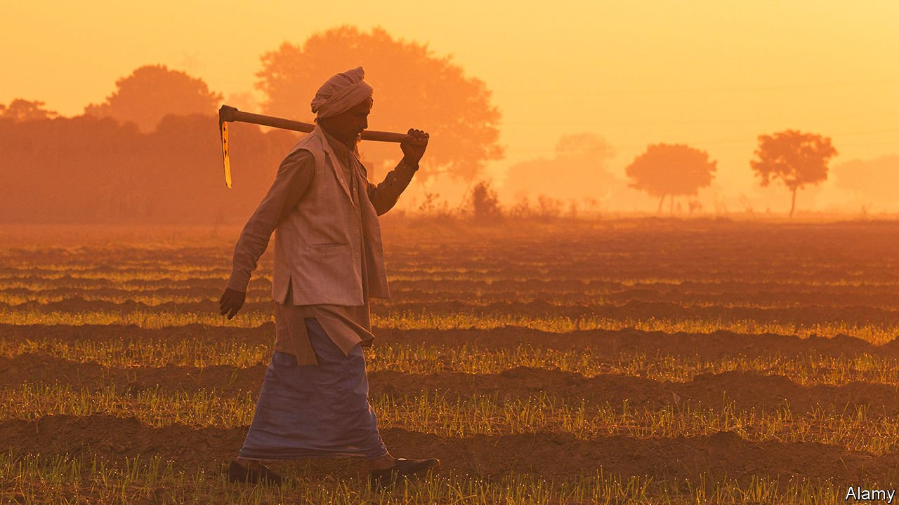
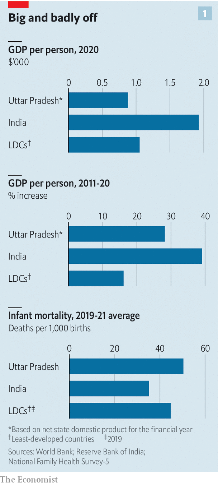
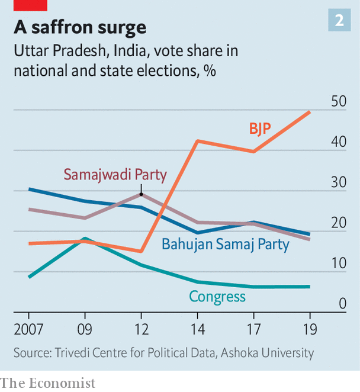
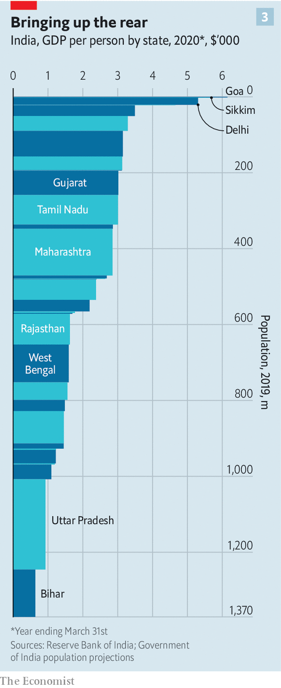
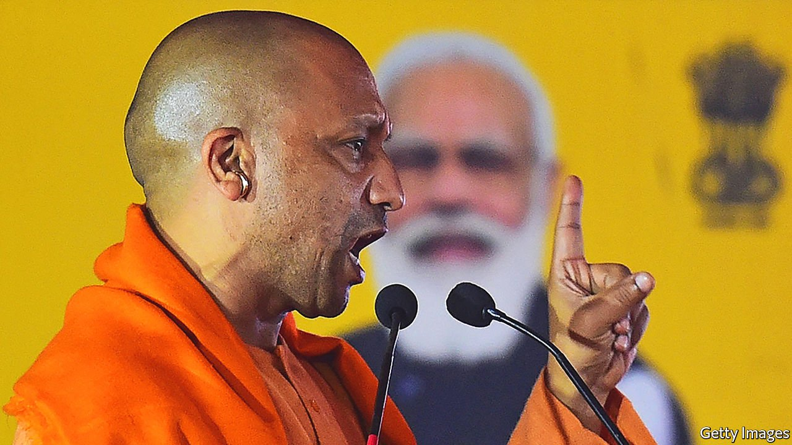

###### Local, but vast

# The elections in Uttar Pradesh will show where India is headed 

##### Can Narendra Modi’s BJP recreate its successes of the 2010s? 

 

> Feb 12th 2022 

THE STATE of Uttar Pradesh is a tad larger than the United Kingdom and three and a half times as populous. Covering much of the vast, fertile Gangetic Plain and pressed up against the border with Nepal, it is home to such treasures as the Taj Mahal and the Hindu holy city of Varanasi, as well as fast-expanding industrial zones, an astonishing 97,941 villages and the constituencies of one-in-seven Indian MPs. Increasing the number of parliamentary seats it took in UP (India loves initials) from 10 to 71 was a key part of the success which saw the Bharatiya Janata Party (BJP) win power in 2014 and made its leader, Narendra Modi, India’s prime minister.

The state also packs in a disproportionate quota of despair. It seems to fester with India’s grisliest crimes, its harshest oppressions by caste, sex or faith, its most feckless politicians and its most polluted environments. It has remained grindingly poor. At $991, nominal GDP per person amounts to less than half of the country’s modest average, and lower than that of any other Asian country save Afghanistan and Tajikistan (see chart 1).


On February 10th UP’s 150m voters began the month-long process of voting for the state’s legislative assembly. It is the world’s largest subnational election. The BJP’s effectiveness in defending its majority in UP’s legislature—it currently holds 303 of 403 elected seats—will be keenly watched throughout the country.

 


Three years into his second term, Mr Modi remains the strongest and most popular prime minister India has had since Indira Gandhi in the 1970s. But political headwinds are mounting. Covid-19, inflation, ever-starker disparities in wealth and intractable youth unemployment have all eaten away at the BJP’s narrative of “development for all”.

Policy blunders such as a flopped effort at farm reform have angered voters across the country. Resistance to Mr Modi’s centralising, homogenising tendencies has stiffened, too, particularly in the non-Hindi-speaking peripheries of the country. The headwinds were seen at full force in last year’s legislative elections in West Bengal, another big, important state. The BJP rolled its full juggernaut into the fray, laden with money and national figures, only for the local Trinamool Congress to pull its wheels off and chase Mr Modi’s men back to Delhi.

In contrast to Bengal, UP sits at the core of the Hindi-speaking, religiously conservative hinterland that is the BJP’s natural habitat. But disaffection has seeped in here, too. The verdict its voters deliver over the coming month—for electoral purposes the state is divided into seven slices which vote in sequence—will be a powerful signal as to India’s political future.

A severe setback could throw doubt on the BJP’s ability to win a third five-year term of national power in 2024. On the other hand, a strong showing will encourage Mr Modi to complete his refashioning of India into a Hindu rashtra, a state whose defining feature is not the diversity of its citizens but the faith of its 80% Hindu majority. This ideology of Hindutva is the BJP’s reason for being, and Mr Modi has been pursuing it in an increasingly autocratic manner. His view of the transformation he is bringing about seems increasingly tied to his own metamorphosis from politician into high priest of the new order.

A convincing victory in UP is important to this project not just because of the state’s size but also because of who runs it: Yogi Adityanath, leader of a religious order in eastern UP. He is 22 years younger than the 71-year-old Mr Modi, who gave him his job. As the prime minister’s anointed viceroy in India’s most populous state he is naturally viewed as a potential heir.

 


Over five terms as an MP the tonsured, saffron-robed monk gained a reputation for fiery chauvinism. In one speech he declared, “If they take one Hindu girl, we will take 100 Muslim girls.” When the BJP took hold of the UP legislature in 2017 (see chart 2) some warned Mr Modi that raising such an extremist to high office would damage the party’s image. Mr Modi ignored them, confident that India’s political centre was shifting further to the right, and was thus able to accommodate such views.

The chief minister lacks his sponsor’s sharp political instincts and photogenic flair, but shares his commitment to celibacy, penchant for pithy speech and snarling contempt for the old Anglophone order. He is no placeman. With his own independent base, he is rumoured to bridle at the interfering ways of the prime minister’s office, of the BJP high command and of the Rashtriya Swayamsevak Sangh, the Hindutva mother organisation in which Mr Modi served before turning to politics. But his style and views link him inextricably to Mr Modi’s project. If he does well, it will be a good omen both for that project’s continuation and for Mr Adityanath’s role in it. If he does badly, it may be back to temple duties for him.

Disharmonious monk

Mr Adityanath has been an industrious and demanding leader. He has promoted Hindutva in various ways, including throttling the trade or slaughter of cattle, promoting religious events and further criminalising the encouragement of religious conversion, ostensibly to protect Hindu women against a “love jihad” being waged by Muslims. He has also diligently pursued the “development for all” agenda.

All Indian parties promise voters goodies. But Mr Modi has taken a strong personal interest in delivering freebies to the poor. From accelerated road-building to the provision of free food during the covid-19 epidemic, not to mention handouts for farmers and other entitled groups, the “double-engine” effect of aligned state and national governments mean UP has benefited disproportionately from central-government largesse. Certificates of vaccination and sacks of free grain alike come emblazoned with the prime minister’s paternal portrait.

Mr Adityanath also takes a tough line on law and order. Upper-caste Hindus, who make up around a fifth of the electorate, praise his gloves-off approach. “Earlier, thugs and criminals used to walk around with their chests out,” says Rajesh Gupta, a prosperous baker in Barabanki, a provincial town east of the state capital, Lucknow (see map). “Now the government has got rid of goondah-gardi (thuggery).”

It is true that incidents of communal rioting, banditry and racketeering, long endemic to UP, have come down. But overall, respect for the law has not gone up. In the Muslim community (which makes up 19% of the population, compared with 14% nationwide) and among the Dalits, once known as Untouchables (21%, compared with 16%), there is little love for the tough measures about which Mr Adityanath boasts. Film of anti-government protests in Muslim districts has shown police acting as violent vandals.

 


The police have glaringly failed to protect lower-caste Hindus. In one notorious case in 2020 they ignored the parents of a 19-year-old Dalit woman who accused a group of men from the Thakur caste of raping their daughter. When she died of her injuries her family was pressed to cremate her corpse without a post mortem. A month later they used anti-terror laws to arrest Siddique Kappan, a journalist covering the story. Mr Kappan, a Muslim from India’s far south, remains in prison awaiting trial. So do many of the 360 other people jailed under the same rules that year.

Such scandals stem from the BJP’s fundamentally divisive approach to politics. If you set aside the upper-caste Hindus and the Dalits and Muslims (who themselves are deeply divided by class and ideology), the bulk of UP’s electorate is made up of a broad category officially termed Other Backward Classes (OBCs). This thick slice, including traditional yeoman farmers such as Jats and Kurmis but also myriad smaller communities, has in recent decades become the fiercest political battleground in north Indian elections. The BJP’s success with OBCs, amplified by the effects of India’s first-past-the-post electoral system, provided the party  with a landslide in UP’s legislative election five years ago.

In 1980 a government commission recommended that OBCs, and not just truly oppressed groups such as Dalits, should benefit from state quotas in jobs and education. That encouraged the growth of parties demanding respect and rewards for their particular group. In northern India and elsewhere this undermined the once-dominant Congress party, a big-tent movement that had led India to independence. In UP it was replaced by a system where power shifted back and forth between the Bahujan Samaj Party (BSP), supported by Dalits and Brahmins, and the Samajwadi Party (SP), dominated by Yadavs, a large OBC community who are by tradition cattle-herders, though few make their living that way these days.

Start your double engines

The BJP’s approach to this fragmented electorate is to target higher castes with appeals to law and order and Hindu pride; to woo smaller OBC groups, and Dalits, by accusing others, such as Yadavs, of grabbing spoils for themselves; and to bind it all together by stoking hostility to Muslims. This approach buried the SP and the BSP in the elections in 2017, producing a legislature with more high-caste Hindus and fewer Muslims than UP had seen for decades. The success of this polarisation strategy can be seen in a shift it has encouraged in other parties. For fear of being branded as “appeasing” Muslims or indulging in “vote-bank politics”, many are now shy of running Muslim candidates, even in the parts of the state, such as its north-west, where minority numbers are biggest.

For the BJP’s strategy to work again, though, it needs OBC voters who trusted the BJP last time to do so again. Some doubtless will. In Ramna, a village near the Ganges just outside of Varanasi, a big pilgrimage centre that Mr Modi has chosen as his own parliamentary district, the government has been generous and farmers wax enthusiastic. They tick off a litany of improvements, from better power supply and roads to schemes for insurance, compensation for flood damage and subsidised seeds and fertiliser. “Tell me if we did not vote for the BJP government, then for whom?” asks Lalchand Patel, gesturing towards neat plantings of winter vegetables.

 


But in Shahpur, a village 30km to the north of Ramna, lower-caste farmers complain of rising prices and of the feral cattle that now wander the countryside since they can no longer be sold. “Modi-ji fooled us,” says Dinesh Dev Rajbhar. “They are giving us a lollipop of five kilos of free grain, but then their stray cows damage 50 kilos of our yields. Let them come this year, we will answer them with our votes.”

In the village of Saidanpur, an hour’s drive east of the state capital, Lucknow, a farmer scoffs at Mr Adityanath’s boasts of vikas, or development, of building broad highways, medical colleges and a high-tech “defence corridor”. Come to my house and I’ll show you development, he says. Across a dirty ditch, through a muddle of goats wearing cast-offs against the winter chill, he points in sarcastic triumph at a low wall built of cow dung and a plastic tarp held up by sticks: “This is my vikas.”

For all this, the double engine gives the BJP the ability to make promises that would not be credible from its smaller rivals. And it has its customary recourse to dog whistles aimed at stoking sectarian feeling. In an attempt to appeal to Jat farmers in western UP, who have turned against the BJP due to the very poorly implemented effort at farming reform, Amit Shah, India’s home minister and Mr Modi’s right-hand man, told a rally that his party and Jats shared the same ideology because “both had fought against Mughal invaders”—a pointed reference to a Muslim dynasty that once ruled much of India. Mr Adityanath has repeatedly insinuated that under previous governments, only Muslims got government handouts, while Muslim mafiosi made streets unsafe for respectable folk. “To them, Pakistan is dear, but we sacrifice our lives to Mother India,” he recently tweeted.

When it comes to putting such messages across, the BJP also has advantages in terms of volunteers and cash. It fields a quiet army of diligent organisers from a constellation of powerful grassroots Hindutva groups. Its coffers are full, in part thanks to a recent law that allows unlimited anonymous funding of parties via “”, in part thanks to favours it has granted to some of India’s wealthiest.

Goodnight and good Lucknow

This wealth has been a boon to UP’s newspapers, where full-page adverts lauding Mr Adityanath’s mighty achievements appear daily, and to creators of posters, flags and catchy jingles. Not that the BJP has to pay for all its advantages in the media. Altnews, an online fact-checking site, revealed that nearly all the “random” interviewees in a vox-pop segment on a local television station were members or employees of the BJP. This is not atypical.

Perhaps the biggest advantage that the BJP enjoys, in UP as nationally, is the fragmentation of its opponents. Aside from a smattering of smaller parties, most of which aim to contest only a few of the state’s 403 seats, there are three main challengers: Congress, the BSP and the SP. Having failed to come up with a formula by which each party would stand down in some seats to give one of the others a better chance, they are condemned to fight each other as well as Mr Modi’s behemoth.

 


Despite an interesting new emphasis on attracting women voters, Congress is widely dismissed as a spent force in the state. The BSP, although still popular among Dalits, no longer finds itself able to push beyond that base. This leaves the SP as the main contender. Its last stint in power was lacklustre. In 2017 its share of the vote fell from 29% to 22%. The party has since rebuilt itself around Akhilesh Yadav, the scion of a local political dynasty. Mr Yadav has successfully roped in at least seven smaller parties, each with drawing power in a local community, such as the Jats.

Perhaps more importantly, he has benefited from multiple defections. The SP has welcomed quite a few OBC candidates from the BJP who claim to have been misled by Mr Adityanath and Mr Modi. This does not just help the party appeal to more voters; it is also a vote of confidence. In a state particularly prone to horse-trading and jockeying, ambitious players are betting on a future in the SP.

Enjoying a base among his own caste and an almost certain tactical vote from most Muslims, Mr Yadav is banking on capturing votes from a wide section of disgruntled communities. In at least half a dozen villages, especially in western UP, BJP candidates have been chased away by hurled shoes, rocks and insults. This suggests that in some parts of the state, at least, voters are not buying the BJP’s propaganda offensive.

Opinion polls indicate that Mr Modi’s party’s grip on the state will slip a bit, but not fail completely. Most predict the BJP will lose 50 or more of its 303 seats, with the SP winning perhaps 150. But several pollsters put the BJP firmly ahead in last year’s state election in West Bengal, only to see it humiliatingly trounced. And in UP’s electoral history, dramatic upsets, helped by the first-past-the-post system, tactical voting and fast-shifting alliances, have been more of a rule than an exception. The state has a habit of punishing incumbents for over-confidence, as the SP can attest.

The near-term impact of a defeat for the BJP when the votes are counted on March 10th would be limited. Because state electors get a vote on who becomes president, fewer BJP legislators would make it less likely for that vote, which will take place in July, to produce a president aligned with the party. That might have some effect on the degree of constitutional change he could undertake, but the president’s powers are pretty scant. In the longer term, though, it could have a profound effect on the BJP, tempering its triumphalism. And a true drubbing would throw Mr Modi’s re-election in 2024 into doubt. Whether it would also improve the prospects of this vast, poor state remains an open question. Little else has. ■

