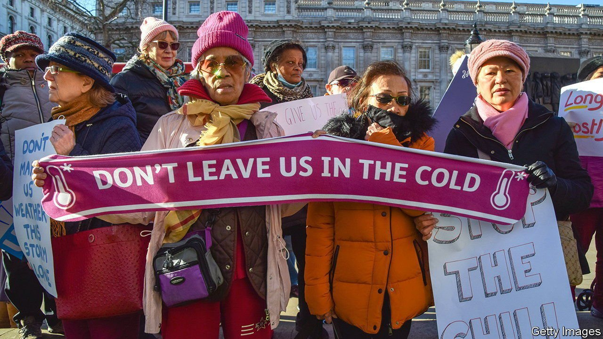
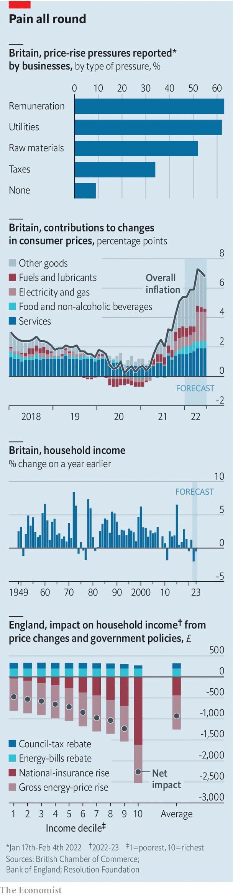

###### Bare necessities

# Britain’s cost-of-living squeeze in four charts 

##### Higher prices and taxes are only partially offset by government measures 

 

> Feb 12th 2022 

THE ABILITY to ignore inflation is increasingly a luxury. A survey of members of the British Chamber of Commerce, a business association, found that most were experiencing pressure from pricier labour, utilities and raw materials. Just 9% said they were not feeling the squeeze. Nearly three-quarters of those facing rising costs are passing some on in higher prices.

Households, too, are seeing their costs go up. On February 3rd the Bank of England predicted that annual consumer-price inflation would rise from 5.4% in December to above 7% in April. Food, fuel and services such as restaurants and hotels are all becoming pricier. Brexit, the pandemic and an energy-price shock are among the culprits. Before government intervention, the average household’s annual bill for electricity and gas was set to increase by £693 ($939).


 


The pain will be felt unevenly. In November universal credit became more generous for low-paid workers, and in April the minimum wage will rise by 6.6%. But pensioners and those out of work will see their benefits rise by just 3.1%, less than half the expected increase in living costs. Since taxes are also rising in April, the Bank of England predicts that households are about to experience the biggest cut in disposable income since 1949, when records began.

The government is seeking to blunt the impact. Some Conservative MPs had called for the scheduled rise in payroll taxes to be postponed, or value-added tax to be removed from energy bills. Instead, it opted for a more progressive approach. From April it will offer 80% of households a council-tax rebate worth £150, and from October all will get £200 taken off their energy bill (to be repaid later). The Warm Home Discount for 3m poor households will increase from £140 to £150; everyone else will pay an extra £5.

The net result of all this is that the very worst-off will get about the same amount of cash help as the rich, even though they will find it harder to pay for essentials. For many, government support will only partially offset higher costs. And even that will be withdrawn at some point. Both voters and politicians will continue to feel the pain.

For more coverage of matters relating to Brexit, visit our 

