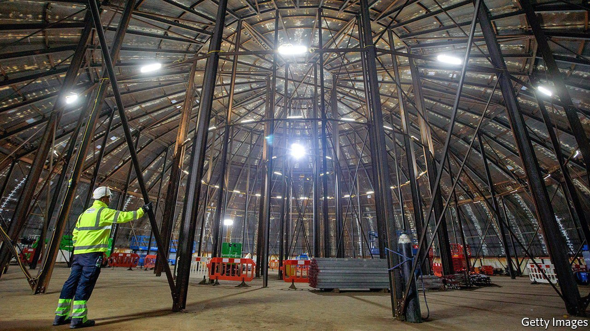

###### Hualong, farewell

# British regulators have approved a Chinese reactor design 

##### It is unlikely to be built 

 

> Feb 12th 2022 

ON FEBRUARY 7TH, after five years of deliberation, 900 meetings and 1,681 official queries, regulators approved a Chinese nuclear-reactor design for construction on British soil. Hualong One, known in Britain as the HPR1000, has a more straightforward design than other reactors being built in Europe, including one at Hinkley Point, in Somerset. The idea is that it should be cheaper and faster to build than previous models. In the rush to decarbonise the power grid, such a reactor would be a boon. One is destined to be the heart of Bradwell B, a planned nuclear-power plant in Essex.

Or at least it was. In fact, no Hualong reactor is likely to be built in Britain, no matter what that regulatory assessment says. The politics of Chinese investment in Britain have changed during the five years in which the project has been under consideration. In November, in response to a question on Chinese investments in nuclear power, Boris Johnson, the prime minister, told Parliament he would block “undue influence by potentially adversarial countries in our critical national infrastructure”. Publicly, the government says no decision has been taken. Privately, it is clear that Chinese involvement in British nuclear-power plants is at an end.


Backing away from the newly approved technology and its seller, China General Nuclear Power Group (CGN), will create a cascade of problems. Construction work on Bradwell B is supposed to start in 2025. On current arrangements, it will be operated and majority-owned by CGN, which is in turn owned by the Chinese government. The company worked its way towards its strategic goal of building and operating a Chinese-designed nuclear-power plant in Britain by bankrolling the development of this century’s only other new nuclear reactors in the country: Hinkley Point C (pictured), in which it has a stake of a third, and Size well C in Suffolk, in which its stake is due to be a fifth.

Without the prize of Bradwell B, CGN’s interest in those other projects may diminish, says Stephen Thomas, a professor of energy policy at University of Greenwich. That would suit the government. But unwinding the investments CGN has made will be tricky, particularly from Hinkley Point C, which is half-built and due to start operating in 2026. Buying out CGN’s stake would cost as much as £10bn ($13.6bn). The Chinese firm has already spent heavily on preparatory work at Sizewell C, and that would need to be bought out, too.

In January the business secretary, Kwasi Kwarteng, announced £100m of government funding for Sizewell C, to “further support” its development during an “important phase of negotiations”. The government will hope that private investors take this as a signal of intent and rush to fill CGN’s shoes. But they showed little interest when the three nuclear projects were first proposed—which is why the government ended up with CGN in the first place.

Building and operating nuclear plants is a risky business. Although cautious optimism regarding the construction of Hinkley Point c is in order—the second half of the build is going faster than the first, as engineering teams learn by doing—the reactor design, known as an evolutionary power reactor, or EPR, is still complex and fault-prone. An EPR built in Taishan, in China, has been closed for months because of faults. French and Finnish EPRs have been under construction for more than a decade, plagued by delays.

If private capital decides to stay away, energy consumers will be left holding a multibillion-pound bill for nuclear-power plants that are central to the government’s plans for swift decarbonisation. The possibility of relying in part on cheaper, easier-to-build Chinese plants will be gone. CGN may end up taking its consolation prize—the imprimatur bestowed on its designs by Britain’s regulator—and heading off to build power stations elsewhere. ■

