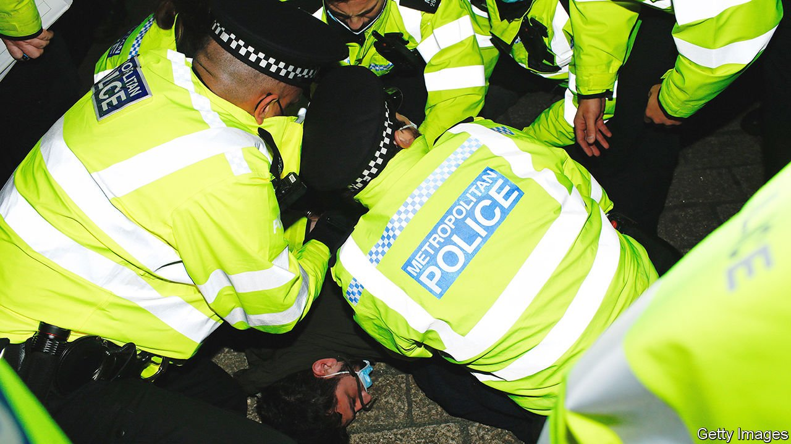
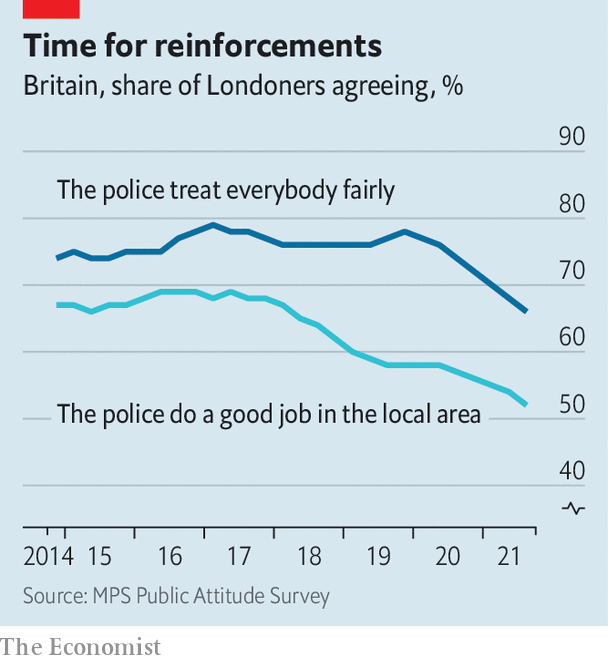

###### Law and order

# London’s Metropolitan Police Service is failing on three fronts 

##### That makes it less, not more, likely that it will change 

 

> Feb 12th 2022 

Editor's note (February 10th 2022): After this article was published, it was announced that Dame Cressida Dick would be standing down as the Metropolitan Police's commissioner.

BRITAIN’S LARGEST police force is staggering from crisis to crisis. Over the past few months much awful behaviour by Metropolitan Police officers has been uncovered, with more almost certain to come out. The force has enraged MPs by wading clumsily into politics. Its attempts to clean house seem desperate. In early February Dame Cressida Dick, the Metropolitan Police commissioner, wrote to every officer, telling racists, homophobes and sexists to “leave now”.

The Met is failing on three fronts. It has been unable to root out prejudice and misbehaviour; it has lost the confidence of many Londoners; and it has offended politicians. Each failing compounds the others and makes them harder to fix. The Met’s size and complex role as a city police force with national responsibilities make reform both urgent and almost impossible.


The cultural crisis at the Met centres on what criminologists call a “signal crime”—an enormity that suggests something has gone badly wrong. In March 2021 an officer abducted, raped and murdered Sarah Everard, a woman he had never met. It transpired that he had previously been accused of indecent exposure and that colleagues had nicknamed him “the rapist”. Two inquiries have been launched, into how the Met hired him and how deep misogyny runs in the force.

Other examples of bad behaviour have piled up. Last December two former officers were imprisoned for sharing pictures that they had taken of murdered sisters (as they put it, “two birds”). A police watchdog said it might reopen an investigation into why officers failed to realise that four gay men found dead in 2014 and 2015 had all been killed by the same man, and whether homophobia clouded their judgment. In January the Met apologised to a female academic who had been abused by officers during a strip-search nine years earlier.

The most alarming episode, for what it suggests about the extent and resilience of a dire culture in the Metropolitan Police, was revealed on February 1st. After a long investigation, the Independent Office for Police Conduct reported that officers in Westminster had joked for years about raping women and turning Africans into dog food. Others had complained, only to be ignored or humiliated. Women officers were treated as the “weary female” and told to “play the game or stay quiet”.

“All organisations have cultures, but none are so strong as policing cultures,” says Sarah Charman, who studies coppers at the University of Portsmouth. Officers are pushed to band together and conform because their safety on the street depends on knowing that other officers have their backs. If a police force or station has a racist, misogynistic culture, officers are under huge pressure to take part or shut up.

The Met has hired more women and ethnic minorities over the years. That may have diluted the old canteen culture, but clearly not enough. Nor do cultural training or high-minded missives from senior officers seem to have achieved much. Managers sometimes go through the motions of investigating misconduct while making clear that they do not believe in the process, says a former Met officer: “Police officers and schoolchildren are two groups who know whether people are being serious or not.”

Londoners’ faith that the police treat everyone fairly has diminished in the past two years, possibly due to the murders of George Floyd in America and of Sarah Everard (see chart). But that is only one aspect of a growing confidence problem. Over the past five years Londoners have become less convinced that the police do a good job locally. The share of crime victims who are satisfied with their treatment has slid, too.

 


A combination of austerity and changing strategy is probably to blame, says Andy Higgins of the Police Foundation, a think-tank. Police in London (and elsewhere) have focused more on investigating domestic violence, child abuse and cybercrime, and less on solving neighbourhood problems. They are less visible. The number of Police Community Support Officers, who walk the streets but cannot use force, has fallen by half since 2012. To save money, in 2018 the Met reorganised itself, going from 32 borough command units to just 12 “basic command units”. That seems to have distanced officers from the public: the larger BCUs cover more civilians than some county police forces. The recent scandals are all the more damaging because Londoners have fewer good experiences of policing to set them against.

The Met’s political adventures have rubbished its reputation further. After weeks of refusing to investigate reports of parties in and around Downing Street during covid-19 lockdowns, in January it suddenly announced reversed course. It also insisted that a full report into the parties by Sue Gray, a civil servant, not be published until its inquiries were over. MPs complained of a “stitch-up” and said the Met was “usurping [Parliament’s] position”. But its inquiry has also shielded the force itself. The government cannot meddle with the coppers who are investigating it.

It is not certain who can push the Met around. Dame Cressida answers to both the mayor of London and the home secretary. “It’s not clear who the dominant boss is,” says Tim Newburn, a police-watcher at the London School of Economics. Both politicians—one Labour, the other Conservative—have let it be known that they despair of the force. Neither seems able, or willing, to do much to fix it. ■

