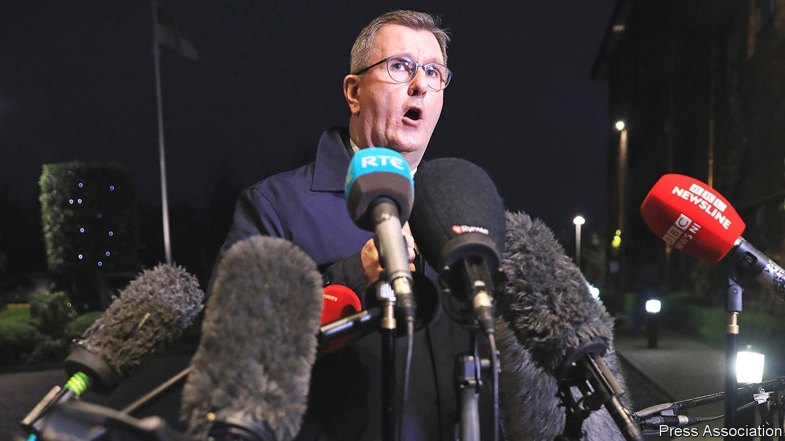

###### Dashed promises

# Northern Irish devolution collapses—again 

##### The province’s politics are very far from the heady days of the Good Friday Agreement 

 

> Feb 12th 2022 

NORTHERN IRELAND’S most famous exports include Rory McIlroy, George Best, Van Morrison—and peace. Since the Good Friday Agreement of 1998, it has been marketed around the world as a template for ending seemingly intractable political violence. And if peace is defined as the absence of violence, it has been remarkably successful. An average of 124 deaths from political violence every year during the three decades of “the troubles” fell to just eight a year in the two decades since. But sectarian divisions remain bitter and the centre piece of the deal, a power-sharing government involving almost every shade of political opinion, has failed.

Since the devolved administration was set up in 1999, it has been absent for 37% of the time. Now it is absent again. On February 3rd Sir Jeffrey Donaldson (pictured) pulled his party’s first minister out of government, collapsing the administration. Sir Jeffrey, leader of the Democratic Unionist Party (DUP), the main party supporting Northern Ireland’s status within the United Kingdom, said the move was in protest at the Northern Ireland protocol, the part of the Brexit deal that prevents an Irish land border by creating a customs border between the province and Great Britain.


The DUP had initially, albeit reluctantly, accepted the protocol. Its voters, however, are less keen. An election to the devolved government looms in May, and a recent poll put support among unionists for the protocol in its current form at just 2%. The day before the DUP walked out, one of its ministers ordered civil servants to stop some of the border checks. They refused, fearing that the order was illegal. A court injunction then suspended the order until a full hearing next month.

In the early years of the devolved administration, whenever it collapsed the British government would appoint its own ministers to run government departments. But in 2017, when a scandal relating to bungled green incentives brought the administration down, local civil servants were given the job instead. The results were messy. They kept most government services functioning day to day. But untaken strategic decisions piled up.

Eventually, public anger over a nurses’ strike together with poor election results for both Sinn Fein, the biggest of the parties that seeks a united Ireland, and the DUP forced the two parties to govern together again from January 2020. But then the pandemic exposed their ability to find rancour in the unlikeliest areas. The Sinn Fein deputy first minister went on television to denounce the unionist health minister’s plans. Senior DUP figures blocked pandemic restrictions by using a veto meant to protect Protestants or Catholics from discrimination.

Many within Stormont, home of the devolved administration, believe that the latest collapse is terminal. That is probably exaggerated. For the DUP and Sinn Fein the alternatives—direct rule from London or no government at all—are less palatable than having some power themselves.

But there may well be another prolonged period without a devolved government. Sinn Fein is expected to emerge from the elections in May as Northern Ireland’s largest party for the first time, and many in the DUP say they will refuse to enter the executive as junior partner with Sinn Fein, which was formed as the political wing of the IRA. Moreover, the DUP has said its veto on devolution will end only if the Irish Sea border is removed. But talks with the EU will at most reduce the border’s impact, and even if the British government were to override the protocol unilaterally, as Boris Johnson again hinted on February 9th, Sinn Fein would then probably wield its veto instead.

And all the while paramilitary groups continue to act in the shadows. Indeed, their clout seems to be growing. Six days before Sir Jeffrey brought down Stormont, he met loyalist paramilitary representatives, and was reportedly told to collapse devolution. In 1983, when republican gunmen burst into a Protestant church and murdered three elders, or in 1994, when loyalist gunmen murdered six pub goers as they watched a football match, the prospect of paramilitaries restricting themselves to political lobbying would have seemed heavenly. But in 1998, Northern Ireland was promised so much more. ■

For more coverage of matters relating to Brexit, visit our 

