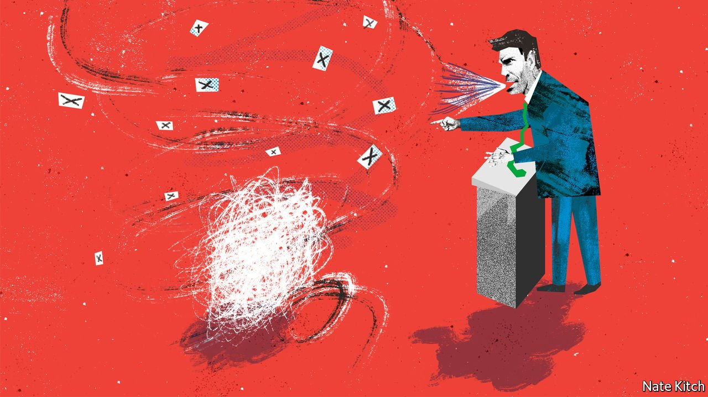

###### Bagehot

# The rise of unpopulism 

##### Why Tories give the British people what they do not want 

 

> Feb 12th 2022 

BORIS JOHNSON’S attack had an alliterative snap. At the despatch box, the prime minister dismissed Sir Keir Starmer, Labour’s chief and a former barrister, as “a lawyer, not a leader”. The line had one flaw: beyond Westminster, lawyers are liked. No parent ever complained about a child becoming a solicitor. Indeed, voters prefer politicians to have been lawyers rather than journalists (like Mr Johnson) by three to one, according to YouGov. People who dislike lawyers include government ministers, who find their best ideas squished due to illegality, and divorced middle-aged men. Westminster has lots of both. And they presume that everyone else feels the same way.

A misjudged attack line reveals a peculiar transformation in the Conservative Party. At the start of Mr Johnson’s tenure, it thrived with a populist message, pledging to implement the will of the people against the wishes of an out-of-touch elite. Now its MPs project their own neuroses, fetishes and obsessions onto an imagined people. They invoke the will of the people to pursue policies that are, in fact, unpopular. MPs slate footballers, fight culture wars and attempt to thwart green policies in the name of voters who prefer the opposite. Call it unpopulism.


The first signs of unpopulism emerged during Britain’s departure from the European Union. Politicians of all stripes argued over minutiae such as data-protection rules and phytosanitary standards. Beyond broad principles, few ordinary people cared. Yet in that debate, proverbial voters with a striking tendency to repeat MPs’ own views on, say, membership of the customs union, kept cropping up. The general election in 2019 was won by the party that pledged to make the topic go away.

Confusion between correlation and causation embedded unpopulism in the Conservative Party. Mr Johnson remains in office because Tory MPs think he has a unique ability to win over places that never voted Conservative before 2019. In fact, Mr Johnson’s personal ratings in these “red wall” seats were lower than Mrs May’s in 2017. Dislike of Jeremy Corbyn, Sir Keir’s far-left predecessor, rather than love of Mr Johnson handed the Conservatives victory. Mr Johnson stays in power despite wretched ratings thanks to the endurance of that myth. He owes his job to the will of Westminster, not the will of the people.

What preoccupies Tory MPs does not always preoccupy voters. The culture war is one example. In Parliament Jacob Rees-Mogg, the new minister for “Brexit opportunities”, lamented the “charge of the woke brigade”. Any voters who chanced to be listening might well have been confused. According to a poll by YouGov, 59% have no idea what “woke” means. Lee Anderson, an MP in Ashfield, a former mining constituency, boycotted the Euro 2020 championships in protest at England’s footballers taking the knee to protest against racism. It was a lonely boycott. Polls showed that about two-thirds of England fans supported the players.

In general, MPs still view Britons as liberty-lovers. There is a cross-party consensus against mandatory ID cards. Britain is not a “papers, please” society, runs a common refrain. In fact, Britain is a “Papers? Please!” society: polls show overwhelming support for ID cards. In the minds of Tory MPs, liberty extends to the Englishman’s inalienable right to drive where he pleases. When local councils started to create low-traffic neighbourhoods during lockdown, those MPs led the attack. But according to Opinium, a pollster, voters support low-traffic neighbourhoods by two to one.

In other areas, unpopulism is just beginning. On environmental policy, increasing numbers of Conservative MPs, such as Steve Baker, an influential backbencher, worry that attempts to reach “net zero” will go down badly with the red wall. A growing crowd of right-wing MPs, columnists and think-tanks, such as Net Zero Watch, are pressing for a referendum on the topic. Yet support for green policies is roughly the same across the country. How to pay for them is a matter of debate, but there is near-universal agreement among voters about carbon neutrality as a target.

Part of the cause of unpopulism is anthropological. After an electoral realignment, politicians do not necessarily understand their new voters. Tory ministers speak to their new voters like nervous British holidaymakers in a Spanish restaurant, loudly and slowly (“We…Would…Like…To…Level…You…Up”). The existence of a large, prosperous middle class outside the south-east is little understood in SW1. Instead, caricatures of the red wall are given credence: a land populated entirely by old, working-class men. It is much easier for politicians to project their own views onto voters than to learn what voters actually think.

Unpopulism is to be expected when old methods of gauging public opinion have failed. Tabloids have become a poor guide. In the 1990s British newspapers sold almost 15m copies each day. Now they muster barely 3m between them. Their remaining readers are much older than the average Briton, with a worldview to match. That tabloids still hold any influence at all is due not to their connection with voters, but to their hold over the elite. Mr Johnson and his team pore over them daily. A front page may not be read by many, but will be covered by the BBC.

Vox unpopuli

Unpopulism can play out one of two ways. Either its exponents continue to obsess over their own interests, rather than voters’—that is, until they are removed from office. Or it can lead to surprising, spectacular electoral success. What is unpopular today can be popular tomorrow. Brexit was once an eccentric hobby of a few Euro phobic Tories, who campaigned for decades in the name of the common man. Eventually, the common man caught up. The rewards were enormous—for Brexit’s proponents, if not for the country. So the unpopulists will keep going in the hope that another such wild card comes up trumps, whether an end to net zero or the waging of a culture war. Unpopulism is here to stay. ■

Read more from Bagehot, our columnist on British politics: (Feb 5th) (Jan 29th) (Jan 22nd)

For more coverage of matters relating to Brexit, visit our 

