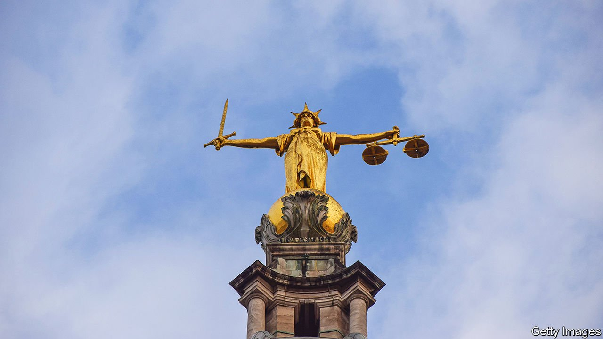

###### Justice delayed

# Unless lawyers are paid better, courts will grind to a halt 

##### The government pays solicitors and barristers too little for legal-aid work 

 

> Feb 12th 2022 

THIRTEEN YEARS ago, when Katy Hanson started practising criminal law in the Welsh seaside town of Cardigan, there were half a dozen law firms in the county, with a dozen solicitors. The number of crimes has not fallen since then. But the number of lawyers representing those accused of crimes has.

Practising criminal law has become wildly unprofitable. Many people accused of crimes cannot afford a lawyer, so the state pays one to advise and if necessary represent them. But its rates for solicitors have not risen since the 1990s. Barristers, who argue more serious cases in the crown court, say their pay is falling behind too. In 2014 the pay freeze was followed by outright cuts, and many firms shut their criminal-law departments or closed down. Some lawyers switched from representing defendants to working for the Crown Prosecution Service, which pays more.


Solicitors are now paid about a third less in real terms than in 2008. The starting annual salary in a criminal-defence firm is just £20,000-25,000 ($27,000-34,000) inside London, and less elsewhere. Even an experienced criminal solicitor is unlikely to make more than £50,000. Recent graduates are also put off by the long and unpredictable hours, says Ms Hanson. Almost two-thirds of those still working in criminal defence are older than 45. Cardigan’s two other law firms now have just two such solicitors between them, both over 50.

Britain once prided itself on its ability to provide anyone, rich or poor, with a fair hearing in court. But the austerity squeeze has affected every part of the criminal-justice system. The backlog of cases waiting to be heard in crown court reached 60,000 last year, the most since comparable figures started to be published in 2014. The average wait between crime and verdict in crown court is now 708 days.

Some of this is because of the pandemic. But cases were queuing and lawyers were quitting before covid-19 ground courts to a halt. The criminal-justice system is a tempting target for spending cuts, says Daniel Newman of Cardiff University’s school of law and politics. Most voters assume they will never be caught up in a criminal case, and whether the system is well-funded does not feature in their decisions about how to cast their ballots.

The shortage of lawyers starts in the police station, where solicitors advise people who have been arrested. Rotas ideally have many lawyers, who can cover a night a week and fill in whenever one of them has a conflict of interest. In Cardigan, Ms Hanson shares this duty with just two others. Next comes the magistrates’ court, where again Ms Hanson shares duty with two other solicitors. For the most serious 5% of cases, solicitors do the preparatory work before handing over to a barrister, who argues the case in crown court. Prosecution barristers are hired from the same pool, and here, too, there are shortages. Between July and September last year, the number of trials postponed was 29% more than the number of trials completed, often because a barrister could not be found for either prosecution or defence.

The bulk of legal-aid work is paid according to fixed rates that depend on location and, in the magistrates’ court, the seriousness of the charges. In crown court pay is based on the number of pages of prosecution evidence and the length of the trial. These rates may not reflect the work involved. Fraud, for example, can pay better than murder because there is more paperwork. Sir Christopher Bellamy QC, a former judge who chaired an independent review of criminal aid published in November, told a parliamentary committee that the legal-aid scheme had “grown into a monster, where page count has become divorced from actual work”.

Meanwhile social media, messaging services and CCTV footage are all increasing the volume of evidence. Solicitors complain, too, that accreditation requirements are becoming more onerous. Since 2010 more than half of courts have been closed to save money. One consequence is that cases are often rescheduled at the last minute. Another is that solicitors waste time in transit. The court in Cardigan closed in 2011, and now Ms Hanson’s nearest magistrates’ court is an hour’s drive away.

Let’s pay all the lawyers

Sir Christopher recommended an immediate rise of 15% in income for both solicitors and barristers. The justice secretary, Dominic Raab, says he will respond to the review in March. In the meantime, he plans to clear the crown-court backlog by allowing magistrates to hear more serious cases. But this is unlikely to make much difference. Defendants will still be entitled to demand trial in a crown court, and many will, since their conviction rates are lower. And in any case magistrates, who are volunteers without professional legal training, are also in short supply.

The Criminal Bar Association, which represents most criminal barristers in England and Wales, is pressing Mr Raab to act more quickly. It plans to vote during the week starting February 14th on whether to take action if the government does not go beyond the recommended 15% pay rise. Its members strongly back a policy of “no returns”, meaning that barristers asked to stand in for a busy colleague will refuse. Since such stand-ins are commonly needed, the criminal-justice system could grind to a halt within days. The government knows voters are worried about crime, and has committed to hiring 20,000 extra police officers. But better detection and more arrests are little use if criminals cannot be tried and sentenced. ■

